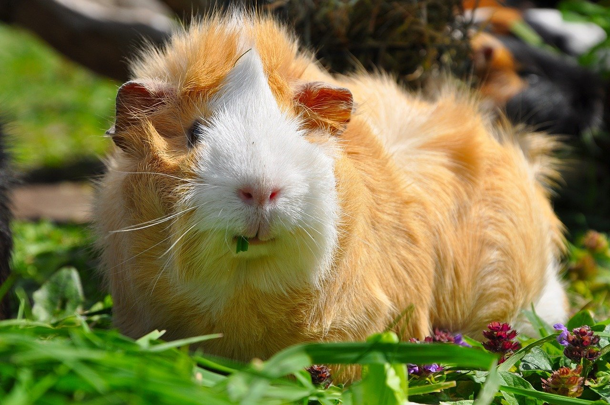

```{r setup, include=FALSE}
BioDataScience1::learnr_setup()
SciViews::R()
```

```{r, echo=FALSE}
BioDataScience1::learnr_banner()
```

```{r, context="server"}
BioDataScience1::learnr_server(input, output, session)
```

----

## Objectifs

Vous avez découvert il y a peu la moyenne et plusieurs tests d'hypothèses associés. Vous êtes devenu des experts dans l'utilisation du test t de Student indépendant qui vous permet de comparer les moyennes de deux populations. Cependant, ce test ne permet pas de comparer les moyennes de 3 ou de 4 populations par exemple. 

Si vous pensez que faire des comparaisons 2 à 2 est une bonne idée, retournez directement lire le [module 10](https://wp.sciviews.org/sdd-umons/?iframe=wp.sciviews.org/sdd-umons-2020/variance.html) de SDD I.

{width='30%'}

Si vous pensez qu'il serait judicieux de réaliser une analyse de variance (ANOVA), continuez ce tutoriel pour découvrir toutes les subtilités qui se cachent derrière ce test d'hypothèse.

{width='30%'}

Dans ce learnr, vous allez pouvoir auto-évaluer votre capacité à\ :

- Pouvoir réaliser des graphiques relatifs à la distribution F

- Appliquer le modèle linéaire, anciennement analyse de variance (ANOVA).

- Savoir effectuer des tests de comparaison multiples

## Distribution F

Avant de vous lancer dans une ANOVA, nous allons d'abord nous intéresser à la distribution associée à ce modèle qu'est la distribution F. La distribution F est une distribution asymétrique n’admettant que des valeurs nulles ou positives (cela devrait vous rappeler une distribution vue dans un des modules précédents).

Afin de répondre à la question suivante, vous devez avoir bien assimilé la technique pour déterminer le nombre de degrés de liberté intragroupe et intergroupe ;) 

Employez R pour représenter le graphique de la densité de probabilité de la distribution F pour une étude ayant 100 observations et 5 groupes.

💬 **Ce code correspond au snippet `.ifdens`**

```{r fplot_h2, exercise=TRUE, exercise.lines=10}
# Fisher-Snedecor's F distribution (density probability) with parameter:
.df1 <- ___; .df2 <- ___ # numerator (.df1) and denominator (.df2) df
.col <- 1; .add <- FALSE # Plot parameters
.x <- seq(0, qf(0.999, df1 = .df1, df2 = .df2), l = 1000)  # Quantiles
.d <- function (x) df(x, df1 = .df1, df2 = .df2)           # Distribution function
.q <- function (p) qf(p, df1 = .df1, df2 = .df2)           # Quantile for lower-tail prob
.label <- bquote(F(.(.df1), .(.df2)))                      # Curve parameters
curve(.d(x), xlim = range(.x), xaxs = "i", n = 1000, col = .col,
  add = .add, xlab = "Quantiles", ylab = "Probability density") # Curve
abline(h = 0, col = "gray") # Baseline
```

```{r fplot_h2-hint-1}
# Fisher-Snedecor's F distribution (density probability) with parameter:
.df1 <- 4; .df2 <- ___ # numerator (.df1) and denominator (.df2) df
.col <- 1; .add <- FALSE # Plot parameters
.x <- seq(0, qf(0.999, df1 = .df1, df2 = .df2), l = 1000)  # Quantiles
.d <- function (x) df(x, df1 = .df1, df2 = .df2)           # Distribution function
.q <- function (p) qf(p, df1 = .df1, df2 = .df2)           # Quantile for lower-tail prob
.label <- bquote(F(.(.df1), .(.df2)))                      # Curve parameters
curve(.d(x), xlim = range(.x), xaxs = "i", n = 1000, col = .col,
  add = .add, xlab = "Quantiles", ylab = "Probability density") # Curve
abline(h = 0, col = "gray") # Baseline

 #### ATTENTION: Hint suivant = solution !####
```

```{r fplot_h2-solution}
# Fisher-Snedecor's F distribution (density probability) with parameter:
.df1 <- 4; .df2 <- 95 # numerator (.df1) and denominator (.df2) df
.col <- 1; .add <- FALSE # Plot parameters
.x <- seq(0, qf(0.999, df1 = .df1, df2 = .df2), l = 1000)  # Quantiles
.d <- function (x) df(x, df1 = .df1, df2 = .df2)           # Distribution function
.q <- function (p) qf(p, df1 = .df1, df2 = .df2)           # Quantile for lower-tail prob
.label <- bquote(F(.(.df1), .(.df2)))                      # Curve parameters
curve(.d(x), xlim = range(.x), xaxs = "i", n = 1000, col = .col,
  add = .add, xlab = "Quantiles", ylab = "Probability density") # Curve
abline(h = 0, col = "gray") # Baseline
```

```{r fplot_h2-check}
grade_code("Le code pour obtenir ce graphique est un peu long... mais le snippet est là pour vous préremplir la majeure partie ! Vous avez cependant su convertir le nombre d'observations et le nombre de groupes en nombre de degrés de liberté intragroupe et intergroupe.", "Il semble que tu n'a pas su déterminer correctement les nombres de degrés de liberté. Si n correspond au nombre d'observations et k au nombre de groupes, alors le nombre de degrés intergroupe vaut k – 1  et le nombre de degrés intragroupe vaut n – k.")
```

## Croissance des dents de cochons d'Inde

Il est temps de passer à une application plus concrète de l'analyse de variance.

Vous allez réaliser une analyse complète sur l'effet de la vitamine C sur la croissance des dents de cochons d'Inde. Les données utilisées proviennent du jeu de données `ToothGrowth` du package `datasets` (vous pouvez donc consulter la page d'aide si vous souhaitez obtenir plus d'informations).

{width='50%'}


Le jeu de données comprend les variables suivantes\ :

```{r, echo = TRUE}
# importation
toothgrowth <- read("ToothGrowth", package = "datasets", lang = "fr")
# Quelques informations sur le tableau de données.
glimpse(toothgrowth)
```

Ce jeu de données comprend 3 variables :

- `len`\ : longueur des dents (mm)
- `supp`\ : supplément administré, OJ (jus d'orange contenant donc entre autres de la vitamine C) ou VC (vitamine C pure)
- `dose`\ : dose de vitamine C administrée en trois rations différentes, 0.5, 1 et 2 mg/J

```{r, echo=TRUE}
# Vérification des types des variables et ajout des labels
toothgrowth %>.%
  mutate(., 
    supp = factor(supp, levels = c("OJ", "VC")),
    dose = ordered(dose, levels = c(0.5, 1, 2))) %>.%
  labelise(toothgrowth, self = FALSE,
    label = list(
      len = "Longueur des dents",
      supp = "Supplémentation",
      dose = "Dose"),
    units = list(
      len = "mm",
      supp = NA,
      dose = "mg/J"
      )
    ) -> toothgrowth
```

**Cette étape est la première à réaliser après avoir importé les données. Il faut vérifier et adapter les types et les labels des variables.** Il est particulièremenbt important que les variables qui définissent les sous-populations comparées soient bien encodées sous forme d'objets `factor` ou `ordered`\ !

Nous allons nous concentrer uniquement sur les individus qui ont reçu de la vitamine C. La question biologique est la suivante : **Y a t'il une différence de croissance des dents en fonction de la ration journalière de vitamine C administrée\ ?**

```{r, echo=TRUE}
tooth_vc <- filter(toothgrowth, supp == "VC")
```

### Description des données

Rappelez-vous que la description des données est une étape indispensable de leur analyse (voir modules [2](https://wp.sciviews.org/sdd-umons/?iframe=wp.sciviews.org/sdd-umons-2020/visu1.html), [3](https://wp.sciviews.org/sdd-umons/?iframe=wp.sciviews.org/sdd-umons-2020/visu2.html) et [4](https://wp.sciviews.org/sdd-umons/?iframe=wp.sciviews.org/sdd-umons-2020/visu3.html) de SDD I).

#### Réalisation d'un tableau résumé des données

Réalisez un tableau proposant les moyennes et les écart-types de la longueur des dents des cochons d'Inde pour chaque dose administrée en vitamine C ainsi que le nombre d'observations par groupe. Le jeu de données à utiliser est donc `tooth_vc`.

💬 **Ce code correspond au snippet `.hmanova1desc`**

```{r tg_prepare}
toothgrowth <- read("ToothGrowth", package = "datasets", lang = "fr")
toothgrowth$dose <- as.ordered(toothgrowth$dose)

toothgrowth <- labelise(toothgrowth, self = FALSE,
  label = list(
    len = "Longueur des dents",
    supp = "Supplémentation",
    dose = "Dose"
  ),
  units = list(
    len = "mm",
    supp = NA,
    dose = "mg/J"
  )
)

tooth_vc <- filter(toothgrowth, supp == "VC")

tooth_vc <- labelise(tooth_vc, self = FALSE,
  label = list(
    len = "Longueur des dents",
    supp = "Supplémentation",
    dose = "Dose"
  ),
  units = list(
    len = "mm",
    supp = NA,
    dose = "mg/J"
  )
)

anova. <- lm(data = tooth_vc, len ~ dose)
```

```{r tooth_tab_h2, exercise=TRUE, exercise.setup="tg_prepare"}
___ %>.%
  group_by(., ___) %>.%
  summarise(., mean = mean(___), sd = sd(___), count = sum(!is.na(___)))
```

```{r tooth_tab_h2-hint-1}
tooth_vc %>.%
  group_by(., ___) %>.%
  summarise(., mean = mean(___), sd = sd(___), count = sum(!is.na(___)))

 #### ATTENTION: Hint suivant = solution !####
```

```{r tooth_tab_h2-solution}
tooth_vc %>.%
  group_by(., dose) %>.%
  summarise(., mean = mean(len), sd = sd(len), count = sum(!is.na(len)))
```

```{r tooth_tab_h2-check}
grade_code("Vous obtenez le tableau adéquat qui permet de comparer les moyennes, les écart-types et le nombre d'observations pour chaque dose.")
```

#### Réalisation de graphiques

Vous trouverez dans la littérature plusieurs graphiques qui permettent de visualiser vos observations lorsque vous souhaitez réaliser une ANOVA. Nous vous proposons d'employer les boîtes de dispersion.

Réalisez des boîtes de dispersions afin de visualiser la longueur des dents des cochons d'inde en fonction de la dose de vitamine C administrée.

💬 **Ce code correspond au snippet `.cbbox`**

```{r tooth_graph, exercise = TRUE, exercise.setup = "tg_prepare"}
chart(data = ___, ___ ~ ___) +
  geom____()
```

```{r tooth_graph-solution}
chart(data = tooth_vc, len ~ dose) +
  geom_boxplot()
```

```{r tooth_graph-check}
grade_code("Vous obtenez le graphique adéquats qui permet de comparer la longueur des dents en focntion de la dose administrée.")
```

*L'ANOVA a pour objectif de comparer des moyennes entre elles alors que la boîte de dispersion va vous représenter les 5 nombres qui sont des descripteurs non-paramétriques.*

Maintenant que vous avez pris connaissance de vos données grâce à un tableau et un graphique, vous pouvez réaliser votre test d'hypothèse. 


### Vérification des conditions d'applications

Pour réaliser une ANOVA, il faut respecter une série de conditions d'application\ :

- échantillon représentatif (par exemple, aléatoire),
- observations indépendantes,
- variable dite réponse quantitative,
- une variable dite explicative qualitative à trois niveaux ou plus,
- distribution normale des résidus,
- homoscédasticité (même variance intragroupe).

Les deux dernières conditions **doivent être vérifiées**. 

En pratique, on commence par vérifier l'homoscédasticité, puis on réalise notre ANOVA et ensuite on vérifie la distribution normale des résidus. Cela peut vous sembler étrange mais nous y reviendrons un peu plus loin dans ce tutoriel.

#### Test de Bartlett

Il existe plusieurs tests qui permettent de vérifier l'homoscédasticité. Nous vous proposons d'utiliser le test de Bartlett. Avant de foncez-r dans la zone de code R, réfléchissez à l'hypothèse nulle et à l'hypothèse alternative de ce test. Si vous ne connaissez pas ces deux hypothèses, vous serez incapable d'interpréter ce test.

💬 **Ce code correspond au snippet `.hvbartlett`**

```{r tooth_bart, exercise = TRUE, exercise.setup = "tg_prepare"}
bartlett.test(data = ___, ___ ~ ___)
```

```{r tooth_bart-solution}
bartlett.test(data = tooth_vc, len ~ dose)
```

```{r tooth_bart-check}
grade_code("vous avez réalisé l'instruction correcte. Le plus important est encore à faire. Répondez donc à la question suivante.")
```

```{r bart_quiz1}
question("Y a t'il homoscédasticité des variances ?",
  answer("oui", correct = TRUE),
  answer("non"),
  correct = "Super,vous avez su correctement analyser les résultats de ton test. ",
  incorrect = "Il semble que vous n'avez pas bien compris la notion d'homoscédasticité ou que vous n'avez pas su définir correctement les hypothèses de ce test de Bartlett.",
  allow_retry = TRUE)
```

### ANOVA

Après avoir réalisé vérifié l'homoscédasticité, il est temps de réaliser l'analyse de variances. L'instruction ci-dessous corresponds au snippet `.hmaniva1`. Il est intéressant d'analyser cette instruction. 

La fonction `lm()` requiert un jeu de données et une formule. Vous êtes habitué à cet interface formule que vous utilisez dans la réalisation de vos graphiques ou de vos tests d'hypothèse précédents. Cette fonction calcule un objet de class `lm` assigné à `anova.` La fonction lm est fonction puissante qui permet de calculer des modèles linéaires que nous verrons dans le cadre du cours de SDD II. Une ANOVA est en fait une variante du modèle linéaire. De cet objet `anova.`, on calcule le tableau de l'ANOVA grâce à la fonction `anova()`.

```{r, echo = TRUE, eval=FALSE}
anova(anova. <- lm(data = DF, YNUM ~ XFACTOR))
```

Réalisez votre modèle ANOVA qui porte donc sur la longueur des dents de cochons d'Inde en fonction de la dose administrée.

💬 **Ce code correspond au snippet `.hmanova1`**

```{r tooth_anova_h2, exercise = TRUE, exercise.setup = "tg_prepare"}
anova(anova. <- lm(data = ___, ___ ~ ___))
```

```{r tooth_anova_h2-hint-1}
anova(anova. <- lm(data = tooth_vc, ___ ~ ___))

#### ATTENTION: Hint suivant = solution !####
```

```{r tooth_anova_h2-solution}
anova(anova. <- lm(data = tooth_vc, len ~ dose))
```

```{r tooth_anova_h2-check}
grade_code("Vous avez réalisé l'instruction correcte. On ne va pas plus loin dans l'analyse du tableau de l'anova tant que l'on a pas vérifé la distribution normale des résidus.")
```

Une fois votre ANOVA réalisée, vous avez à votre disposition un snippet qui vous permet de vérifier la distribution normale de vos résidus. Cette condition se vérifie de manière graphique. 

Vérifiez la distribution normale des résidus de votre objet `.anova`

💬 **Il existe une snippet pour vous aider `.hmanovaqqplot`**

```{r tooth_qqplot_h2, exercise = TRUE, exercise.setup = "tg_prepare"}
plot(___, ___ = ___)
```

```{r tooth_qqplot_h2-hint-1}
plot(___, which = 2)

#### ATTENTION: Hint suivant = solution !####
```

```{r tooth_qqplot_h2-solution}
plot(anova., which = 2)
```

```{r tooth_qqplot_h2-check}
grade_code("Vous avez réalisé l'instruction correcte. Comme vous pouvez le voir sur ce graphique, on observe une distribution normale des résidus. Vous pouvez donc à présent analyser votre tableau de l'ANOVA.")
```

```{r anova_quiz}
question("Y a t'il un effet significatif de la dose administrée sur la croissance des dents au seuil alpha de 5%?",
         answer("oui", correct = TRUE),
         answer("non"),
  correct = "Bravo, vous avez correctement analysé votre tableau de l'analyse de la variance. L'ANOVA vous permet de savoir qu'au moins un des groupes diffère des autres. Vous allez devoir réaliser une analyse complémentaire pour déterminer quel groupe diffère des autres.",
  incorrect = "Il semble que vous avez mal analysé le tableau de l'analyse de la variance ou que les hypothèses nulle et alternative sont mal définies.",
  allow_retry = TRUE)
```

### Analyse Post Hoc

Votre ANOVA indique qu'il y a au moins une des moyennes qui est significativement différente des autres. Afin de connaitre le niveau dont la moyenne (ou les niveaux) qui est significativement différent des autres moyennes, vous pouvez réaliser une analyse complémentaire de l'ANOVA, une analyse post hoc dont le snippet est le suivant : 

💬 **Ce code correspond au snippet `.hmanovamult`**

```{r tooth_post, exercise = TRUE, exercise.setup = "tg_prepare"}
summary(anovaComp. <- confint(multcomp::glht(anova.,
  linfct = multcomp::mcp(___ = "Tukey")))) # Add a second factor if you want
.oma <- par(oma = c(0, 5.1, 0, 0)); plot(anovaComp.); par(.oma); rm(.oma)
```

```{r tooth_post-solution}
summary(anovaComp. <- confint(multcomp::glht(anova.,
  linfct = multcomp::mcp(dose = "Tukey")))) # Add a second factor if you want
.oma <- par(oma = c(0, 5.1, 0, 0)); plot(anovaComp.); par(.oma); rm(.oma)
```

```{r tooth_post-check}
grade_code("Avec l'aide des snippets, il est relativement simple de réaliser un test post hoc. Cette analyse se base sur l'objet anova. réalisé précédement. Le plus important va être d'interpréter ces résulats. Il est possible de le faire graphiquement ou sur base la sortie R. Les niveaux de la variable facteur votn être comparé 2 à 2 avec un correction via la méthode HSD de Tukey.")
```

```{r post_quiz}
question("Quels sont les niveaux significativement différents au seuil alpha de 5% ?",
         answer("0.5 par rapport à 1", correct = TRUE),
         answer("0.5 par rapport à 2", correct = TRUE),
         answer("1 par rapport à 2", correct = TRUE), 
  allow_retry = TRUE, correct = "Bravo ! Les 3 groupes sont différents les uns des autres.",
  incorrect = "Ta réponse est probablement incomplète. Pour une première analyse, regarder au tableau qui découle de cette analyse post hoc. Chaque niveau est comparé aux autres niveaux.")
```

## Conclusion

Bravo! Vous venez de terminer votre séance d'exercices dans un tutoriel "learnr". Toutes les étapes de cette analyse sont importantes. **Ayez une véritable réflexion sur l'ensemble de l'analyse que vous venez de réaliser.**.

```{r comm_noscore, echo=FALSE}
question_text(
  "Laissez-nous vos impressions sur cet outil pédagogique",
  answer("", TRUE, message = "Pas de commentaires... C'est bien aussi."),
  incorrect = "Vos commentaires sont enregistrés.",
  placeholder = "Entrez vos commentaires ici...",
  allow_retry = TRUE
)
```
