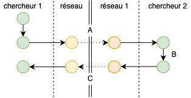

```{r setup, include=FALSE}
BioDataScience1::learnr_setup()
SciViews::R()
```

```{r, echo=FALSE}
BioDataScience1::learnr_banner()
```

```{r, context="server"}
BioDataScience1::learnr_server(input, output, session)
```

----

## Objectifs

- Vérifier que la terminologie relative aux différents outils logiciels qui seront utilisés est connue.
- Auto-évaluer sa compréhension des différentes actions 'Git'.

## Outils logiciels

Vous avez découvert tout au long de ce premier module de nombreux outils logiciels qui nous avons sélectionné pour vous. Répondez aux questions ci-dessous afin de vous assurer que vous avez compris ces outils. 

```{r qu_tools}
quiz(
  question( "Quel outil est un logiciel de gestion de versions ?",
    answer("Git", correct = TRUE, message = "En effet, Git est un gestionnaire de version très employé."),
    answer("RStudio", message = "RStudio est un environnement complet et optimisé pour réaliser vos analyses, vos graphiques et vos rapports."),
    answer("Renku", message = "Renku permet de lancer une fenêtre RStudio avec tous les packages dont nous avons besoin pour réaliser des analyses en sciences des données."),
    answer("GitHub", message = "GitHub est un réseau social centré sur un gestionnaire de versions de projet."),
    allow_retry = TRUE, random_answer_order = TRUE
  ),
  question("Quel est le rôle de la fenêtre `Console` dans RStudio ?",
    answer("Cette fenêtre est dédiée à l'exécution de code R.", correct = TRUE),
    answer("Cette fenêtre permet de lire les pages d'aide des fonctions."),
    answer("Cette fenêtre permet de visualiser un graphique."),
    answer("Cette fenêtre est dédiée à l'édition de documents."),
    allow_retry = TRUE, random_answer_order = TRUE
    ),
  question("Dans un projet RStudio fictif,quel est le rôle du fichier terminant par l'extension `.Rproj` ?",
    answer("Ce fichier sert à configurer le projet RStudio.", correct = TRUE),
    answer("Ce fichier sert à exclure des fichiers du gestionnaire de versions."),
    answer("Ce fichier comprend toutes les instructions R du projet."),
    answer("Il s'agit d'un dossier compressé qui comprend toutes les figures générées dans un projet."),
    allow_retry = TRUE, random_answer_order = TRUE
    ),
  question("Que sont les Issues sur GitHub ?",
    answer("Il s'agit d'un espace de discussion qui permet de mettre en avant un problème ou une idée d'amélioration sur un projet.", correct = TRUE),
    answer("Il s'agit d'une messagerie instantanée comme Facebook Messenger ou WhatsApp."),
    answer("Il s'agit d'une interface qui permet de lancer une fenêtre RStudio."),
    answer("Il s'agit d'une machine virtuelle qui permet de lancer des outils professionnels liés à la science des données."),
    allow_retry = TRUE, random_answer_order = TRUE
    )
)
```


## Analyse de situation Git

Le gestionnaire de version Git est un outil puissant, mais complexe. C'est souvent le cas lorsqu'on utilise un outil professionnel. Git a une terminologie qui lui est propre. Vous devez vous assurer d'avoir compris les termes suivants : repository, commit, clone, push, pull, fork, pull request. Analysez les situations suivantes basées sur les images schématisant la situation.

### Situation 1

Deux chercheurs distants de plusieurs centaines de kilomètres collaborent sur un projet commun. Ils ont pour cela décidé d'employer un outil de gestion de version et d'héberger ce projet sur un système d'hébergement web dédié pour cela. 

Sur base de l'image ci-dessous et de la situation précisée précédemment, répondez aux questions suivantes.


```{r qu_git1}
quiz(
  question("Qualifiez la situation **A**",
    ans(-5,   "commit"),
    ans(63,   "clone"),
    ans(14,   "push"),
    ans(-15,  "pull"),
    ans(-67,  "fetch"),
    ans(13,   "fork"),
    ans(-26,  "pull request"),
    allow_retry = TRUE, random_answer_order = TRUE
    ),
  question("Qualifiez la situation **B**",
    answer("commit"),
    answer("clone"),
    answer("push", correct = TRUE),
    answer("pull"),
    answer("fetch"),
    answer("fork"),
    answer("pull request"),
    allow_retry = TRUE, random_answer_order = TRUE
    ),
  question("Qualifiez la situation **C**",
    answer("commit"),
    answer("clone"),
    answer("push"),
    answer("pull", correct = TRUE),
    answer("fetch"),
    answer("fork"),
    answer("pull request"),
    allow_retry = TRUE, random_answer_order = TRUE
    )
)
```

### Situation 2

Le chercheur 2 s'intéresse au projet du chercheur 1, travaille dessus et propose des modifications afin de l'améliorer. 

Sur base de l'image ci-dessous et de la situation précisée précédemment, répondez aux questions suivantes.



```{r qu_git2}
quiz(
  question("Qualifiez la situation **A**",
    answer("commit"),
    answer("clone"),
    answer("push"),
    answer("pull"),
    answer("fetch"),
    answer("fork", correct = TRUE),
    answer("pull request"),
    allow_retry = TRUE, random_answer_order = TRUE
    ),
  question("Qualifiez la situation **B**",
    answer("commit", correct = TRUE),
    answer("clone"),
    answer("push"),
    answer("pull"),
    answer("fetch"),
    answer("fork"),
    answer("pull request"),
    allow_retry = TRUE, random_answer_order = TRUE
    ),
  question("Qualifiez la situation **C**",
    answer("commit"),
    answer("clone"),
    answer("push"),
    answer("pull"),
    answer("fetch"),
    answer("fork"),
    answer("pull request", correct = TRUE),
    allow_retry = TRUE, random_answer_order = TRUE
    )
)
```


## Conclusion

Vous avez beaucoup de nouveaux outils logiciels à découvrir. Nous progresserons étape par étape pour les maîtriser. Pour l'instant, l'important est d'avoir une vue d'ensemble des différents logiciels utilisés et de comprendre la terminologie de Git.

```{r comm_noscore, echo=FALSE}
question_text(
  "Laissez-nous vos impressions sur ce learnr",
  answer("", TRUE, message = "Pas de commentaires... C'est bien aussi."),
  incorrect = "Vos commentaires sont enregistrés.",
  placeholder = "Entrez vos commentaires ici...",
  allow_retry = TRUE
)
```
