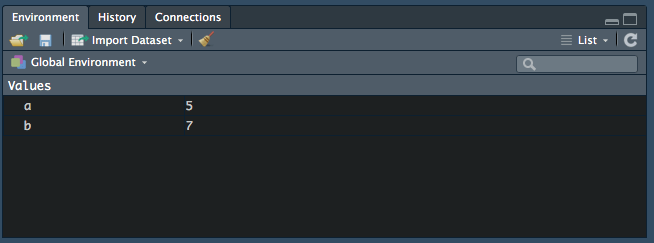
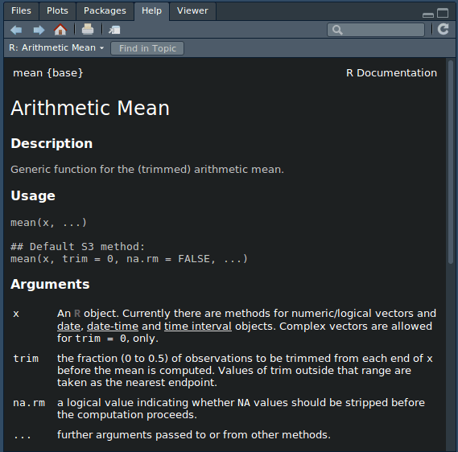

```{r setup, include=FALSE}
BioDataScience1::learnr_setup()
SciViews::R()
```

```{r, echo=FALSE}
BioDataScience1::learnr_banner()
```

```{r, context="server"}
BioDataScience1::learnr_server(input, output, session)
```

------------------------------------------------------------------------

## Objectif

Dans ce premier module, vous avez découvert plusieurs logiciels que vous utiliserez dans les cours de sciences des données. Ce tutoriel a pour objectif de vous permettre d’apprendre les bases du langage R afin de réaliser des tableaux et des graphiques dans vos futurs carnets de notes au format Quarto.

<!-- Vous avez réalisé un premier projet qui comprenait, entre autres, des instructions R. Vous avez en fait utilisé le langage R afin de réaliser des tableaux et des graphiques dans un carnet de notes au format Quarto. -->

```{r, out.width='50%'}

```

## Introduction

Regardez la vidéo ci-dessous.


[R](https://www.r-project.org/about.html) est un logiciel **open source** (ce qui signifie que le code source du logiciel est disponible sous une licence permissive) centré sur l'analyse de données. Le langage de programmation R qu'il implémente est mature et développé depuis 1993. Il prend ses sources dans le langage S (spécialement conçu pour les statistiques dans les années 1970). R permet, entre autres, la manipulation, la visualisation et l'application de calculs statistiques sur des données. C'est l'un des environnements les plus utilisés et les plus puissants pour l'analyse des données. Python est un autre langage très utilisé en science des données, mais il est moins facile à aborder pour un non-informaticien. Donc, étudier R sera un **investissement clé** pour votre future carrière de biologiste, car des données, vous en aurez tous à analyser dans votre travail !

**Éléments optionnels :** si vous voulez lire une analyse complète et objective (un peu longue, technique et en anglais) qui compare R à d'autres logiciels d'analyse des données, [suivez ce lien](http://r4stats.com/articles/popularity/). [Pourquoi R ?](https://www.infoworld.com/article/2940864/application-development/r-programming-language-statistical-data-analysis.html), un autre point de vue (toujours en anglais).

Ce tutoriel vous propose une suite d'activités pour apprendre les rudiments de R.

## R, une "calculette" scientifique

Vous pouvez tout d'abord employer R comme une calculatrice (ce qui est bien réducteur de la puissance de cet outil). Les opérations de base sont directement utilisables dans R.

| Opération      | Symbole | Exemple | Réponse de R |
|:---------------|:-------:|:-------:|:------------:|
| Addition       |   `+`   | `3 + 2` |   `[1] 5`    |
| Soustraction   |   `-`   | `3 - 2` |   `[1] 1`    |
| Multiplication |   `*`   | `3 * 2` |   `[1] 6`    |
| Division       |   `/`   | `3 / 2` |  `[1] 1.5`   |
| Puissance      |   `^`   |  `3^2`  |   `[1] 9`    |

**À noter :**

-   Les espaces au sein des instructions sont facultatifs, mais ils aèrent le code. C'est comme en français : sansespacesonlitnettementmoinsbien! Dans certains cas, il vaut mieux les omettre, comme pour `3^2` qui indique que cette opération est prioritaire sur les autres. `1 - 3^2` signifie `1 - (3^2)`, 3 est d'abord élevé au carré, et puis on soustrait cette valeur de un, et non `(1 - 3)^2`. De même, la multiplication et la division sont prioritaires sur l'addition et la soustraction tout comme en mathématique.

-   R retourne une réponse précédée de `[1]`. Nous verrons plus loin qu'il retourne en réalité un vecteur, même si ce vecteur ne contient qu'un seul élément. Le `[1]` indique la position dans le vecteur.

Voici un premier exemple d'instruction R tel qu'elle se présente dans les tutoriels (les instructions à rentrer dans R sont présentées dans des cadres gris) suivie de la réponse renvoyée par le logiciel (cadre blanc juste en dessous) :

```{r calculatrice, echo=TRUE}
3 + 2
```

À vous maintenant :

-   Multipliez les nombres `15` et `23` (un encadré **Code R** est une zone où vous pouvez vous-même entrer des instructions R et/ou les modifier. Les numéros à gauche sont les numéros de lignes. Ils ne font pas partie des instructions. Utilisez le bouton **Run Code** pour tester, et ensuite **Submit Answer** quand vous êtes satisfait de votre réponse).

*S'il est présent, le bouton **Solution** permet de visualiser le code qui est demandé. Essayez toujours de résoudre l'exercice par vous-même.* **Attention : si vous visualisez la solution, vous perdez automatiquement la moitié des points pour la question !**

```{r calcul1, exercise=TRUE}

```

```{r calcul1-solution}
15 * 23
```

```{r calcul1-check}
grade_result(
  pass_if(~ identical(.result, 15 * 23), "Vous venez d'écrire votre première instruction en R."),
  fail_if(~ TRUE, "Ce n'est pas vraiment la réponse que j'attendais. Revoyez comment écrire une multiplication en R plus haut dans cette page.")
)
```

*Les learnrs font appel partiellement à des outils de correction automatisée. Les messages qu'ils renvoient sont en anglais. Ne soyez donc pas étonnés du mélange anglais/français parfois. Surtout, si le message est sur fond rouge, lisez-le attentivement : il contient des informations utiles pour corriger votre réponse.*

Vous pouvez également utiliser des fonctions mathématiques directement implémentées dans R comme le logarithme népérien avec la fonction `log()`. Ce langage a été mis au point pour suivre les conventions des mathématiques et des statistiques comme le respect de l'ordre des opérations.

```{r, echo=TRUE}
log(4 + 5)
```

-   Calculez l'exponentielle (fonction `exp()`) de `23` moins `15`.

**Le bouton Hints** propose des aides pour vous guider dans l'exercice. Il se peut que la dernière aide soit la solution (cela sera indiqué dans l'aide précédente afin d'éviter de perdre des points en l'affichant de manière malencontreuse). Toute aide affichée fait perdre 10% de la note pour l'exercice. Encore une fois, essayez d'abord de trouver la réponse par vous-même.

```{r calcul2_h2, exercise=TRUE}

```

```{r calcul2_h2-hint}
# Vous pouvez imbriquer les calculs avec les fonctions
# comme vous le faites avec les opérateurs mathématiques

## Attention : solution dans le 'hint' suivant!
```

```{r calcul2_h2-solution}
## Solution ##
exp(23 - 15)
```

```{r calcul2_h2-check}
grade_result(
  pass_if(~ identical(.result, exp(23 - 15)), "Vous avez compris le principe."),
  fail_if(~ TRUE, "Ce n'est pas la bonne réponse.")
)
```

## Les assignations

Effectuer des calculs, c'est bien... pouvoir sauvegarder et réutiliser les résultats, c'est encore mieux. L'action qui consiste à associer un résultat à un nom s'appelle une **assignation**. L'instruction correspondante dans R symbolise une flèche indiquant le sens de l'assignation (`<-`, soit l'assemblage du signe plus petit que `<` et du signe moins `-`). Par exemple :

```{r assignation, echo=TRUE}
a <- 5
b <- 4 + 3
# Réutilisation : addition de la valeur de a et de b
a + b # Somme de a et b
```

Notez aussi que tout ce qui suit un dièse (`#`) sur une même ligne dans R est considéré comme un **commentaire**. Ce commentaire n'est pas interprété par le programme. Servez-vous-en pour documenter vos instructions !

**À retenir :**

-   Vous pouvez aussi voir et gérer vos objets dans l'onglet "**Environment**" de RStudio lorsque plus tard vous travaillerez dans ce logiciel.



-   Les noms reconnus par R doivent commencer par une lettre ou le point `.`, et être suivis de lettres, chiffres, point ou trait souligné `_`.

    -   Exemple de noms corrects : `a`, `a1`, `vec`, `vec_max`, `.vec`, `A`.
    -   Exemple de noms incorrects : `1a`, `_a`, `vec max`, `vec-max`.

-   Évitez d'utiliser des caractères accentués dans les noms, même si ici ce n'est pas une règle absolue.

-   R fait la différence entre majuscules et minuscules : `x` est différent de `X`. **Je répète : R fait la différence entre majuscules et minuscules dans les noms !**

-   Un nom commençant par un point sera "caché" (non visible dans l'onglet "**Environment**" de RStudio).

-   Utilisez des noms courts, mais représentatifs du contenu de l'objet. Si possible, séparez les mots par un trait souligné (`_`) et utilisez uniquement des lettres minuscules. On a coutume d'utiliser des noms anglais, car cela facilite l'échange de code avec des collègues internationaux (oui, ça vous arrivera... donc, prenez directement de bonnes habitudes).

    -   Exemples corrects : `x`, `v1`, `initial_date`, `final_date`, `elapsed_time`.
    -   Exemples incorrects : `toto`, `Toto2`, `FinalDate`, `fd` or `FD` or `fi_dat` (pour final date), `date_finale`, `laatse_datum`.

À vous de jouer !

-   Assignez à `a` la valeur `18`.

-   Assignez à `b` la division de `12` par `14`.

-   Multipliez ensuite `a` par `b`.

```{r assig1, exercise=TRUE, exercise.lines=7}
# Assignation à a
a <- ___
# Assignation à b
___
# Multiplication de a par b
___
```

```{r assig1-solution}
# Assignation à a
a <- 18
# Assignation à b
b <- 12 / 14
# Multiplication de a par b
a * b
```

```{r assig1-check}
grade_code("C'est cela. La flèche `<-` comme opérateur d'assignation dans R aide à comprendre que la valeur est attribuée au nom en indiquant le sens de l'assignation.")
```

*Les aides peuvent être circonstanciées, mais le code que vous écrirez doit correspondre strictement à ce qui est demandé. Quelquefois, des suggestions vous guident et les marques `___` indiquent des zones à compléter dans ces suggestions. Utilisez le bouton **Start Over** pour revenir à la suggestion de départ à tout moment.*

Dans R, et contrairement à une calculatrice de poche, vous pouvez rassembler divers éléments de même nature dans un **vecteur**. C'est la fonction `c()` qui s'en charge :

```{r vecteur, echo=TRUE}
v1 <- c(2, 5, 8, 11, 13, 16)
v1
# NA indique une valeur manquante ('not available')
v2 <- c(2, 5, NA, 11, 13, 16)
v2
# Aussi avec des chaînes de caractères (entre guillemets)
v3 <- c("noir", "jaune", "rouge")
v3
```

**Astuce :**

-   Pour créer un vecteur d'une séquence continue de nombre, tel 2, 3, 4, 5, vous pouvez utiliser l'opérateur `:` en plaçant le nombre initial de la série devant et le nombre final derrière.

```{r serie, echo=TRUE}
# La série
c(2, 3, 4, 5)
# peut s'écrire plus facilement comme ceci
2:5
# Aussi dans l'autre sens !
5:2
```

Vous constatez que R ne renvoie rien en cas d'assignation. C'est un comportement normal. Si vous voulez voir le contenu d'un objet à tout moment, il suffit d'entrer son nom comme instruction. Exemple :

```{r vecteur2, echo=TRUE}
# Entrer le nom d'un objet pour que R vous montre ce qu'il contient
v1
```

Maintenant que vous avez compris comment réaliser une assignation, à votre tour...

-   Assignez à `v4` les valeurs `15` , `19`, une valeur manquante (`NA`) et `13`.

-   Assignez à `v5` la multiplication de `v4` par `6`.

-   Terminez par une instruction pour affichez les valeurs contenues dans `v5`.

```{r vec1, exercise=TRUE, exercise.lines=7}
# Assignation des valeurs à v4
v4 <- ___
# Multipliez v4 par 6 et assignez-le à v5
___
# Affichez le résultat contenu dans v5
___
```

```{r vec1-solution}
# Assignation des valeurs à v4
v4 <- c(15, 19, NA, 13)
# Multipliez v4 par 6 et assignez-le à v5
v5 <- v4 * 6
# Affichez le résultat contenu dans v5
v5
```

```{r vec1-check}
grade_code("Les assignations n'ont manifestement plus de secrets pour vous.")
```

**Commentaires :**

-   Les calculs et beaucoup de fonctions sont dits *vectorisés* dans R. C'est-à-dire que les calculs se répartissent naturellement élément par élément lorsqu'un ou plusieurs vecteurs de longueur supérieure à un sont fournis. Ainsi, `v4 * 6` effectue naturellement la multiplication par six à *chacun* des quatre éléments de `v4`.

-   Un calcul effectué sur une ou plusieurs valeurs manquantes `NA` a lui-même pour résultat une valeur manquante `NA`.

**Astuce :**

-   Il est possible de combiner une assignation et l'impression du contenu de l'objet en une seule ligne. Il suffit de mettre l'assignation entre parenthèses :

```{r vecteur3, echo=TRUE}
# Assigner et imprimer le contenu en use seule instruction
(v4 <- c(15, 19, NA, 13))
```

## Les fonctions

Les fonctions sont très importantes dans R. C'est elles qui effectuent tous nos calculs. Pour appeler une fonction, on utilise son nom suivi d'une parenthèse, et éventuellement un ou plusieurs arguments fournis à l'intérieur de la parenthèse et séparés par une virgule `fun_name(arg1, arg2, ...)`. Voici un exemple d'une fonction appelée sans argument :

```{r fun1, echo=TRUE}
Sys.Date()
```

Une autre fonction appelée avec un seul argument :

```{r fun2, echo=TRUE}
x <- 1:4
sum(x)
```

Pour déterminer les arguments que comprend une fonction, on peut utiliser `args()` :

```{r fun3, echo=TRUE}
args(sum)
args(mean)
```

Lorsque vous voyez `...`, cela signifie que la fonction accepte un nombre variable d'arguments à cet endroit. Sinon, les arguments portent des noms (`x` dans la fonction `mean()`, `na.rm` à l'intérieur de la fonction `sum()`). Dans la définition de fonction, un argument peut avoir une valeur par défaut. Par exemple dans `sum()`, `na.rm` prend la valeur `FALSE` par défaut. Lorsque c'est le cas, l'argument est facultatif dans l'appel (ne doit pas être indiqué si la valeur par défaut vous convient).

Lors de l'appel d'une fonction, si le nom des arguments n'est pas précisé, R associe les arguments dans l'ordre dans lequel ils sont fournis. Si un nom est donné (`argument = valeur`) alors, la valeur est associée à l'argument qui porte ce nom, quel que soit l'endroit où il se trouve dans la définition de la fonction. On peut mélanger les deux formes, par exemple, `sum(1:4, na.rm = TRUE)`. Généralement on ne nomme pas le premier ou les deux premiers arguments, mais bien ceux qui suivent.

**Piège :**

-   Il existe des fonctions dites **génériques** qui peuvent prendre différentes formes en fonction de la nature des arguments. `mean()` est une fonction générique. Dans ce cas-là, `args()` ne renvoie pas toujours la totalité des arguments utilisables. Par exemple, `mean()` accepte aussi l'argument `na.rm`. Nous le verrons plus loin.

-   Calculez la moyenne du vecteur `v4` en utilisant la fonction `mean()`.

```{r vec2, exercise=TRUE, exercise.lines=4}
# Assignation des valeurs à v4
v4 <- c(15, 19, NA, 13)
# Moyenne du vecteur
___
```

```{r vec2-solution}
# Assignation des valeurs à v4
v4 <- c(15, 19, NA, 13)
# Moyenne du vecteur
mean(v4)
```

```{r vec2-check}
grade_code("C'est cela : les fonctions génériques s'utilisent comme les autres, mais faites bien attention aux différentes formes possibles (que l'on appelle les **méthodes** de la fonction) !")
```

Certaines fonctions servent à **résumer** un ensemble de données, c'est-à-dire qu'elles les représentent avec une seule ou un petit nombre de valeurs. Ainsi, quelle que soit la taille du vecteur `v4`, sa moyenne est toujours un nombre unique. Ici, nous avons obtenu `NA`. Nous savons pourquoi. Les valeurs manquantes sont **contaminantes** dans les calculs. Il en suffit d'une seule pour que l'ensemble du résultat soit `NA`. Naturellement dans ce cas, c'est dommage, car la moyenne pourrait être *estimée* sur base des trois autres valeurs connues. L'argument `na.rm` permet de le faire... mais comment le savoir ? En lisant **la page d'aide de la fonction**. Pour cela, utilisez l'opérateur `?` suivi du nom de la fonction. Dans RStudio, la page d'aide apparaît dans l'onglet **Aide** ou \*Help\*\* (selon que l'interface de RStudio soit en français ou en anglais, voir copie d'écran ci-dessous).

```{r, eval=FALSE, echo=TRUE}
?mean
```

<center></center>

Dans la section **Usage** de l'aide, on découvre la forme générique renvoyée par `args()` plus avant. La **méthode** par défaut est renseignée ensuite. C'est en fait la forme qui est réellement utilisée dans notre cas. Nous découvrons qu'elle accepte deux arguments supplémentaires : `trim` et `na.rm`.

**Astuce :**

-   Dans RStudio, il est encore bien plus facile de placer le curseur sur le nom de la fonction dans le code et d'appuyer sur la touche `F1` pour faire apparaître sa page d'aide.

Plus loin dans la page d'aide, on peut lire que l'argument `na.rm =` détermine si les valeurs manquantes sont éliminées du vecteur avant calcul ou non ("**na** **r**e**m**ove"). Comme vous pouvez le voir dans la page d'aide, cet argument prend la valeur `FALSE` par défaut. Cela signifie que les valeurs manquantes ne sont **pas** éliminées par défaut. Mais il est possible d'indiquer `na.rm = TRUE` pour changer le calcul et obtenir quand même une estimation de moyenne en présence de valeurs manquantes (les constantes `TRUE` et `FALSE`, toujours en majuscules, sont les valeurs logiques dans R -objects `logical`- voulant dire "vrai" ou "faux").

-   Calculez la moyenne du vecteur `v4` à nouveau, mais cette fois-ci, en ignorant la valeur manquante dans le calcul.

```{r vec3, exercise=TRUE, exercise.lines=4}
# Assignation des valeurs à v4
v4 <- c(15, 19, NA, 13)
# Moyenne du vecteur, avec élimination des NAs
___
```

```{r vec3-solution}
# Assignation des valeurs à v4
v4 <- c(15, 19, NA, 13)
# Moyenne du vecteur, avec élimination des NAs
mean(v4, na.rm = TRUE)
```

```{r vec3-check}
grade_code("Vous avez bien compris la façon de traiter les valeurs manquantes à l'aide de l'argument `na.rm =`.")
```

Vous obtenez cette fois-ci la réponse souhaitée.

> La prise en charge des valeurs manquantes de manière fine est une caractéristique importante de tout logiciel d'analyse de données digne de ce nom. Notez, par exemple, qu'Excel (un logiciel qui traite des tableaux) **n'est pas** capable de le faire de manière aussi fine que R !

## Fonctions statistiques "fast"

Dans le dialecte `SciViews::R` (qui nécessite donc cette instruction en toute première ligne pour se configurer comme tel), nous utiliserons une famille de fonctions alternatives qui servent à résumer des données, comme le calcul de la moyenne. Ces fonctions statistiques sont appelées "fast" parce qu'elles calculent plus rapidement que les fonctions équivalentes de R de base, mais elles ont aussi d'autres propriétés intéressantes que vous découvrirez plus tard. Ces fonctions portent le même nom que la version plus classique, mais préfixée d'un "f". Ainsi, l'équivalent de `mean()` en fonction statistique "fast" est `fmean()`. Une particularité de ces fonctions est d'inverser la convention pour la valeur par défaut de l'argument `na.rm=` qui vaut ici `TRUE` si non précisé. Ainsi, dans notre exemple de la moyenne de `v4` qui contient une valeur manquante, vous pourrez simplement écrire avec `fmean()` :

```{r, echo=TRUE}
SciViews::R # À n'écrire qu'une seule fois en début de script
# Assignation des valeurs à v4
v4 <- c(15, 19, NA, 13)
# Moyenne du vecteur, avec élimination des NAs
fmean(v4)
```

Naturellement, rien ne vous empêche d'être plus explicite et d'indiquer `na.rm = TRUE` quand même, et cela ne changera rien au calcul effectué. Ici, avec un si petit vecteur, le calcul est tellement rapide que vous ne vous rendez pas compte de la différence de vitesse. Lorsque vous aurez des bien plus gros jeux de données, alors les fonctions "fast" deviendront réellement intéressantes. Pour lister ces fonctions statistiques "fast" vous faites :

```{r, echo=TRUE}
list_fstat_functions()
```

## Imbrication et chaînage

Vous pouvez utiliser un appel de fonction partout dans une instruction, à la même place que vous utiliseriez un nom ou une valeur. Par exemple :

```{r, fun-astuces, echo=TRUE}
x <- 2:5
x_mean <- mean(x)
x_sd <- sd(x) # sd() calcule l'écart type, un autre descripteur statistique
10 - x_mean / x_sd
# Le même calcul avec appel de fonctions incluses
10 - mean(x) / sd(x)
```

Plus fort, on peut **imbriquer** des fonctions dans des fonctions :

```{r, fun-astuces2, echo=TRUE}
x <- 2:5
x_mean <- mean(x)
log_x_mean <- log(x_mean)
round(log_x_mean, digits = 3) # Arrondi à la 3ème décimale
# Le même calcul en imbriquant les appels de fonctions
round(log(mean(x)), digits = 3)
```

Mais dans ce dernier cas, la lecture devient plus difficile. On peut aussi **chaîner** des instructions avec l'opérateur `%>.%` dans la version `SciViews::R` qui charge des "packages" supplémentaires pour fournir des fonctions en plus de R de base :

```{r, fun-astuces3, echo=TRUE}
# Utiliser l'extension SciViews::R
SciViews::R
# Chaîner les calculs mean() -> log() -> round()
x <- 2:5
mean(x) %>.%
  log(.) %>.%
  round(., digits = 3)
```

-   Le chaînage crée une instruction unique qui effectue un calcul plus complexe, décomposé étape par étape.
-   On indique un point `.` à la place où le résultat précédent doit être inséré dans la fonction.
-   Le chaînage est bien plus lisible que l'imbrication au-delà de deux niveaux. En effet, si vous lisez l'instruction chaîne à voix haute en disant "ensuite" pour `%>.%` cela donne : "je prends la moyenne de `x` ensuite le logarithme, ensuite j'arrondis à trois chiffres derrière la virgule". C'est parfaitement clair, non ?

Un petit exercice, maintenant :

-   Créez un vecteur `x` qui contient `13`, `19`, `NA` et `21`,

-   Calculez le logarithme de `x`,

-   **Ensuite**, calculez-en la moyenne, en écartant les valeurs manquantes,

-   **Ensuite**, arrondissez le nombre obtenu à deux décimales

```{r chain, exercise=TRUE, exercise.lines=8}
SciViews::R
# Assignation des valeurs à x
x <- c(___)
# Chaînez vos calculs de moyenne du log(x) arrondie à 2 décimales
log(x) ___
  ___
  ___
```

```{r chain-solution}
SciViews::R
# Assignation des valeurs à x
x <- c(13, 19, NA, 21)
# Chaînez vos calculs de moyenne du log arrondie à 2 décimales
log(x) %>.%
  mean(., na.rm = TRUE) %>.%
  round(., digits = 2)
```

```{r chain-check}
grade_code("C'est exactement cela. Le chaînage des opérations rend le code bien plus lisible.")
```

On retrouve plusieurs opérateurs de pipe dans R. Par exemple, l'opérateur de pipe de R de base est `|>`. Il s'utilise de façon similaire, sauf que le membre de gauche est injecté comme premier argument dans la fonction à droite, et il ne faut pas (et même, on ne peut pas) indiquer où le mettre à l'aide du point `.`. Voici, à titre d'illustration, trois fois la même instruction, écrite en imbriquant les fonction, puis avec `%>.%`, et enfin, avec `|>`.

```{r, echo=TRUE}
x <- 1:5
# Fonctions imbriquées
mean(log(x), na.rm = TRUE)
# Pipe %>.%
log(x) %>.% # On va généralement à la ligne ici
  mean(., na.rm = TRUE) # Le point indique où placer "log(x)"
# Pipe |>
log(x) |> mean(na.rm = TRUE) # Pas de point ici !
```

## Conclusion


Bravo ! Vous venez de terminer cette séance d'exercices dans un tutoriel "learnr".

Durant cette séance, vous avez appris à :

-   Effectuer des calculs dans R
-   Créer des vecteurs et vectoriser vos calculs
-   Assigner les résultats à des noms
-   Employer des fonctions, préciser leurs arguments et accéder à leurs pages d'aide
-   Manipuler les valeurs manquantes, et les calculs en leur présence
-   Imbriquer et chaîner des instructions

**Cela fait beaucoup de notions à apprendre et retenir d'un seul coup.** Mais rassurez-vous, avec la pratique, cela deviendra une habitude. Vous pouvez aussi revenir dans ce tutoriel un peu plus tard pour approfondir votre connaissance des bases du langage R.

**Pour aller plus loin...**

-   [Ce tutoriel](https://tutorials.shinyapps.io/04-Programming-Basics/) (en anglais), explique avec plus de détails les fonctions, les arguments et les vecteurs dans R.

```{r comm_noscore, echo=FALSE}
question_text(
  "Laissez-nous vos impressions sur ce learnr",
  answer("", TRUE, message = "Pas de commentaires... C'est bien aussi."),
  incorrect = "Vos commentaires sont enregistrés.",
  placeholder = "Entrez vos commentaires ici...",
  submit_button = "Soumettre une réponse",
  try_again_button = "Resoumettre une réponse",
  allow_retry = TRUE
)
```
