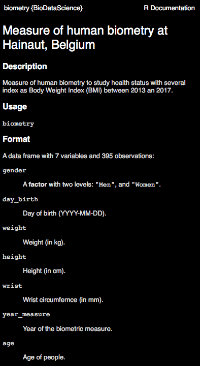
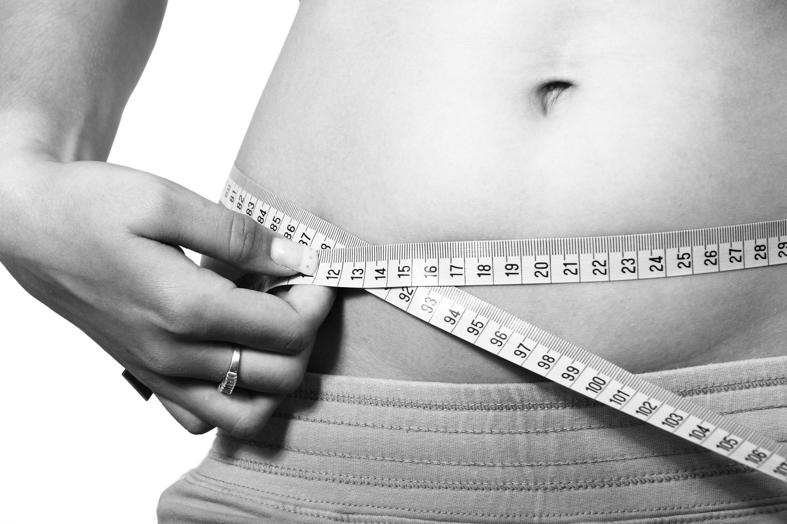

```{r setup, include=FALSE}
BioDataScience1::learnr_setup()
SciViews::R(lang = "fr")
library(BioDataScience)
```

```{r, echo=FALSE}
BioDataScience1::learnr_banner()
```

```{r, context="server"}
BioDataScience1::learnr_server(input, output, session)
```

------------------------------------------------------------------------

## Objectif

Dans le tutoriel précédent, vous avez appris les bases du langage R. Vous avez entre autres effectué des calculs, utilisé des fonctions ou encore assigné des résultats. Ce tutoriel va vous permettre d'utiliser le logiciel R pour résoudre une question biologique sur l'obésité. Vous serez guidé tout au long de ce travail.

```{r, out.width = "50%"}
knitr::include_graphics(path = "images/Rlogo.png")
```

## Introduction

Dans ce tutoriel, nous utiliserons ensemble R pour résoudre une question biologique à travers l'analyse d'un jeu de données concernant la biométrie humaine.

### Manipuler

En partant d'un tableau de données relatif à de la biométrie humaine contenant 395 observations et sept variables :

```{r, echo=TRUE, warning=FALSE}
# Chargement de SciViews::R
SciViews::R(lang = "fr")
# Importation du jeu de données
biometry <- read("biometry", package = "BioDataScience")
# Affichage des 10 premières lignes du tableau
tabularise(biometry, max.rows = 10)
```

**Notez ceci :**

-   Les encadrés gris dénotent des instructions entrées dans R. Si ce dernier renvoie des résultats, ils sont présentés dans des encadrés blancs juste en dessous.

-   Toujours commencer par l'instruction `SciViews::R()` pour installer les différents outils (rassemblés dans des extensions du programme, appelées "packages" R) dont nous aurons besoin. Cette instruction peut comprendre des arguments comme `lang = "fr"`. Cet argument va avoir pour effet de définir le français comme langue par défaut (là où cela est supporté).

-   L'anglais est la langue la plus employée en science des données. Les jeux de données employés sont encodés en anglais. En définissant le français comme langue par défaut, si une traduction est disponible, certains graphiques et tableaux que l'on va réaliser auront automatique des labels en français.

-   Le jeu de données est disponible dans un "package" R (un package est une sorte d'"addin" pour R qui apporte de nouvelles fonctions et de nouveaux jeux de données à votre environnement de travail) : {BioDataScience}, spécialement préparé pour ce cours. Notez que le nom des packages est présenté toujours entre accolades.

-   La fonction `read()` permet de lire les données issues du package {BioDataScience}. La fonction `tabularise()` a pour objectif de formater correctement un tableau (et bien plus encore. Vous le découvrirez tout à long de ce cours).

Le point d'interrogation devant notre jeu de données renvoie vers une page d'aide, tout comme pour les fonctions.

```{r, eval = FALSE, echo = TRUE}
?biometry
```



Nous commençons par sélectionner des colonnes d'intérêt du tableau initial `biometry`.

```{r, echo=TRUE}
bio <- sselect(biometry, -day_birth, -wrist, -year_measure)
```

**Notez ceci :**

Nous réalisons cette sélection avec la fonction `sselect()` en éliminant des colonnes du tableau que nous n'utiliserons pas (les variables `day_birth`, `wrist` et `year_measure`). Le résultat de cette fonction est assigné à `bio` grâce à l'opérateur d'assignation `<-` déjà vu dans le tutoriel précédent.

Utilisons la fonction `tabularise()` du package {tabularise} maintenant pour présenter les huit premières lignes de notre jeu de données.

```{r, echo=TRUE, warning=FALSE}
tabularise(bio, max.rows = 8)
```

**Notez ceci :**

Le "pipe" `%>.%` (prononcez "païpe" comme en anglais) et le chaînage que nous avons également découvert à la fin du précédent tutoriel sont employés dans les instructions ci-dessus.

Considérons maintenant uniquement les femmes. On peut filtrer les lignes d'un tableau de données en utilisant comme critère `gender == "W"` (**attention :** notez bien que dans un *test de condition*, l'égalité s'écrit avec **deux** signes égaux dans R). Les autres options sont : `!=` pour différent de, `>` pour plus grand que, `<` pour plus petit que, ainsi que `>=` ou `<=` pour plus grand ou égale et plus petit ou égal.

```{r, echo=TRUE, warning=FALSE}
bio %>.%
  sfilter(., gender == "W") %>.%
  tabularise(., max.rows = 8)
```

Continuons à manipuler notre tableau en sélectionnant des colonnes et en filtrant les lignes en une seule opération. Pour sélectionner les femmes `gender == "W"` et retirer la colonne `age`, nous utiliserons :

```{r, echo=TRUE, warning=FALSE}
bio %>.%
  sfilter(., gender == "W") %>.% # Sélectionne les femmes
  sselect(., -age) %>.% # Retire la colonne âge
  tabularise(., max.rows = 8)
```

Maintenant que nous avons vu comment lire, remanier et présenter des tableaux de données dans R (nous reviendrons sur ces notions plus tard), nous pouvons explorer ses potentialités pour réaliser des graphiques à la section suivante...

### Visualiser

Voici quelques exemples de graphiques réalisés avec R, sur notre jeu de données portant sur la biométrie humaine :

-   Le graphique en barres nous montre que le nombre d'hommes et de femmes est similaire.

```{r, echo=TRUE}
chart(data = biometry, ~ gender %fill=% gender) +
  geom_bar(show.legend = FALSE) +
  labs(y = "Dénombrement")
```

-   Les histogrammes nous montrent que les personnes interrogées forment deux groupes. L'un est proche de la vingtaine et le second de la cinquantaine.

```{r, echo=TRUE}
chart(data = biometry, ~ age %fill=% gender | gender) +
  geom_histogram(bins = 25) +
  labs(y = "Dénombrement")
```

-   Les graphiques en violon couplés avec des boites de dispersion montrent que les hommes sont plus grands et plus lourds que les femmes dans notre jeu de données.

```{r, echo=TRUE}
a <- chart(data = biometry, height ~ gender %fill=% gender) +
  geom_violin(show.legend = FALSE, alpha = 0.4)  +
  geom_boxplot(width = 0.1, show.legend = FALSE)

b <- chart(data = biometry, weight ~ gender %fill=% gender) +
  geom_violin(show.legend = FALSE, alpha = 0.4)  +
  geom_boxplot(width = 0.1, show.legend = FALSE)

combine_charts(list(a, b))
```

-   Le nuage de points nous montre la variation de la taille en fonction de la masse.

```{r, echo=TRUE}
chart(data = biometry, height ~ weight %col=% gender) +
  geom_point()
```

Avez-vous remarqué la ressemblance dans la syntaxe employée pour réaliser un graphique en barres, un histogramme, un graphique en violon ou encore un nuage de points ? Nous utilisons la fonction `chart()` à chaque fois. On commence par lui fournir le tableau de données à employer avec `data =`, puis une "formule", c'est-à-dire une description de type `y ~ x` ... avec le tilde `~` qui caractérise cet objet formule. Si on reprend le nuage de points réalisé, on utilise le tableau `biometry` pour réaliser un graphique de la hauteur en fonction (symbolisé par le tilde `~` donc) de la masse. On spécifie que ce graphique est un nuage de points grâce à `geom_point()`. La formule peut être plus complexe si on souhaite ajouter des éléments en plus (comme différencier le genre des personnes grâce à la couleur). Le `+`permet d'ajouter des couches sur le graphique. En résumé, on aura la structure ci-dessous. La fonction `geom_...()` va varier en fonction du type de graphique à réaliser : `geom_point()` (un nuage de points), `geom_bar()` (un graphique en barres), `geom_histogram()` (un histogramme), `geom_boxplot()` (une boite de dispersion)... Si toute cette terminologie vous est étrangère, n'ayez crainte, nous l'étudierons progressivement. Retenez simplement à ce stade qu'il s'agit de types différents de graphiques. Nous pouvons donc résumer le canevas général comme suit (avec les items en lettres majuscules à replacer selon le contexte) :

```{r, echo=TRUE, eval=FALSE}
chart(data = DF, FORMULA) +
  geom_TYPE()
```

**Ceci n'est qu'un aperçu des possibilités que propose R, vous en découvrirez une partie lors des cours de science de données.**

Après une partie plus descriptive, c'est à vous de jouer !

## L'obésité

Plusieurs médias publient ou ont publié récemment des articles avec des titres accrocheurs comme obésité, le mal du siècle, [13% de la population adulte mondiale est obèse, 20% pourraient l'être en 2025](https://www.lemonde.fr/sante/article/2016/04/01/13-de-la-population-adulte-mondiale-est-obese-20-pourrait-bientot-l-etre_4893671_1651302.html) ou encore [obésité et malnutrition, fléaux du XXI^e^ siècle](http://www.natura-sciences.com/sante/obesite-malnutrition.html). Ils se basent sur plusieurs déclarations de l'Organisation Mondiale de la Santé (OMS) indiquant que la lutte contre l'obésité sera l'un des défis majeurs pour la santé publique au 21^e^ siècle. L'OMS estime que 1,5 milliard de personnes sont en surpoids actuellement et ce chiffre augmentera si rien ne change.

{width="50%"}

Une multitude d'indicateurs pour quantifier l'excédent de poids ont été employés au cours du temps ( [formule de Lorentz](https://www.calculersonimc.fr/autres-calculs/poids-ideal-lorentz.html), [formule de Creff](https://www.calculersonimc.fr/autres-calculs/poids-ideal-creff.html) ou encore [formule de Broca](https://www.calculersonimc.fr/autres-calculs/poids-ideal-broca.html)). Actuellement, c'est l'indice de masse corporelle (**IMC**, ou encore *BMI* en anglais) qui est l'indicateur le plus employé. La formule est la suivante :

$$imc\ [kg/m^2] = \frac{masse\ [kg]}{taille [m]^2}$$

ou encore en anglais (puisque le nom des variables est en anglais dans notre jeu de données) :

$$bmi\ [kg/m^2] = \frac{weight\ [kg]}{height\ [m]^2}$$

Une fois la valeur de l'IMC obtenue, il faut la comparer au tableau ci-dessous pour connaitre son état de santé.

| IMC (kg/m2)      |          Interprétation (selon l'OMS)           |
|:-----------------|:-----------------------------------------------:|
| Inférieur 18.5   |      Sous-poids (en anglais `underweight`)      |
| Entre 18.5 et 25 | Corpulence normale (en anglais `normal weight`) |
| Entre 25 et 30   |       Surpoids (en anglais `overweight`)        |
| Supérieur à 30   |          Obésité (en anglais `obese`)           |

Nous allons maintenant avancer pas à pas dans cette première analyse avec R. Le but est de calculer l'IMC (qui sera dans la variable `bmi`), et puis de visualiser comment cet indice se répartit dans la population étudiée.

## Calcul de l'IMC

Les observations relatives à la première personne mesurée se présentent comme ceci dans le jeu de données :

| id  | gender | weight [kg] | height [cm] |
|:---:|:------:|:-----------:|:-----------:|
|  1  |   W    |     50      |     170     |

Rappelez-vous de la formule qui est :

$$bmi\ [kg/m^2] = \frac{weight\ [kg]}{height\ [m]^2}$$

Rappelez-vous aussi que vous pouvez employer les opérations mathématiques de base dans R. Elles respectent l'ordre de priorité des opérateurs mathématiques. Au besoin, il est possible d'indiquer explicitement, ou de modifier les priorités avec des parenthèses comme `3 * (2 + 1)`.

| Opérations de base | Symboles |
|:-------------------|:--------:|
| addition           |   `+`    |
| soustraction       |   `-`    |
| division           |   `/`    |
| multiplication     |   `*`    |
| puissance          |   `^`    |

La formule mathématique se traduit donc comme suit en une instruction que R peut utiliser :

```{r id1_imc, echo=TRUE}
50 / (170/100)^2
```

Nous avons dû diviser la taille par 100 car elle est donnée en centimètres alors que nous devons l'avoir en mètres. Rappelez-vous également que R indique un `[1]` devant la réponse. En fait, R travaille avec des vecteurs (même si ici, le vecteur ne contient qu'un seul élément). Ainsi, le nombre entre crochets devant indique la position dans le vecteur. Ce calcul sur vecteurs nous sera très utile lorsque nous traiterons l'ensemble du tableau. En effet, le même calcul sera *automatiquement distribué* sur tous les individus !

L'IMC de cette femme indique qu'elle est en **sous-poids** selon l'échelle de l'OMS.

Réalisez maintenant par vous-mêmes le calcul sur notre deuxième individu :

| id  | gender | weight [kg] | height [cm] |
|:---:|:------:|:-----------:|:-----------:|
|  2  |   M    |     93      |     191     |

*L'espace ci-dessous est une zone où vous pouvez entrer du code R. Le bouton `Run Code` permet ensuite de l'exécuter et de visualiser le résultat. Vous pouvez modifier autant de fois qu'il faut l'expression, et utiliser plusieurs fois `Run Code`. Lorsque vous êtes satisfait du résultat, cliquez sur `Submit Answer`. Dans les tutoriels, la `Solution` est également accessible, mais faites l'exercice par vous-même d'abord ! Dans les tests, vous n'y aurez pas accès, évidemment.*

Calculez l'IMC de l'homme ci-dessus de 191 cm et de 93 kg.

```{r id2_imc, exercise=TRUE}

```

```{r id2_imc-solution}
## Solution ##
93 / (191/100)^2
```

```{r id2_imc-check}
grade_code("Vous venez de définir l'indice de masse corporelle de cet homme. Il est en surpoids selon l'échelle de l'OMS")
```

## Calcul de l'IMC sur plusieurs individus

Vous vous retrouvez rapidement avec cinq nouveaux individus, femmes et hommes.

| id  | gender | weight [kg] | height [cm] |
|:---:|:------:|:-----------:|:-----------:|
|  3  |   W    |     69      |     174     |
|  4  |   W    |     49      |     155     |
|  5  |   W    |     75      |     169     |
|  6  |   W    |     66      |     179     |
|  7  |   W    |     54      |     168     |

Le calcul un à un de l'IMC de chaque individu deviendra très rapidement fastidieux. Nous allons créer des **vecteurs** contenant plusieurs nombres en les **concaténant** avec la fonction `c()`. Nous utiliserons aussi l'assignation `<-` pour conserver le résultat du calcul dans un objet nommé (comme `weight_w` ci-dessous) :

```{r, echo=TRUE}
# Assignation des valeurs de masses dans un vecteur nommé `weight_w`
weight_w <- c(69, 49, 75, 66, 54)
# Assignation des valeurs de tailles dans un vecteur nommé `height_w`
height_w <- c(174, 155, 169, 179, 168)
# Transformation du vecteur `height_w` de centimètre en mètre 
height_w <- height_w / 100
# Calcul de l'IMC/BMI
weight_w / height_w^2
```

**Important :**

-   Choisissez bien les noms de vos objets. Ces noms doivent être courts, mais informatifs sur leur contenu.

-   Rappelez-vous que des noms acceptables commencent par une lettre, et comportent ensuite des lettres, chiffres, le trait souligné `_` ou le point `.`, mais évitez, si possible, le point qui a une signification particulière dans divers contextes.

-   Comme il est difficile de mémoriser la casse d'un nom, il est conseillé d'utiliser uniquement des lettres minuscules.

-   Si le nom est constitué de plusieurs mots, il est préférable de séparer ces mots par un trait souligné. Pour rappel, l'espace n'est pas utilisable. Par exemple, `tour_de_poignet`.

-   Éviter d'utiliser des caractères accentués.

-   Si possible, utilisez des noms en anglais. Certainement si votre travail sera échangé avec d'autres scientifiques en international... mais c'est une bonne habitude à prendre même sur votre propre code. Pour reprendre l'exemple précédent `wrist_circumference`

Réalisez les mêmes opérations sur les individus 8 à 12 qui sont des hommes.

| id  | gender | weight [kg] | height [cm] |
|:---:|:------:|:-----------:|:-----------:|
|  8  |   M    |     82      |     174     |
|  9  |   M    |     73      |     186     |
| 10  |   M    |     105     |     203     |
| 11  |   M    |     61      |     172     |
| 12  |   M    |     95      |     190     |

```{r vec_imc_h2, exercise=TRUE}
# Assignation des valeurs de masses dans un vecteur nommé `weight_m`
weight_m <- c(___)
# Assignation des valeurs de tailles dans un vecteur nommé `height_m`
height_m <- ___
# Transformation du vecteur `height_m` de centimètre en mètre 
height_m <- height_m / 100
# Calcul de IMC
___
```

```{r vec_imc_h2-hint-1}
# Assignation des valeurs de masses dans un vecteur nommé `weight_m`
weight_m <- c(82, 73, 105, 61, 95)
# Assignation des valeurs de tailles dans un vecteur nommé `height_m`
height_m <- ___
# Transformation du vecteur `height_m` de centimètre en mètre 
height_m <- ___
# Calcul de IMC
weight_m / height_m^2

#### Attention : solution dans le 'hint' suivant! ####
```

```{r vec_imc_h2-solution}
## Solution ##
# Assignation des valeurs de masses dans un vecteur nommé `weight_m`
weight_m <- c(82, 73, 105, 61, 95)
# Assignation des valeurs de tailles dans un vecteur nommé `height_m`
height_m <- c(174, 186, 203, 172, 190)
# Transformation du vecteur `height_m` de centimètre en mètre 
height_m <- height_m / 100
# Calcul de IMC
weight_m / height_m^2
```

```{r vec_imc_h2-check}
grade_code("Vous obtenez les cinq valeurs d'IMC en une seule fois avec l'utilisation de vecteurs.")
```

## Encodage d'un tableau de données

Il devient rapidement évident qu'il est plus simple que nos observations de terrain soient rassemblées en un jeu de données structuré. Pour cela vous allez créer ce qu'on appelle un objet **data.table** (qui se traduit en français par "tableau de données") dans R. La fonction qui permet de le créer dans `SciViews::R` est `dtx()`. Cette dernière fonction permet de combiner vos différents vecteurs colonne par colonne dans un tableau.

Dans `dtx()`, vous entrerez vos différents vecteurs comme autant d'**arguments** de la fonction, séparés par une virgule `,`. De plus, vous pouvez nommer vos colonnes en donnant des noms aux arguments de type `nom = valeur`. Analysez avec attention l'exemple ci-dessous.

```{r, echo=TRUE}
# Création du tableau de données (data.table) avec dtx()
woman <- dtx(
  id     = 3:7,       # Valeurs numériques
  gender = rep("W", times = 5), # Chaines de caractères (! guillemets)
  weight = weight_w,  # Vecteur de masses créé précédemment
  height = height_w   # Vecteur de tailles créé précédemment
)
# Afficher le tableau
woman
```

Avez-vous remarqué la différence dans la façon d'encoder des valeurs numériques et des chaînes de caractères ?

Réalisez les mêmes opérations sur les individus de 8 à 12 (inspirez-vous des instructions ci-dessus et du tableau ci-dessous) :

| id  | gender | weight [kg] | height [cm] |
|:---:|:------:|:-----------:|:-----------:|
|  8  |   M    |     82      |     174     |
|  9  |   M    |     73      |     186     |
| 10  |   M    |     105     |     203     |
| 11  |   M    |     61      |     172     |
| 12  |   M    |     95      |     190     |

*Utilisez les vecteurs `weight_m` et `height_m` que vous avez créés à l'exercice précédent.*

```{r vec_man_setup}
# Assignation des valeurs de masses dans un vecteur `weight_m`
weight_m <- c(82, 73, 105, 61, 95)
# Assignation des valeurs de tailles dans un vecteur `height_m`
height_m <- c(1.74, 1.86, 2.03, 1.72, 1.90)
```

```{r vec_man, exercise=TRUE, exercise.setup="vec_man_setup"}
# Encoder le jeu de données
man <- dtx(
  id     = ___,
  gender = ___,
  weight = ___,
  height = ___
)
# Afficher le tableau (simplement sans utiliser tabularise)
___
```

```{r vec_man-solution}
## Solution ##
# Encoder le jeu de données
man <- dtx(
  id     = 8:12,
  gender = rep("M", times = 5),
  weight = weight_m,
  height = height_m
)
# Afficher le tableau (simplement sans utiliser tabularise)
man
```

```{r vec_man-check}
grade_code("Maintenant que vous êtes capable de créer un tableau de données dans R, vous verrez, vous ne pourrez plus vous en passer.")
```

Calculez de nouveau l'IMC et ajoutez vos résultats dans le tableau de données. Vous avez à votre disposition la fonction `smutate()` qui requiert comme argument le jeu de données et le nom de la nouvelle variable, suivie du signe égal `=`, puis de l'instruction qui calcule son contenu.

```{r, echo=TRUE}
# Calculer l'IMC pour les femmes
woman <- smutate(woman, bmi = weight / height^2)
# Afficher le tableau de données
woman
```

**À retenir :**

-   Vous pouvez vous référer à d'autres colonnes du tableau (= autres variables) en utilisant leurs noms directement dans la formule,

-   La ou les nouvelles colonnes sont ajoutées à la fin du tableau et sont directement utilisables.

Réalisez par vous-mêmes les mêmes opérations sur le jeu de données `man`.

```{r imc_mutate_setup}
# Assignation des valeurs de masses dans un vecteur `weight_m`
weight_m <- c(82, 73, 105, 61, 95)
# Assignation des valeurs de tailles dans un vecteur `height_m`
height_m <- c(1.74, 1.86, 2.03, 1.72, 1.90)
# Dataset
man <- dtx(
  id     = 8:12,
  gender = rep("M", times = 5),
  weight = weight_m,
  height = height_m
)
```

```{r imc_mutate, exercise=TRUE, exercise.setup="imc_mutate_setup"}
# Calculer l'IMC pour les hommes
man <- smutate(man, bmi = ___)
# Afficher le tableau de données (sans tabularise)
___
```

```{r imc_mutate-solution}
## Solution ##
# Calculer l'IMC pour les hommes
man <- smutate(man, bmi = weight / height^2)
# Afficher le tableau de données (sans tabularise)
man
```

```{r imc_mutate-check}
grade_code("Vous avez employé la fonction `smutate()` judicieusement.")
```

Vous pouvez observer que tout comme le tableau de données portant sur les femmes, vous obtenez une nouvelle colonne au sein de votre tableau de données portant le nom `bmi` (pour "Body Mass Index", soit l'IMC en français).

## Fraction obèse de la population

Le monde titre que 13% de la population mondiale est obèse. Vérifiez cette affirmation avec le jeu de données `biometry` qui regroupe les masses et les tailles de 395 personnes adultes vivant sur le territoire belge (Hainaut, Belgique). Nous allons créer un tableau `bio_100` qui contient les 100 premières lignes de `biometry` (l'opérateur `[ ]` extrait un sous-tableau). Nous vous montrerons ensuite comment le travailler, et vous ferez de même sur le tableau complet `biometry` par vous-mêmes.

```{r, echo=TRUE}
biometry <- read("biometry", package = "BioDataScience")
# Récupération des 100 premières lignes du tableau
bio_100 <- biometry[1:100, ]
```

Vous pouvez observer que la taille est ici exprimée en centimètres, il faut en tenir compte lors du calcul de l'IMC qui attend la taille exprimée en mètre. Un jeu de données réduit est employé pour expliciter les suites d'instructions `bio_100` qui ne reprend que 100 observations du jeu de données complet `biometry`.

Pour calculer l'IMC sur le jeu de données `bio_100`, nous employons à nouveau la fonction `smutate()`.

```{r, echo=TRUE}
bio_100 <- smutate(bio_100, bmi = weight / (height / 100)^2)
# Afficher les premières lignes du tableau de données 
head(bio_100, n = 5)
```

Calculez maintenant l'IMC sur le jeu de données `biometry` tout entier. Utilisez la fonction `smutate()`. Nommez cette nouvelle variable `bmi` et assignez votre résultat de nouveau à `biometry`

```{r bio_imc_h2, exercise=TRUE}
# Calcul de l'IMC
___ <- ___
# Affichage des 5 premières lignes du tableau de données
___
```

```{r bio_imc_h2-hint-1}
# Calcul de l'IMC
biometry <- smutate(___)
# Affichage des 5 premières lignes du tableau de données
___

#### Attention : solution dans le 'hint' suivant! ####
```

```{r bio_imc_h2-solution}
## Solution ##
# Calcul de l'IMC
biometry <- smutate(biometry, bmi = weight / (height / 100)^2)
# Affichage des 5 premières lignes du tableau de données
head(biometry, n = 5)
```

```{r bio_imc_h2-check}
grade_code(
  correct = "Vous progressez très rapidement.", incorrect = "Observez comment nous avions fait sur `bio`. N'auriez-vous pas oublié quelque chose ?")
```

## Signification de l'IMC

Une fois la valeur obtenue de l'IMC, il faut lui attribuer son interprétation pour connaitre son état de santé. Rappel du tableau de l'OMS :

| IMC (kg/m2)      |          Interprétation (selon l'OMS)           |
|:-----------------|:-----------------------------------------------:|
| Inférieur 18.5   |      Sous-poids (en anglais `underweight`)      |
| Entre 18.5 et 25 | Corpulence normale (en anglais `normal weight`) |
| Entre 25 et 30   |       Surpoids (en anglais `overweight`)        |
| Supérieur à 30   |          Obésité (en anglais `obese`)           |

Vous avez à votre disposition la fonction `case_when()` qui permet d'attribuer l'interprétation de l'OMS à la valeur d'IMC. Vous devez lui indiquer d'une part la condition (ex. : `bmi < 18.5`), et d'autre part son interprétation (ex. : `underweight`), le tout séparé par un `~` (donc, dans une formule). Vous pouvez retrouver les opérateurs de comparaison dans R ci-dessous.

| Comparaison               | Représentation |
|:--------------------------|:--------------:|
| Égal à                    |      `==`      |
| Différent de              |      `!=`      |
| Supérieur à               |      `>`       |
| Inférieur à               |      `<`       |
| Supérieur ou égal à       |      `>=`      |
| Inférieur ou égal à       |      `<=`      |
| Et (combinaison de tests) |      `&`       |
| Ou (idem)                 |      `|`       |

Ajoutez une nouvelle variable qui tient compte de l'échelle de l'OMS dans le jeu de données `bio_100` dans la variable `bmi_cat`. Analysez la structuration de la suite d'instructions, les conditions employées, la position des guillemets ...

```{r, echo=TRUE}
# Ajouter la nouvelle variable
bio_100 <- smutate(bio_100, bmi_cat = case_when(
  bmi < 18.5 ~ "underweight",
  bmi >= 18.5 & bmi < 25 ~ "normal weight",
  bmi >= 25 & bmi < 30 ~ "overweight",
  bmi >= 30 ~ "obese"
))
# Afficher les 5 premières lignes du tableau
head(bio_100)
```

Ajoutez maintenant une nouvelle variable `bmi_cat` au jeu de données `biometry` en complétant les informations manquantes. Affichez les premières lignes du tableau avec la fonction `head()`.

```{r case_when_setup}
biometry <- read("biometry", package = "BioDataScience")
biometry <- smutate(biometry, bmi = weight / (height / 100)^2)
```

```{r case_when, exercise=TRUE, exercise.setup="case_when_setup"}
# Ajouter la nouvelle variable
___ <- smutate(___, bmi_cat = case_when(
  bmi  ___ ___~ "underweight",
  bmi  ___ ___~ "normal weight",
  bmi  ___ ___~"overweight",
  bmi  ___ ___~ "obese"
))
# Afficher les 5 premières lignes du tableau
head(___)
```

```{r case_when-solution}
## Solution ##
# Ajouter la nouvelle variable
biometry <- smutate(biometry, bmi_cat = case_when(
  bmi < 18.5 ~ "underweight",
  bmi >= 18.5 & bmi < 25 ~ "normal weight",
  bmi>= 25 & bmi < 30 ~"overweight",
  bmi >= 30 ~ "obese"
))
# Afficher les 5 premières lignes du tableau 
head(biometry)
```

```{r case_when-check}
grade_code("C'est correct. Vous êtes maintenant capable de réaliser des catégories avec `case_when()`.")
```

Votre nouvelle variable contient des chaînes de caractères (du texte). Elle est de classe **character** dans R. Cependant c'est une variable non numérique. On parle encore de variable qualitative ou variable "facteur" en statistiques. Si nous voulons qu'elle soit comprise comme tel dans R, nous pouvons la convertir en un objet **factor** avec la fonction `factor()`. Avec l'argument `levels =`, nous spécifions l'ordre des différents niveaux de notre variable. Nous utilisons la fonction `smutate()` comme précédemment.

Pour convertir en **factor** notre nouvelle variable `bmi_cat` dans `bio_100`, nous faisons donc :

```{r, echo=TRUE}
bio_100 <- smutate(bio_100, bmi_cat = factor(bmi_cat,
  levels = c("underweight", "normal weight", "overweight", "obese")))
bio_100
```

En apparence, pas grand changement, mais maintenant, nous avons indiqué un ordre logique de progression dans les différents **niveaux** (`levels =`) de la variable qui est maintenant comprise comme **factor**. Ici, nous pourrions faire encore mieux. Si nous utilisons la fonction `ordered()` à la place de `factor()`, avec les mêmes arguments, nous indiquons à R qu'en plus d'être une variable qualitative, les différents niveaux sont classés du plus petit au plus grand (`underweight` \< `normal weight` \< `overweight` \< `obese`). Nous pouvons voir la façon dont les différents niveaux sont encodés à l'aide de la fonction `levels()`.

Classer votre nouvelle variable avec le jeu de données `biometry` tout entier, et en utilisant `ordered()` ici.

```{r factor_setup}
biometry <- read("biometry", package = "BioDataScience", lang = "fr")
biometry$bmi <- biometry$weight / (biometry$height / 100)^2
biometry <- smutate(biometry, bmi_cat = case_when(
  bmi < 18.5 ~ "underweight",
  bmi >= 18.5 & bmi < 25 ~ "normal weight",
  bmi >= 25 & bmi < 30 ~ "overweight",
  bmi >= 30 ~ "obese"
))
```

```{r factor, exercise=TRUE, exercise.setup="factor_setup"}
biometry <- smutate(biometry, bmi_cat = ordered(___,
  levels = c(___)))
# Visualiser le vecteur
biometry$bmi_cat
# Extraire les niveaux d'encodage des niveaux
___(biometry$bmi_cat)
```

```{r factor-solution}
## Solution ##
biometry <- smutate(biometry, bmi_cat = ordered(bmi_cat,
  levels = c("underweight", "normal weight", "overweight", "obese")))
# Visualiser le vecteur
biometry$bmi_cat
# Extraire les niveaux d'encodage des niveaux
levels(biometry$bmi_cat)
```

```{r factor-check}
grade_code("Quelle progression fulgurante.")
```

## Vérification

La fonction `summary()` permet d'obtenir un résumé complet d'un tableau de données. La fonction `table()` renvoie ce que l'on appelle un **tableau de contingence**, soit un tableau qui dénombre les occurrences de chaque catégorie d'une variable telle que `bmi_cat` du tableau `bio_100`, ce qui se note `bio_100$bmi_cat` :

```{r, echo=TRUE}
# Résumé des données
summary(bio_100)
# Tableau de contingence pour bmi
table(bio_100$bmi_cat)
```

Utilisez la fonction `summary()` pour obtenir une description du tableau de données complet `biometry`.

```{r obese_setup}
biometry <- read("biometry", package = "BioDataScience", lang = "fr")
biometry$bmi <- biometry$weight/(biometry$height/100)^2
biometry <- fmutate(biometry,
  bmi_cat = case_when(
    bmi < 18.5 ~ "underweight",
    bmi >= 18.5 & bmi < 25 ~ "normal weight",
    bmi >= 25 & bmi < 30 ~ "overweight",
    bmi >= 30 ~ "obese"
))
biometry$bmi_cat <- ordered(biometry$bmi_cat,
  levels = c("underweight", "normal weight", "overweight", "obese"))
label(biometry$bmi) <- "Indice de masse corporelle"
units(biometry$bmi) <- NA
```

```{r obese, exercise=TRUE, exercise.setup = "obese_setup"}
# Résumé des données
summary(___)
```

```{r obese-solution}
# Résumé des données
summary(biometry)
```

```{r obese-check}
grade_code("La fonction `summary()` est générique et affiche des informations condensées à partir de pratiquement n'importe quel objet dans R.")
```

Pour déterminer le pourcentage d'obèses, nous pouvons générer un tableau de contingence sur l'ensemble des données dans `biometry`. Faites-le maintenant et assignez cette table au nom `bmi_tab`.

```{r obese1, exercise=TRUE, exercise.setup = "obese_setup"}
# Calculer le pourcentage d'obèses via un tableau de contingence
bmi_tab <- ___(___$___)
bmi_tab
```

```{r obese1-solution}
## Solution ##
# Calculer le pourcentage d'obèses via un tableau de contingence
bmi_tab <- table(biometry$bmi_cat)
bmi_tab
```

```{r obese1-check}
grade_code("Vous utiliserez fréquemment des tableaux de contingence dans ce cours.")
```

Vos résultats concordent-ils avec les valeurs avancées dans les médias ? Pour le savoir, vous divisez le nombre d'obèses observés par le nombre total d'observations du tableau que vous pouvez obtenir à l'aide de `nrow()` et vous multipliez le tout par 100 pour l'avoir en pourcentage. Notez bien que vous vectorisez l'opération sur tout le tableau de contingence pour avoir les pourcentages de toutes les catégories d'un seul coup :

```{r}
bmi_tab <- table(biometry$bmi_cat)
```

```{r, echo=TRUE}
bmi_tab / nrow(biometry) * 100
```

Représentons graphiquement la distribution du `bmi` de nos individus sondés.

```{r}
label(bio_100$bmi) <- "Indice de masse corporelle"
units(bio_100$bmi) <- NA
label(bio_100$gender) <- "Genre"
```

```{r, echo=TRUE}
chart(data = bio_100, ~ bmi %fill=% gender) +
  geom_histogram(bins = 25) +
  geom_vline(xintercept = 30, color = "red")
```

Utilisez la fonction `chart()` pour représenter graphiquement la distribution des données par rapport au `bmi` de tous les individus de `biometry`.

```{r histo, exercise=TRUE, exercise.setup="obese_setup"}
chart(data = ___, ~ ___ %fill=% gender) + # instruction du graphique
  geom_histogram(bins = 25) + # réaliser un histogramme
  geom_vline(xintercept = 30, color = "red") # ajouter une ligne à 30 de bmi
```

```{r histo-solution}
## Solution ##
chart(data = biometry, ~ bmi %fill=% gender) + # instruction du graphique
  geom_histogram(bins = 25) + # réaliser un histogramme
  geom_vline(xintercept = 30, color = "red") # ajouter une ligne à 30 de bmi
```

```{r histo-check}
grade_code("Essayez petit à petit de comprendre, puis de mémoriser la logique du code qui permet de réaliser ce genre de graphique.")
```

## Conclusion

La fraction d'obèses dans notre jeu de données est de 12,7%, ce qui est très proche des 13% annoncés dans l'article paru dans le Monde.

Bravo ! Vous venez de terminer cette petite analyse dans un tutoriel learnr. Durant cette séance, vous avez découvert comment :

-   Approfondir vos calculs dans R
-   Vectoriser vos calculs
-   Rassembler des données dans un tableau "data.table"
-   Remanier un tableau de données
-   Créer des variables qualitatives ordonnées (ordered) ou non (factor)
-   Réaliser vos premiers graphiques dans R pour visualiser les données

Tout cela a été très vite et la quantité de nouveautés est importante. Rassurez-vous, vous ne devez pas retenir tout le contenu de ce tutoriel pour l'instant. Il s'agit essentiellement d'un tour rapide de ce que nous apprendrons à faire ensemble pendant le premier quadrimestre.

```{r comm_noscore, echo=FALSE}
question_text(
  "Laissez-nous vos impressions sur ce learnr",
  answer("", TRUE, message = "Pas de commentaires... C'est bien aussi."),
  incorrect = "Vos commentaires sont enregistrés.",
  placeholder = "Entrez vos commentaires ici...",
  submit_button = "Soumettre une réponse",
  try_again_button = "Resoumettre une réponse",
  allow_retry = TRUE
)
```
