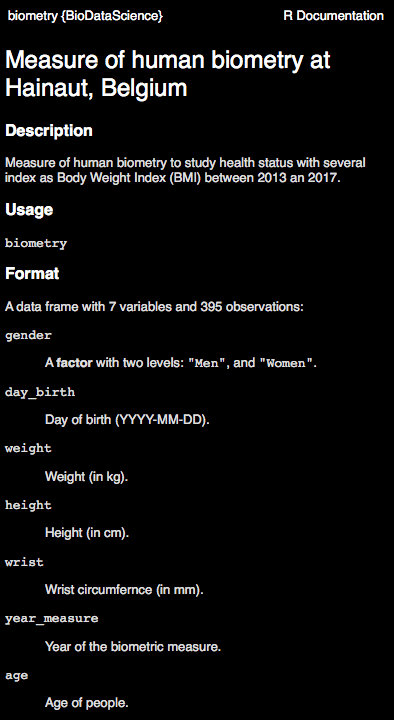
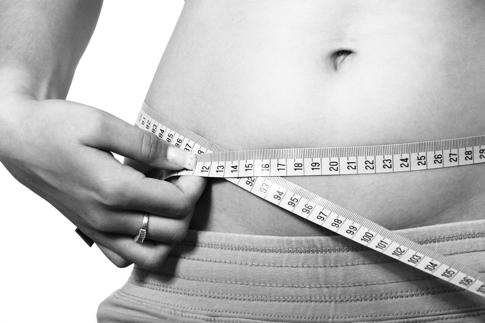

```{r setup, include=FALSE}
BioDataScience1::learnr_setup()
SciViews::R()
```

```{r, echo=FALSE}
BioDataScience1::learnr_banner()
```

```{r, context="server"}
BioDataScience1::learnr_server(input, output, session)
```

----

## Objectif

- Utilisation guidée du logiciel R afin de résoudre une question sur l'obésité

```{r, out.width = "50%"}
knitr::include_graphics(path = "images/Rlogo.png")
```


## Introduction

Dans ce tutoriel, nous utiliserons ensemble R pour résoudre une question biologique à travers l'analyse d'un jeu de données concernant la biométrie humaine. 

### Manipuler

En partant d'un tableau de données relatif à de la biométrie humaine contenant 395 observations et 7 variables\ : 

```{r, echo=TRUE}
# Chargement de SciViews::R
SciViews::R
# Importation du jeu de données
(biometry <- read("biometry", package = "BioDataScience",
  lang = "fr"))
```

**Notez ceci\ :**

- Les encadrés gris dénotent des instructions entrées dans R. Si ce dernier renvoie des résultats, ils sont présentés dans des encadrés blancs juste en dessous (pas le cas ici).

- Toujours commencer par l'instruction `SciViews::R` pour installer les différents outils (rassemblés dans des extensions du programme, appelées "packages" R) dont nous aurons besoin.

- Le jeu de données est disponible dans un package R\ : `BioDataScience`, spécialement préparé pour ce cours.

- L'anglais est la langue la plus employée en science des données. Les jeux de données employés sont encodés en anglais. 

Le point d'interrogation devant notre jeu de données renvoit vers une page d'aide, tout comme pour les fonctions.

```{r, eval = FALSE, echo = TRUE}
?biometry
```



```{r, echo = TRUE}
biometry %>.%
  select(., -c(day_birth, wrist, year_measure)) -> bio
```

**Notez ceci\ :**

Nous utilisons ici le chaînage (`%>.%`) et une sélection avec la fonction `select()` en éliminant des colonnes du tableau que nous n’utiliserons pas (les variables `day_birth`, `wrist` et `year_measure`).

Lorsqu’on utilise un chaînage d’instructions, l’assignation du résultat est plus lisible quand elle est réalisée à la fin (`-> bio`). Notez l'utilisation ici de la flèche d'assignation inversée `->` à n'utiliser que dans des cas très particuliers comme ici.

La fonction `kable()` du package `knitr` peut être appelée directement sans charger le package à l'aide de l'instruction `knitr::kable()`. Elle permet de formater correctement un tableau en Markdown. Utilisons-là maintenant pour présenter les huit premières lignes de notre jeu de données  grâce à la fonction `head()`.

```{r, echo=TRUE}
bio %>.%
  head(., n = 8) %>.% # Garde les huit premières lignes
  knitr::kable(., align = "c")
```

Considérons maintenant uniquement les femmes. On peut filtrer simplement les lignes d'un tableau de données en utilisant comme critère `gender == "W"` (**attention :** notez bien que dans un _test de condition_, l'égalité s'écrit avec **deux** signes égaux dans R). Les autres options sont : `!=` pour différent de, `>` pour plus grand que, `<` pour plus petit que, ainsi que `>=` ou `<=` pour plus grand ou égale et plus petit ou égal.

```{r, echo=TRUE}
bio %>.%
  filter(., gender == "W") %>.%
  head(., n = 8) %>.% # Garde les huit premières lignes
  knitr::kable(., align = "c")
```

Continuons à manipuler notre tableau en sélectionnant des colonnes et en filtrant les lignes en une seule opération. Pour sélectionner les femmes `gender == "W"`  et retirer la colonnes `age`, nous utiliserons :

```{r, echo=TRUE}
bio %>.%
  filter(., gender == "W") %>.% # Sélectionne les femmes
  select(., - age) %>.% # Retire la colonne âge
  head(., n = 8) %>.% # Garde les huit premières lignes
  knitr::kable(., align = "c")
```

Maintenant que nous avons vu comment lire, remanier et présenter des tableaux de données dans R (nous reviendrons sur ces notions plus tard), nous pouvons explorter ses potentialités pour réaliser des graphiques à la section suivante...


### Visualiser

Voici quelques exemples de graphiques réalisés avec R, sur notre jeu de données portant sur la biométrie humaine :

- Le graphique en barre nous montre que le nombre d'homme et de femme est similaire.

```{r, echo=TRUE}
chart(biometry, ~ gender %fill=% gender) +
  geom_bar(show.legend = FALSE) +
  scale_fill_viridis_d()
```

- Les histogrammes nous montrent que les personnes intérogées forment deux groupes. L'un est proche de la vingtaine et le second de la cinquantaine.

```{r, echo=TRUE}
chart(biometry, ~ age %fill=% gender | gender) +
  geom_histogram(bins = 25) +
  scale_fill_viridis_d()
```

- Les graphiques en violon couplés avec des boites de dispersion montrent que les hommes sont plus grands et plus lourds que les femmes dans notre jeu de données. 

```{r, echo=TRUE}
a <- chart(biometry, formula = height ~ gender %fill=% gender) +
  geom_violin(show.legend = FALSE, alpha = 0.4)  +
  geom_boxplot(width = 0.1, show.legend = FALSE) +
  scale_fill_viridis_d()

b <- chart(biometry, formula = weight ~ gender %fill=% gender) +
  geom_violin(show.legend = FALSE, alpha = 0.4)  +
  geom_boxplot(width = 0.1, show.legend = FALSE) +
  scale_fill_viridis_d()

ggpubr::ggarrange(a,b)
```

- Le nuage de points nous montre la variation de la taille en fonction de la masse.

```{r, echo=TRUE}
chart(biometry, height ~ weight %col=% gender) +
  geom_point() +
  scale_color_viridis_d()
```

**Ceci n'est qu'un bref aperçu des possibilités que propose R, vous en découvrirez une partie lors des cours de science de données.** 


## L'obésité

Plusieurs médias publient ou ont publié récemment des articles avec des titres accrocheurs comme [obésité, le mal du siècle](https://www.lesechos.fr/idees-debats/cercle/cercle-166670-obesite-le-mal-du-siecle-2067263.php), [13% de la population adulte mondiale est obèse, 20% pourrait l’être en 2025](https://www.lemonde.fr/sante/article/2016/04/01/13-de-la-population-adulte-mondiale-est-obese-20-pourrait-bientot-l-etre_4893671_1651302.html) ou  encore [obésité et malnutrition, fléaux du XXI^e^ siècle](http://www.natura-sciences.com/sante/obesite-malnutrition.html). Ils se basent sur plusieurs déclarations de l'Organisation Mondiale de la Santé (OMS) indiquant que la lutte contre l'obésité sera l'un des défis majeurs pour la santé publique au 21^ième^ siècle. L'OMS estime que 1.5 milliards de personnes sont en surpoids actuellement et ce chiffre augmentera si rien ne change.


{width=50%}

Une multitude d'indicateurs pour quantifier l'excédent de poids ont été employés au cours du temps ( [formule de Lorentz](https://www.calculersonimc.fr/autres-calculs/poids-ideal-lorentz.html), [formule de Creff](https://www.calculersonimc.fr/autres-calculs/poids-ideal-creff.html) ou encore [formule de Broca](https://www.calculersonimc.fr/autres-calculs/poids-ideal-broca.html)). Actuellement, c'est l'indice de masse corporelle (IMC, ou encore **BMI** en anglais) qui est l'indicateur le plus employé. La formule est la suivante :

$$IMC (kg/m^2) = \frac{masse(kg)}{taille(m)^2}$$

ou encore en anglais : 

$$BMI (kg/m^2) = \frac{weight(kg)}{height(m)^2}$$

Une fois la valeur de l'IMC obtenue, il faut la comparer au tableau ci-dessous pour connaitre son état de santé.

|IMC (kg/m2) | Interprétation (selon l’OMS)                         |
|:----------------|:-----------------------------------------------:|
|Inférieur 18.5   | Sous-poids (en anglais `underweight`)           |
|Entre 18.5 et 25 | Corpulence normale (en anglais `normal weight`) |
|Entre 25 et 30   | Surpoids (en anglais `overweight`)              |
|Supérieur à 30   | Obésité (en anglais `obese`)                    |


Nous allons maintenant avancez pas à pas dans cette première analyse avec R. Le but est de calculer l'IMC (`BMI`), et puis de visualiser comment cet indice se répartit dans la population étudiée.

## Calcul de l'IMC

Les premières personnes dont vous avez les résultats sont les suivantes : 

| id | gender | weight [kg] | height [cm] |
|:--:|:------:|:-----------:|:-----------:|
|  1 |    W   |      50     |     170     |

Rappelez-vous de la formule qui est : 

$$BMI (kg/m^2) = \frac{weight(kg)}{height(m)^2}$$

On peut employer les opérations mathématiques de base avec R. Elles respectent l'ordre de priorité des opérateurs mathématiques. Au besoin, il est possible d'indiquer explicitement, ou de modifier les priorités avec des parenthèses comme `3 * (2 + 1)`.

| Opérations de base | Symboles |
|:-------------------|:--------:|
| addition           |    `+`   |
| soustraction       |    `-`   |
| division           |    `/`   |
| multiplication     |    `*`   |
| puissance          |    `^`   |

La formule mathématique se traduit donc comme suit en une instruction que R peut utiliser :

```{r id1_imc, echo=TRUE}
50 / 1.70^2
```

**Notez ceci :** R indique un `[1]` devant la réponse. En fait, R travaille avec des vecteurs (même si ici, le vecteur ne contient qu'un seul élément). Ainsi, le nombre entre crochets devant indique la position dans le vecteur. Ce calcul sur vecteurs nous sera très utile lorsque nous traiterons l'ensemble du tableau. En effet, le même calcul sera _automatiquement distribué_ sur tous les individus !

L'IMC de cette femme indique qu'elle est en `sous-poids` selon l'échelle de l'OMS.

Réalisez maintenant par vous-mêmes le calcul sur notre deuxième individu : 

| id | gender | weight [kg] | height [cm] |
|:--:|:------:|:-----------:|:-----------:|
|  2 |    M   |      93     |     191     |

L'espace ci-dessous est une zône où vous pouvez entrer du code R. Le bouton `Run Code` permet ensuite de l'exécuter et de visualiser le résultat. Vous pouvez modifier autant de fois qu'il faut l'expression, et utiliser plusieurs fois `Run Code`. Lorsque vous êtes satisfait du résultat, cliquez sur `Submit Answer`. Dans les tutoriaux, la `Solution` est également accessible, mais faites l'exercice par vous-même d'abord ! Dans les tests, vous n'y aurez pas accès, évidemment.

Calculez l'IMC de l'homme ci-dessus de 191 cm et de 93 kg.

```{r id2_imc, exercise=TRUE}

```

```{r id2_imc-solution}
93 / 1.91^2
```

```{r id2_imc-check}
grade_code("Vous êtes génial !")
```

L'IMC de cet homme indique qu'il est en `surpoids` selon l'échelle de l'OMS.

## Calcul de l'IMC sur plusieurs individus

Vous vous retrouvez rapidement avec 5 nouveaux individus femmes et hommes.

| id | gender | weight [kg] | height [cm] |
|:--:|:------:|:-----------:|:-----------:|
|  3 |    W   |      69     |     174     |
|  4 |    W   |      49     |     155     |
|  5 |    W   |      75     |     169     |
|  6 |    W   |      66     |     179     |
|  7 |    W   |      54     |     168     |

Le calcul un à un de l'IMC de chaque individu deviendra très rapidement fastidueux. R permet de créer des vecteurs que l'on peut affecter à des symboles avec la flèche `<-` (constituée du signe plus petit que immédiatemment suivi du signe moins) comme le montre l'exemple ci-dessous. Pour rassembler plusieurs valeurs dans un vecteur on les "concatène" avec la fonction `c()` : 

```{r, echo=TRUE}
# Assignation des valeurs de masses dans un vecteur nommé `weight`
weight_w <- c(69, 49, 75, 66, 54)
# Assignation des valeurs de tailles dans un vecteur nommé `height`
height_w <- c(174, 155, 169, 179, 168)
# Transformation du vecteur `height_w` de centimètre en mètre 
height_w <- height_w / 100
# Calcul de l'IMC/ BMI
weight_w / height_w^2
```

**Important\ :**

- Choisissez bien les noms de vos objets. Ces noms doivent être courts, mais informatifs concernant leur contenu.

- Rappelez-vous que des noms acceptables commencent par une lettre, et comportent ensuite des lettres, chiffres, le trait souligné `_` ou le point `.`.

- Comme il est difficile de mémoriser la casse d'un nom, il est conseillé d'utiliser uniquement des lettres minuscules.

- Si le nom est constitué de plusieurs mots, il est préférable de séparer ces mots par un trait souligné. Pour rappel, l'espace n'est pas utilisable. Par exemple, `circonference_poignet`.

- Éviter d'utiliser des caractères accentués.

- Si possible, utilisez des noms en anglais. Certainement si votre travail sera échangé avec d'autres scientifiques en international, ... mais c'est une bonne habitude à prendre même sur votre propre code. Pour reprendre l'exemple précedent `wrist_circumference`

Réalisez les mêmes opérations sur les individus de 8 à 12.

| id | gender | weight [kg] | height [cm] |
|:--:|:------:|:-----------:|:-----------:|
|  8 |    M   |      82     |     174     |
|  9 |    M   |      73     |     186     |
| 10 |    M   |     105     |     203     |
| 11 |    M   |      61     |     172     |
| 12 |    M   |      95     |     190     |

```{r vec_imc, exercise=TRUE}
# Assignation des valeurs de masses dans un vecteur nommé `weight_m`
weight_m <- c(___)
# Assignation des valeurs de tailles dans un vecteur nommé `height_m`
height_m <- ___
# Transformation du vecteur `height_m` de centimètre en mètre 
height_m <- height_m / 100
# Calcul de IMC
___
```

Vous obtenez les 5 valeurs d'IMC en une seule fois avec l'utilisation de vecteurs.

```{r vec_imc-solution}
# Assignation des valeurs de masses dans un vecteur nommé `weight_m`
weight_m <- c(82, 73, 105, 61, 95)
# Assignation des valeurs de tailles dans un vecteur nommé `height_m`
height_m <- c(174, 186, 203, 172, 190)
# Transformation du vecteur `height_m` de centimètre en mètre 
height_m <- height_m / 100
# Calcul de IMC
weight_m / height_m^2
```

```{r vec_imc-check}
grade_code("C'est tout simplement parfait... que dire de plus.")
```


## Encodage d'un tableau de données 

Il devient rapidement évident qu'il est plus simple que nos observations de terrain soient rassemblées en un jeu de données structuré. Pour cela vous allez créer ce qu'on appelle un **"data frame"** (qui se traduit en français par "tableau de données") dans R. La fonction qui permet de le créer est `data_frame()`. Cette dernière permet de combiner vos différents vecteurs colonne par colonne dans un tableau.

Dans `data_frame()`, vous entrerez vos différents vecteurs comme autant d'**arguments** de la fonction, séparés par une `,`. De plus, vous pouvez nommer vos colonnes en donnant des noms aux arguments de type `nom = valeur`. Analysez avec attention l'exemple ci-dessous.

```{r, echo=TRUE}
# Création du tableau de données (data frame)
woman <- data_frame(
  id     = 3:7,       # Valeurs numériques
  sex    = rep("W", times = 5), # Chaines de caractères (! guillemets)
  weight = weight_w,  # Vecteur de masses fait précédemment
  height = height_w   # Vecteur de tailles fait précédemment
)
# Afficher le tableau
woman
```

Avez-vous remarqué la différence dans la façon d'encoder des valeurs numériques et des chaînes de caractères \?

Réalisez-les mêmes opérations sur les individus de 8 à 12 (inspirez vous des instructions ci-dessus) : 

| id | gender | weight [kg] | height [cm] |
|:--:|:------:|:-----------:|:-----------:|
|  8 |    M   |      82     |     174     |
|  9 |    M   |      73     |     186     |
| 10 |    M   |     105     |     203     |
| 11 |    M   |      61     |     172     |
| 12 |    M   |      95     |     190     |

```{r vec_man_setup}
# Assignation des valeurs de masses dans un vecteur `weight_m`
weight_m <- c(82, 73, 105, 61, 95)
# Assignation des valeurs de tailles dans un vecteur `height_m`
height_m <- c(1.74, 1.86, 2.03, 1.72, 1.90)
```

```{r vec_man, exercise=TRUE, exercise.setup="vec_man_setup"}
# Encoder le jeu de données
man <- data_frame(
  id     = ___,
  sex    = ___,
  weight = ___,
  height = ___
)
# Afficher le tableau
___
```

```{r vec_man-solution}
# Encoder le jeu de données
man <- data_frame(
  id     = 8:12,
  sex    = rep("M", times = 5),
  weight = weight_m,
  height = height_m
)
# Afficher le tableau
man
```

```{r vec_man-check}
grade_code("Mais parfaitement. Maintenant que vous savez créer un tableau de données dans R, vous verrez, vous ne pourrez plus vous en passer.")
```

Calculez de nouveau l'IMC et ajoutez vos résultats dans le tableau de données. Vous avez à votre disposition la fonction `mutate()` qui requiert comme argument le jeu de données et le nom de la nouvelle variable comme nom d'argument suivi de la formule mathématique qui calcule son contenu.

```{r, echo=TRUE}
# Calculer l'IMC pour les femmes
woman <- mutate(woman, bmi = weight / height^2)
# Afficher le tableau de données
woman
```

**A retenir :**

- Vous pouvez vous référer à d'autres colonnes du tableau (= autres variables) en utilisant leurs noms directement dans la formule,

- La ou les nouvelles colonnes sont ajoutées à la fin du tableau et sont directement utilisables.

Réalisez par vous-mêmes les mêmes opérations sur le jeu de données `man`.

```{r imc_mutate_setup}
# Assignation des valeurs de masses dans un vecteur `weight_m`
weight_m <- c(82, 73, 105, 61, 95)
# Assignation des valeurs de tailles dans un vecteur `height_m`
height_m <- c(1.74, 1.86, 2.03, 1.72, 1.90)
# Dataset
man <- data_frame(
  id     = 8:12,
  sex    = rep("M", times = 5),
  weight = weight_m,
  height = height_m
)
```

```{r imc_mutate, exercise=TRUE, exercise.setup="imc_mutate_setup"}
# Calculer l'IMC pour les hommes
man <- mutate(man, bmi = ___)
# Afficher le tableau de données
___
```

```{r imc_mutate-solution}
# Calculer l'IMC pour les hommes
man <- mutate(man, bmi = weight / height^2)
# Afficher le tableau de données
man
```

```{r imc_mutate-check}
grade_code("La fonction `mutate()` n'a maintenant plus de secrets pour vous.")
```

Vous pouvez observer que tout comme le tableau de données portant sur les femmes, vous obtenez une nouvelle colonne au sein de votre tableau de données portant le nom de `bmi` (pour "Body Mass Index", soit l'IMC en français).

## Fraction obèse de la population

Le monde titre que 13% de la populaton mondiale est obèse. Vérifiez cette affirmation avec le jeu de données `biometry` qui regroupe les masses et les tailles de 395 personnes adultes vivant sur le territoire belge (Hainaut, Belgique). Nous allons également tirer au hasard 100 individus comme sous-échantillon de ce tableau (à titre d'illustration d'autres traitements possibles sur le tableau). La fonction qui réalise cela est `sample_n()`. La fonction `set.seed()` prend un nombre et initialise le générateur de nombres dit "pseudo-aléatoires" pour que tout le monde ait le même sous-ensemble. En pratique, cette instruction est facultative, mais elle est utile pour générer des résultats **reproductibles**. Indiquez naturellement un nombre différent, à chaque fois que vous l'utiliser !

```{r, echo=TRUE}
biometry <- read("biometry", package = "BioDataScience")
set.seed(50) # Initialisation du générateur de nombres pseudo-aléatoires
# Échantillonnage au hasard de 100 individus
biometry %>.%
  sample_n(., size = 100, replace = FALSE) -> bio_100
bio_100
```

Vous pouvez observer que la taille est ici exprimée en centimètres, il faut en tenir compte lors du calcul de l'IMC qui attend la taille exprimée en mètre. Un jeu de données réduit est employé pour expliciter les suites d'instructions `bio_100` qui comprend uniquement 100 observations.

Pour calculer l'IMC sur le jeu de données `bio_100`, nous employons à nouveau la fonction `mutate()`. 

```{r, echo=TRUE}
bio_100 <- mutate(bio_100, bmi = weight / (height / 100)^2)
# Afficher les premières lignes du tableau de données 
head(bio_100, n = 5)
```

Calculez l'IMC sur le jeu de données `biometry` tout entier.

```{r bio_imc, exercise=TRUE}
# Calcul de l'IMC
___ <- ___
# Affichage des 5 premières lignes du tableau de données
___
```

```{r bio_imc-solution}
# Calcul de l'IMC
biometry <- mutate(biometry, bmi = weight / (height / 100)^2)
# Affichage des 5 premières lignes du tableau de données
head(biometry, n = 5)
```

```{r bio_imc-check}
grade_code("Vous devenez expert en R, ma parole.")
```


## Signification de l'IMC

Une fois la valeur obtenue de l'IMC, il faut lui attribuer son interprétation pour connaitre son état de santé.

|IMC (kg/m2) | Interprétation (selon l’OMS)                         |
|:----------------|:-----------------------------------------------:|
|Inférieur 18.5   | Sous-poids (en anglais `underweight`)           |
|Entre 18.5 et 25 | Corpulence normale (en anglais `normal weight`) |
|Entre 25 et 30   | Surpoids (en anglais `overweight`)              |
|Supérieur à 30   | Obésité (en anglais `obese`)                    |

Vous avez à votre disposition la fonction `case_when()` qui permet d'attribuer l'interprétation de l'OMS à la valeur d'IMC. Vous devez lui indiquer d'une part la condition (ex. : `bmi < 18.5`), et d'autre part son interprétation (ex. : `underweight`), le tout séparé par un `~`. Vous pouvez retrouver les conditions ci-dessous.

|Condition                  | Représentation |
|:--------------------------|:--------------:|
| Egal à                    |      `==`      |
| Différent de              |      `!=`      |
| Supérieur à               |      `>`       |
| Inférieur à               |      `<`       |
| Supérieur ou égal à       |      `>=`      |
| Inférieur ou égal à       |      `<=`      |
| Et (combinaison de tests) |       `&`      |
| Ou (idem)                 |       `|`      |

Ajoutez une nouvelle variable qui tient compte de l'échelle de l'OMS avec le jeu de données `bio_100` dans la variable `bmi_cat`. Analysez la structuration de la suite d'instructions, les conditions employées, la position des guillemets, ...

```{r, echo=TRUE}
# Ajouter la nouvelles variable
bio_100 <- mutate(bio_100,
  bmi_cat = case_when(
    bmi < 18.5 ~ "underweight",
    bmi >= 18.5 & bmi < 25 ~ "normal weight",
    bmi >= 25 & bmi < 30 ~ "overweight",
    bmi >= 30 ~ "obese"
))
# Afficher le tableau 
bio_100
```

Ajoutez une nouvelle variable `bmi_cat` au jeu de données `biometry` en complétant les informations manquantes.

```{r case_when_setup}
biometry <- read("biometry", package = "BioDataScience")
biometry <- mutate(biometry, bmi = weight / (height / 100)^2)
```

```{r case_when, exercise=TRUE, exercise.setup="case_when_setup"}
# Ajouter la nouvelles variable
___ <- mutate(___,
  bmi_cat = case_when(
    bmi  ___ ___~ "underweight",
    bmi  ___ ___~ "normal weight",
    bmi  ___ ___~"overweight",
    bmi  ___ ___~ "obese"
))
# Afficher le début du tableau 
head(___)
```

```{r case_when-solution}
# Ajouter la nouvelles variable
biometry <- mutate(biometry,
  bmi_cat = case_when(
    bmi < 18.5 ~ "underweight",
    bmi >= 18.5 & bmi < 25 ~ "normal weight",
    bmi>= 25 & bmi < 30 ~"overweight",
    bmi >= 30 ~ "obese"
))
# Afficher le début du tableau  
head(biometry)
```

```{r case_when-check}
grade_code("C'est correct. Vous êtes maintenant capable de réaliser des catégories avec `case_when()`.")
```

Votre nouvelle variable comprend une succession de lignes complétées par des chaines de caractères. Organisez cette variable de votre tableau de données avec la fonction `factor()`. Observez la nouvelle structuration de la suite d'instructions. Vous observez pour la première fois l'opérateur `$`. Dans l'exemple ci-dessous, lorsque vous utilisez `bio_100$echelle_imc`, vous pouvez l'interpréter comme : "dans le tableau de données `bio_100`, je prend la colonne/variable `echelle_imc`. La fonction `factor()` s'applique donc sur cette colonne (dont le vecteur est extrait). Avec l'argument `levels`, vous spécifiez l'ordre des différents niveaux de votre variable à classer. 

Classer votre nouvelle variable avec le jeu de données `bio_100`.

```{r, echo=TRUE}
bio_100$bmi_cat <- factor(bio_100$bmi_cat,
  levels = c("underweight", "normal weight", "overweight", "obese"))
bio_100
```

En apparence, pas grand changement, mais maintenant, nous avons indiqué un ordre logique de progression dans les différents **niveaux** (`levels`) de la variable. Ici, nous pourrions faire encore mieux. Si nous utilisons la fonction `ordered()` à la place de `factor()`, avec les mêmes arguments, nous indiquons à R qu'en plus, les différents niveaux sont classés du plus petit au plus grand (`underweight` < `normal weight`< `overweight`< `obese`). Nous pouvons voir la façon dont les différents niveaux sont encodés à l'aide de la fonction `levels()`.

Classer votre nouvelle variable avec le jeu de données `biometry` tout entier, et en utilisant `ordered()` ici.

```{r factor_setup}
biometry <- read("biometry", package = "BioDataScience", lang = "fr")
biometry$bmi <- biometry$weight / (biometry$height / 100)^2
biometry <- mutate(biometry,
  bmi_cat = case_when(
    bmi < 18.5 ~ "underweight",
    bmi >= 18.5 & bmi < 25 ~ "normal weight",
    bmi >= 25 & bmi < 30 ~ "overweight",
    bmi >= 30 ~ "obese"
))
```

```{r factor, exercise=TRUE, exercise.setup="factor_setup"}
biometry$___ <- ordered(biometry$bmi_cat,
  levels = c(___))
# Visualiser le vecteur
biometry$bmi_cat
# Extraire les niveaux d'encodage des niveaux
___(biometry$bmi_cat)
```

```{r factor-solution}
biometry$bmi_cat <- ordered(biometry$bmi_cat,
  levels = c("underweight", "normal weight", "overweight", "obese"))
# Visualiser le vecteur
biometry$bmi_cat
# Extraire les niveaux d'encodage des niveaux
levels(biometry$bmi_cat)
```

```{r factor-check}
grade_code("Quelle progression fulgurante.")
```


## Vérification

La fonction `summary()` permet d'obtenir un résumé complet d'un tableau de données.

```{r, echo=TRUE}
# Résumé des données
summary(bio_100)
# Nombre d'obèses : 12 /100 = 12%
bio_100 %>.%
  filter(., bmi_cat == "obese") %>.%
  nrow(.) / nrow(bio_100) * 100 # Nbre lignes filtrées / nbre total * 100
```

Utilisez la fonction `summary()` pour obtenir une description du tableau de données complet `biometry`.

```{r obese_setup}
biometry <- read("biometry", package = "BioDataScience", lang = "fr")
biometry$bmi <- biometry$weight/(biometry$height/100)^2
biometry <- mutate(biometry,
  bmi_cat = case_when(
    bmi < 18.5 ~ "underweight",
    bmi >= 18.5 & bmi < 25 ~ "normal weight",
    bmi >= 25 & bmi < 30 ~ "overweight",
    bmi >= 30 ~ "obese"
))
biometry$bmi_cat <- ordered(biometry$bmi_cat,
  levels = c("underweight", "normal weight", "overweight", "obese"))
label(biometry$bmi) <- "Indice de masse corporelle"
units(biometry$bmi) <- NA
```

```{r obese, exercise=TRUE, exercise.setup = "obese_setup"}
# Résumé des données
summary(___)
```

```{r obese-solution}
# Résumé des données
summary(biometry)
```

```{r obese-check}
grade_code("Mais oui. La fonction `summary()` est générique et affiche des informations condensées à partir de pratiquement n'importe quel objet dans R.")
```

Pour calculer le pourcentage d'obèses, nous pouvons filtrer le tableau et ensuite utiliser la fonction `nrow()` pour compter le nombre de lignes retenues... à diviser par le nombre de lignes du tableau de départ. Faites-le par vous-mêmes :

```{r obese1, exercise=TRUE, exercise.setup = "obese_setup"}
# Calculer le pourcentage d'obèse dans notre tableau de données
biometry %>.%
  filter(., ___) %>.%
  nrow(.) / nrow(biometry) * 100 # Nbre lignes filtrées / nbre total * 100
```

```{r obese1-solution}
# Calculer le pourcentage d'obèse dans notre tableau de données
biometry %>.%
  filter(., bmi_cat == "obese") %>.%
  nrow(.) / nrow(biometry) * 100 # Nbre lignes filtrées / nbre total * 100
```

```{r obese1-check}
grade_code("Vous apprenez vite. Les opérateurs de condition comme `==` sont très utiles en combinaison avec `filter()` pour sélectionner les lignes d'intérêt dans le tableau de données.")
```

Vos résultats concordent-ils avec les valeurs avancées dans les médias ? Représentons la distribution du bmi de nos individus sondés.

```{r, echo = TRUE}
chart(bio_100, ~ bmi %fill=% gender) +
  geom_histogram(bins = 25) +
  geom_vline(xintercept = 30, color = "red") +
  scale_fill_viridis_d()
```

Utilisez la fonction `chart()` pour représenter graphiquement la distribution des données par rapport au bmi des individus.

```{r histo, exercise = TRUE, exercise.setup = "obese_setup"}
chart(___, ~ ___ %fill=% gender) + # instruction du graphique
  geom_histogram(bins = 25) + # réaliser un histogramme
  geom_vline(xintercept = 30, color = "red") + # ajouter une ligne à 30 de bmi
  scale_fill_viridis_d() 
```

```{r histo-solution}
chart(biometry, ~ bmi %fill=% gender) + # instruction du graphique
  geom_histogram(bins = 25) + # réaliser un histogramme
  geom_vline(xintercept = 30, color = "red") + # ajouter une ligne à 30 de bmi
  scale_fill_viridis_d() 
```

```{r histo-check}
grade_code("Vous progressez très bien.")
```


## Conclusion 

La fraction d'obèses dans notre jeu de données est de 12,7%, ce qui est très proche des 13% annoncés par le monde. 

Bravo\ ! Vous venez de terminer cette petite analyse dans un tutoriel "learnr". 

Durant cette séance, vous avez appris à\ : 

- Approfondir vos calculs dans R
- Vectoriser vos calculs
- Rassembler des données dans un tableau "data frame"
- Remanier un tableau de données
- Réaliser vos premiers graphiques dans R pour visualiser les données

```{r comm_noscore, echo=FALSE}
question_text(
  "Laissez-nous vos impressions sur ce learnr",
  answer("", TRUE, message = "Pas de commentaires... C'est bien aussi."),
  incorrect = "Vos commentaires sont enregistrés.",
  placeholder = "Entrez vos commentaires ici...",
  allow_retry = TRUE
)
```
