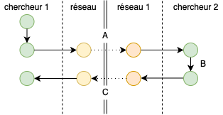

```{r setup, include=FALSE}
BioDataScience1::learnr_setup()
SciViews::R()
# Required for RSConnect
# SciViews::R
library(rlang)
library(data.table)
library(ggplot2)
library(tibble)
library(tidyr)
library(dplyr)
library(dtplyr)
library(broom)
library(forcats)
library(collapse)
library(fs)
library(data.trame)
library(svFast)
library(svTidy)
library(svMisc)
library(svBase)
library(svFlow)
library(data.io)
library(chart)
library(tabularise)
library(SciViews)
# ... more
library(readxl)
library(testthat)
library(equatags)
```

```{r, echo=FALSE}
BioDataScience1::learnr_banner()
```

```{r, context="server"}
if (Sys.info()["user"] == "rstudio-connect") {
  options(learnr_user_id = session$user)
  assignInNamespace("default_user_id", function() {
    getOption("learnr_user_id", unname(Sys.info()["user"]))
  }, ns = "learnr")
}
BioDataScience1::learnr_server(input, output, session)
```

------------------------------------------------------------------------

## Objectifs

-   Autoévaluer sa compréhension des différentes actions dans Git.

## Analyse de situation Git

Le gestionnaire de version Git est un outil puissant, mais complexe. C'est souvent le cas lorsqu'on utilise un outil professionnel. Git a une terminologie qui lui est propre. Vous devez vous assurer d'avoir compris les termes suivants : **dépôt** (*repository*), **commit**, **clone**, **push**, **pull**, **fork**, **pull request**. Analysez les situations suivantes basées sur les images schématisant la situation.

### Situation 1

Deux chercheurs distants de plusieurs centaines de kilomètres collaborent sur un projet commun. Ils ont pour cela décidé d'employer un outil de gestion de version et d'héberger ce projet sur un système d'hébergement web dédié pour cela.

Sur base de l'image ci-dessous et de la situation précisée précédemment, répondez aux questions suivantes.


```{r qu_git1}
quiz(
  question("Qualifiez l'action **A**",
    answer("commit", correct = TRUE, message = "Un commit permet d'enregistrer une version du projet."),
    answer("clone", message = "Un *clone* permet de créer un double local d’un dépôt GitHub."),
    answer("push", message = "Un *push* permet d'envoyer ses modifications locales vers le dépôt GitHub."),
    answer("pull", message = "Un *pull* permet de rapatrier les modifications que les autres utilisateurs ont appliquées dans le dépôt GitHub vers sa propre version locale."),
    answer("fetch", message = "Un *fetch* permet de faire un pull et un push successivement."),
    answer("fork", message = "Un *fork* permet de faire une copie dans notre propre compte GitHub d'un dépôt sur GitHub."),
    answer("pull request", message = "Un *pull request* permet de suggérer à l’auteur du dépôt d'origine que vous avez fait des modifications qui pourraient l’intéresser. L'auteur peut accepter ou refuser ces modifications."),
    allow_retry = TRUE, random_answer_order = TRUE,
    correct = "Bravo ! Vous avez trouvé la bonne réponse.",
    incorrect = "Attention, Ce n'est pas la bonne réponse. Toutes ces notions ne sont pas simples. Prenez le temps de réviser la section sur Git et sur GitHub",
    submit_button = "Soumettre une réponse",
    try_again_button = "Resoumettre une réponse"
    ),
  question("Qualifiez l'action **B**",
    answer("commit", message = "Un *commit* permet d'enregistrer une version du projet."),
    answer("clone", message = "Un *clone* permet de créer un double local d’un dépôt GitHub."),
    answer("push", correct = TRUE, message = "Un *push* permet d'envoyer ses modifications locales vers le dépôt GitHub."),
    answer("pull", message = "Un *pull* permet de rapatrier les modifications que les autres utilisateurs ont appliquées dans le dépôt GitHub vers sa propre version locale."),
    answer("fetch", message = "Un *fetch* permet de faire un pull et un push successivement."),
    answer("fork", message = "Un *fork* permet de faire une copie dans notre propre compte GitHub d'un dépôt sur GitHub."),
    answer("pull request", message = "Un *pull request* permet de suggérer à l’auteur du dépôt d'origine que vous avez fait des modifications qui pourraient l’intéresser. L'auteur peut accepter ou refuser ces modifications."),
    allow_retry = TRUE, random_answer_order = TRUE,
    correct = "Bravo ! Vous avez trouvé la bonne réponse.",
    incorrect = "Attention, Ce n'est pas la bonne réponse. Toutes ces notions ne sont pas simples. Prenez le temps de réviser la section sur Git et sur GitHub",
    submit_button = "Soumettre une réponse",
    try_again_button = "Resoumettre une réponse"
    ),
  question("Qualifiez l'action **C**",
    answer("commit", message = "Un *commit* permet d'enregistrer une version du projet."),
    answer("clone", message = "Un *clone* permet de créer un double local d’un dépôt GitHub."),
    answer("push", message = "Un *push* permet d'envoyer ses modifications locales vers le dépôt GitHub."),
    answer("pull", correct = TRUE, message = "Un *pull* permet de rapatrier les modifications que les autres utilisateurs ont appliquées dans le dépôt GitHub vers sa propre version locale."),
    answer("fetch", message = "Un *fetch* permet de faire un pull et un push successivement."),
    answer("fork", message = "Un *fork* permet de faire une copie dans notre propre compte GitHub d'un dépôt sur GitHub."),
    answer("pull request", message = "Un *pull request* permet de suggérer à l’auteur du dépôt d'origine que vous avez fait des modifications qui pourraient l’intéresser. L'auteur peut accepter ou refuser ces modifications."),
    allow_retry = TRUE, random_answer_order = TRUE,
    correct = "Bravo ! Vous avez trouvé la bonne réponse.",
    incorrect = "Attention, Ce n'est pas la bonne réponse. Toutes ces notions ne sont pas simples. Prenez le temps de réviser la section sur Git et sur GitHub",
    submit_button = "Soumettre une réponse",
    try_again_button = "Resoumettre une réponse"
    )
)
```

### Situation 2

Le chercheur 2 s'intéresse au projet du chercheur 1, travaille dessus et propose des modifications afin de l'améliorer.

Sur base de l'image ci-dessous et de la situation précisée précédemment, répondez aux questions suivantes.



```{r qu_git2}
quiz(
  question("Qualifiez l'action **A**",
    answer("commit", message = "Un *commit* permet d'enregistrer une version du projet."),
    answer("clone", message = "Un *clone* permet de créer un double local d’un dépôt GitHub."),
    answer("push", message = "Un *push* permet d'envoyer ses modifications locales vers le dépôt GitHub."),
    answer("pull", message = "Un *pull* permet de rapatrier les modifications que les autres utilisateurs ont appliquées dans le dépôt GitHub vers sa propre version locale."),
    answer("fetch", message = "Un *fetch* permet de faire un pull et un push successivement."),
    answer("fork", correct = TRUE, message = "Un *fork* permet de faire une copie dans notre propre compte GitHub d'un dépôt sur GitHub."),
    answer("pull request", message = "Un *pull request* permet de suggérer à l’auteur du dépôt d'origine que vous avez fait des modifications qui pourraient l’intéresser. L'auteur peut accepter ou refuser ces modifications."),
    allow_retry = TRUE, random_answer_order = TRUE,
    correct = "Bravo ! Vous avez trouvé la bonne réponse.",
    incorrect = "Attention, Ce n'est pas la bonne réponse. Toutes ces notions ne sont pas simples. Prenez le temps de réviser la section sur Git et sur GitHub",
    submit_button = "Soumettre une réponse",
    try_again_button = "Resoumettre une réponse"
    ),
  question("Qualifiez l'action **B**",
    answer("commit", correct = TRUE, message = "Un *commit* permet d'enregistrer une version du projet."),
    answer("clone", message = "Un *clone* permet de créer un double local d’un dépôt GitHub."),
    answer("push", message = "Un *push* permet d'envoyer ses modifications locales vers le dépôt GitHub."),
    answer("pull", message = "Un *pull* permet de rapatrier les modifications que les autres utilisateurs ont appliquées dans le dépôt GitHub vers sa propre version locale."),
    answer("fetch", message = "Un *fetch* permet de faire un pull et un push successivement."),
    answer("fork", message = "Un *fork* permet de faire une copie dans notre propre compte GitHub d'un dépôt sur GitHub."),
    answer("pull request", message = "Un *pull request* permet de suggérer à l’auteur du dépôt d'origine que vous avez fait des modifications qui pourraient l’intéresser. L'auteur peut accepter ou refuser ces modifications."),
    allow_retry = TRUE, random_answer_order = TRUE,
    correct = "Bravo ! Vous avez trouvé la bonne réponse.",
    incorrect = "Attention, Ce n'est pas la bonne réponse. Toutes ces notions ne sont pas simples. Prenez le temps de réviser la section sur Git et sur GitHub.",
    submit_button = "Soumettre une réponse",
    try_again_button = "Resoumettre une réponse"
    ),
  question("Qualifiez l'action **C**",
    answer("commit", message = "Un *commit* permet d'enregistrer une version du projet."),
    answer("clone", message = "Un *clone* permet de créer un double local d’un dépôt GitHub."),
    answer("push", message = "Un *push* permet d'envoyer ses modifications locales vers le dépôt GitHub."),
    answer("pull", message = "Un *pull* permet de rapatrier les modifications que les autres utilisateurs ont appliquées dans le dépôt GitHub vers sa propre version locale."),
    answer("fetch", message = "Un *fetch* permet de faire un pull et un push successivement."),
    answer("fork", message = "Un *fork* permet de faire une copie dans notre propre compte GitHub d'un dépôt sur GitHub."),
    answer("pull request", correct = TRUE, message = "Un *pull request* permet de suggérer à l’auteur du dépôt d'origine que vous avez fait des modifications qui pourraient l’intéresser. L'auteur peut accepter ou refuser ces modifications."),
    allow_retry = TRUE, random_answer_order = TRUE,
    correct = "Bravo ! Vous avez trouvé la bonne réponse.",
    incorrect = "Attention, Ce n'est pas la bonne réponse. Toutes ces notions ne sont pas simples. Prenez le temps de réviser la section sur Git et sur GitHub.",
    submit_button = "Soumettre une réponse",
    try_again_button = "Resoumettre une réponse"
    )
)
```

## Conclusion

Vous allez utiliser abondamment Git (et GitHub) dans la suite du cours. Il est important de bien comprendre son fonctionnement de base.

```{r comm_noscore, echo=FALSE}
question_text(
  "Laissez-nous vos impressions sur ce learnr",
  answer("", TRUE, message = "Pas de commentaires... C'est bien aussi."),
  incorrect = "Vos commentaires sont enregistrés.",
  placeholder = "Entrez vos commentaires ici...",
  submit_button = "Soumettre une réponse",
  try_again_button = "Resoumettre une réponse",
  allow_retry = TRUE
)
```

```{css, echo=FALSE}
@media print {
  .topics {
    width: 100% !important;
    padding: 0 0.5em 0 !important;
  }
  .topicsContainer, .topicsContainer *, .learnrBanner, .learnrBanner *, .topicActions, .topicActions * {
    display: none !important;
  }
}
```
