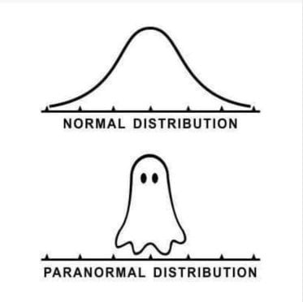
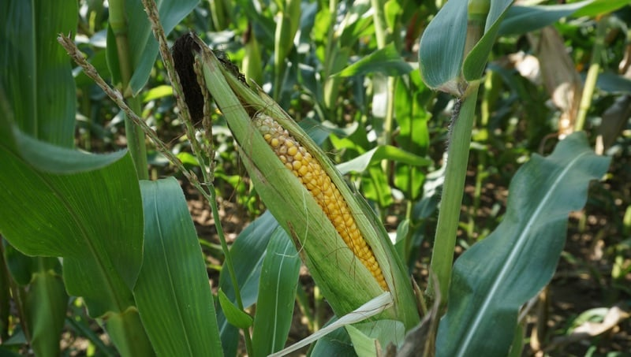

```{r setup, include=FALSE}
BioDataScience1::learnr_setup()
SciViews::R("infer")
# Required for RSConnect
# SciViews::R
library(rlang)
library(data.table)
library(ggplot2)
library(tibble)
library(tidyr)
library(dplyr)
library(dtplyr)
library(broom)
library(forcats)
library(collapse)
library(fs)
library(data.trame)
library(svFast)
library(svTidy)
library(svMisc)
library(svBase)
library(svFlow)
library(data.io)
library(chart)
library(tabularise)
library(SciViews)
# ... more
library(readxl)
library(testthat)
library(equatags)
library(distributional)
library(inferit)
library(BioDataScience)
library(BioDataScience1)
```

```{r, echo=FALSE}
BioDataScience1::learnr_banner()
```

```{r, context="server"}
if (Sys.info()["user"] == "rstudio-connect") {
  options(learnr_user_id = session$user)
  assignInNamespace("default_user_id", function() {
    getOption("learnr_user_id", unname(Sys.info()["user"]))
  }, ns = "learnr")
}
BioDataScience1::learnr_server(input, output, session)
```

------------------------------------------------------------------------

## Objectifs

La loi de distribution normale est centrale en statistiques. Ce tutoriel vous permet d'auto-évaluer vos acquis à son sujet. Vous allez :

-   Vérifier que vous comprenez bien la logique des calculs autour de la distribution normale

-   Pouvoir calculer des quantiles à partir de probabilités

-   Être capable de calculer des probabilités à partir de quantiles


Vous devez avoir étudié le contenu du [module 6](https://wp.sciviews.org/sdd-umons/?iframe=wp.sciviews.org/sdd-umons-2025/probacorr.html) du cours SDD I, et en particulier les sections relatives à la [distribution normale](https://wp.sciviews.org/sdd-umons/?iframe=wp.sciviews.org/sdd-umons-2025/distribution-normale.html). Assurez-vous également au préalable d'être à l'aise avec le calcul des probabilités (que vous vérifiez avec le learnr `BioDataScience1::run("A06La_proba")`).

## Distribution normale



La distribution normale (ou Gaussienne) est appelée comme cela parce que c'est celle qui se rencontre le plus souvent. Elle s'observe à chaque fois que le résultat est la somme de petits effets aléatoires qui se combinent. Elle a une forme caractéristique, dite "en cloche".

### Graphique

Employez R pour représenter la densité de probabilité de la distribution $Y \sim N(10, 9)$ (attention à la différence entre la variance ici et l'écart type "sigma" qui est utilisé dans la fonction de calcul) !

<!-- 💬 **Ce code correspond au snippet `.indens`** [`.in` = (d)`i`stribution: `n`ormal]. -->

```{r normal1_h2, exercise=TRUE, exercise.lines=5}
N1 <- dist_normal(mu = ___, sigma = ___)
___(___) +
  ___("Densité de probabilité")
```

```{r normal1_h2-hint-1}
N1 <- dist_normal(mu = ___, sigma = ___)
___(___) +
  ___("Densité de probabilité")

 #### ATTENTION: Hint suivant = solution !####
```

```{r normal1_h2-solution}
## Solution ##
N1 <- dist_normal(mu = 10, sigma = 3)
chart(N1) +
  ylab("Densité de probabilité")
```

```{r normal1_h2-check}
grade_code("Ceci est plutôt simple à réaliser une fois que l'on se rappelle que l'écart type \"sigma\" est la racine carrée dce la variance. La ligne avec `ylab()` n'est là que pour s'assurer d'avoir le label de l'axe en français.")
```

Ajoutez maintenant sur le graphique une aire en rouge délimitée entre les quantiles 8 et 12 et annotez-là en son centre avec l'indication "P[8, 12]" en rouge. Pour ajouter une aire colorée sous la courbe, vous utilisez `geom_funfill()` avec l'argument `fun = dfun(...)` pour un graphique de densité de probabilité ou `fun = cdfun(...)` pour un graphique de densité de probabilité cumulée. Enfin pour annoter le graphique avec du texte, vous utilisez `annotate("text", ...)`.

<!-- 💬 **Le code ajouté en dernière ligne après celui qui génère le graphique correspond au snippet `.inllabel`.** -->

```{r normal2_h2, exercise=TRUE, exercise.lines=5}
N1 <- dist_normal(mu = 10, sigma = 3)
chart(N1) +
  ylab("Densité de probabilité") +
  ___(fun = ___(N1), from = ___, to = ___) +
  ___("text", x = ___, y = 0.06, label = "P[8, 12]", col = "red")
```

```{r normal2_h2-hint-1}
N1 <- dist_normal(mu = 10, sigma = 3)
chart(N1) +
  ylab("Densité de probabilité") +
  geom_funfill(fun = ___(N1), from = ___, to = ___) +
  annotate("text", x = ___, y = 0.06, label = "P[8, 12]", col = "red")

 #### ATTENTION: Hint suivant = solution !####
```

```{r normal2_h2-solution}
## Solution ##
N1 <- dist_normal(mu = 10, sigma = 3)
chart(N1) +
  ylab("Densité de probabilité") +
  geom_funfill(fun = dfun(N1), from = 8, to = 12) +
  annotate("text", x = 10, y = 0.06, label = "P[8, 12]", col = "red")
```

```{r normal2_h2-check}
grade_code("Si `geom_funfill()` est une function spécifique à `SciViews::R` pour compléter les graphiques des distributions, `annotate(\"text\", ...)` est classique pour les graphiques de type {ggplot2} comme ici et est donc réutilisable pour annoter tous vos graphiques.")
```

### Calculs avec la loi normale

Comme pour les autres lois de distributions, il est vital de pouvoir calculer des probabilités en fonctions de quantiles et des quantiles à partir de probabilités. Nous nous référerons toujours à la probabilités d'avoir une valeur plus petite (aire à gauche avec `lower.tail = TRUE`) ou plus grande (aide à droite avec `lower.tail = FALSE`) que ce quantile. Une aire comprise entre deux quantiles doit se calculer en deux temps (Pr{Q2} - Pr{Q1}).



Vous étudiez la croissance de plants de maïs. A partir d'un grand nombre de mesures, vous avez pu déterminer que la hauteur de vos plants suit une distribution normale avec une moyenne de 145 cm et une variance de 484 (donc un écart type de 22 cm).

Calculez la probabilités d'avoir un plant de maïs pris au hasard de moins de 100 cm de haut dans votre champ.

<!-- 💬 **Ce code correspond au snippet `.inproba`.** -->

```{r normal3_h3, exercise=TRUE}
pnorm(___, mean = ___, sd = ___, lower.tail = ___)
```

```{r normal3_h3-hint-1}
pnorm(100, mean = ___, sd = ___, lower.tail = ___)
```

```{r normal3_h3-hint-2}
pnorm(100, mean = 145, sd = ___, lower.tail = ___)

 #### ATTENTION: Hint suivant = solution !####
```

```{r normal3_h3-solution}
## Solution ##
pnorm(100, mean = 145, sd = 22, lower.tail = TRUE)
```

```{r normal3_h3-check}
grade_code("Ici, c'est bien l'aire à gauche du quantile 100 cm qui nous intéresse. Elle correspond à la probabilité qu'un plant soit moins haut que ce quantile et se calcule en spécifiant `lower.tail = TRUE` dans la fonction `pnorm()`.")
```

Calculez la probabilités d'avoir un plant de maïs prélevé au hasard dont la hauteur est comprise entre 120 et 150 cm en utilisant les aires à gauche des quantiles et toujours la fonction `pnorm()`.

```{r normal4_h3, exercise=TRUE}
pnorm(___, mean = ___, sd = ___, lower.tail = ___) -
  ___
```

```{r normal4_h3-hint-1}
pnorm(150, mean = ___, sd = ___, lower.tail = ___) -
  pnorm(___, mean = ___, sd = ___, lower.tail = ___)
```

```{r normal4_h3-hint-2}
pnorm(150, mean = ___, sd = ___, lower.tail = ___) -
  pnorm(120, mean = ___, sd = ___, lower.tail = ___)

 #### ATTENTION: Hint suivant = solution !####
```

```{r normal4_h3-solution}
## Solution ##
pnorm(150, mean = 145, sd = 22, lower.tail = TRUE) -
  pnorm(120, mean = 145, sd = 22, lower.tail = TRUE)
```

```{r normal4_h3-check}
grade_code("Une aire comprise entre deux quantiles se calcule toujours en soustrayant la plus petite de la plus grande (par rapport aux deux quantiles respectifs). Deux calculs sont possibles : via les aires à gauche comme ici, ou via les aires à droite en utilisant `lower.tail = FALSE`.")
```

En partant de la distribution théorique $Y \sim N(10, 6.25)$, calculez le quantile délimitant une probabilités à droite de 0.1 (10% des plus grandes observations), en utilisant l'une des fonctions p/q/r/d.

<!-- 💬 **Ce code correspond au snippet `.inquant`.** -->

```{r normal5_h2, exercise=TRUE}
qnorm(___, mean = ___, sd = __, lower.tail = ___)
```

```{r normal5_h2-hint-1}
qnorm(0.1, mean = ___, sd = ___, lower.tail = ___)

 #### ATTENTION: Hint suivant = solution !####
```

```{r normal5_h2-solution}
## Solution ##
qnorm(0.1, mean = 10, sd = 2.5, lower.tail = FALSE)
```

```{r normal5_h2-check}
grade_code("La fonction `qnorm()` calcule un quantile à partir d'une probabilité, contrairement à `pnorm()` qui calcule une probabilité à partir d'un quantile. Vous auriez aussi pu utiliser `quantile(dist_normal(10, 2.5), 1 - 0.1)`... pourquoi `1 - 0.1` ? Parce que `quantile()` calcule toujours par rapport à l'aire à gauche, donc, l'aire complémentaire à nos 10%, soit 90% ici !")
```

## Conclusion

Vous rencontrerez très souvent la loi normale dans vos analyses de données biologiques. Être capable de vérifier si un échantillon suit cette distribution ou non sera également très utile. Faites tout de même attention à la **taille de l'échantillon**. Il vous faut plusieurs dizaines d'observations, sinon, vous n'aurez pas suffisamment de données pour l'estimer de manière valable.

```{r comm_noscore, echo=FALSE}
question_text(
  "Laissez-nous vos impressions sur cet outil pédagogique",
  answer("", TRUE, message = "Pas de commentaires... C'est bien aussi."),
  incorrect = "Vos commentaires sont enregistrés.",
  placeholder = "Entrez vos commentaires ici...",
  allow_retry = TRUE
)
```

```{css, echo=FALSE}
@media print {
  .topics {
    width: 100% !important;
    padding: 0 0.5em 0 !important;
  }
  .topicsContainer, .topicsContainer *, .learnrBanner, .learnrBanner *, .topicActions, .topicActions * {
    display: none !important;
  }
}
```
