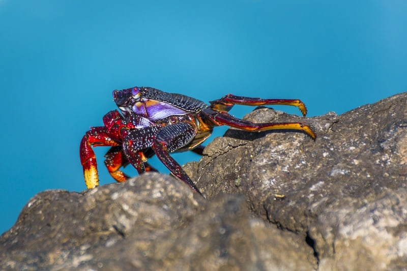

```{r setup, include=FALSE}
BioDataScience1::learnr_setup()
SciViews::R("infer")
# Required for RSConnect
# SciViews::R
library(rlang)
library(data.table)
library(ggplot2)
library(tibble)
library(tidyr)
library(dplyr)
library(dtplyr)
library(broom)
library(forcats)
library(collapse)
library(fs)
library(data.trame)
library(svFast)
library(svTidy)
library(svMisc)
library(svBase)
library(svFlow)
library(data.io)
library(chart)
library(tabularise)
library(SciViews)
# infer section
library(distributional)
library(inferit)
# ... more
library(readxl)
library(testthat)
library(equatags)
library(BioDataScience)
library(BioDataScience1)
```

```{r, echo=FALSE}
BioDataScience1::learnr_banner()
```

```{r, context="server"}
if (Sys.info()["user"] == "rstudio-connect") {
  options(learnr_user_id = session$user)
  assignInNamespace("default_user_id", function() {
    getOption("learnr_user_id", unname(Sys.info()["user"]))
  }, ns = "learnr")
}
BioDataScience1::learnr_server(input, output, session)
```

------------------------------------------------------------------------

## Objectifs

Une loi de distribution statistique généralise le calcul des probabilités dans une situation bien définie. Elle permet de calculer la probabilité que des évènements se produisent d'un point de vue théorique. La distribution binomiale et celle de Poisson concernent des variables quantitatives à deux modalités, c'est-à-dire que seulement deux évènements disjoints peuvent se produire.

Parmi les distributions continues, la distribution log-normale est une variante de la distribution normale où les quantiles ne peuvent être que nuls ou positifs. Le graphique quantile-quantile est un outil graphique permettant de comparer la distribution d'un échantillon à une distribution théorique.

Ce tutoriel est une auto-évaluation de vos connaissances pour :

-   Vérifier vos connaissances relatives à la loi de distribution des probabilités binomiale

-   Vous assurer d'avoir bien compris la distribution de Poisson

-   Être certain de bien comprendre le graphique quantile-quantile et l'utiliser pour décider si la distribution d'un échantillon suit une distribution normale ou log-normale

Vous devez avoir étudié le contenu du [module 7](https://wp.sciviews.org/sdd-umons/?iframe=wp.sciviews.org/sdd-umons-2025/districhi2.html) du cours SDD I, et en particulier les sections relatives à la [distribution binomiale](https://wp.sciviews.org/sdd-umons/?iframe=wp.sciviews.org/sdd-umons-2025/distribution-binomiale.html) et à la [distribution de Poisson](https://wp.sciviews.org/sdd-umons/?iframe=wp.sciviews.org/sdd-umons-2025/distribution-de-poisson.html), à la [distribution log-normale](https://wp.sciviews.org/sdd-umons/?iframe=wp.sciviews.org/sdd-umons-2025/distribution-log-normale.html) et au [graphique quantile-quantile](https://wp.sciviews.org/sdd-umons/?iframe=wp.sciviews.org/sdd-umons-2025/graphique-quantile-quantile.html). Enfin, cette matière nécessite que vous soyez à l'aise avec le calcul des probabilités, et que vous l'ayez vérifié via un tutoriel précédent `BioDataScience1::run("A06La_proba")`.

## Distribution binomiale

La distribution binomiale calcule les probabilités de *n* succès pour un modèle essai-erreur indépendant. Cela signifie que seulement deux évènements disjoints sont possibles : le "succès" ou l'"échec" (ces noms sont attribués aux deux évènements qui peuvent représenter tout autre chose comme pile ou face, mâle ou femelle, chevelu ou non ...). Le nombre d'essais indépendants *p* est fixé à l'avance et est toujours le même pour une distribution donnée.


En guise d'entrée en matière, répondez aux questions suivantes en effectuant le calcul à la main (en vous aidant éventuellement d'une calculatrice de poche). Considérant une population de lions dans une réserve naturelle au Kenya qui est composée d'autant de lions mâles que de lionnes (sexe ratio de 1:1). Vous vous baladez dans la réserve et vous avez observé dix individus au total (considérez que les individus se répartissent aléatoirement dans la réserve, nous savons bien qu'en pratique, ce n'est pas vraiment le cas).

```{r qu_binom}
quiz(
  question("Calculez la probabilité d'avoir observé trois mâles au maximum.",
    answer("0.117"),
    answer("0.161"),
    answer("0.172", correct = TRUE),
    answer("0.828"),
    allow_retry = TRUE, random_answer_order = TRUE,
    incorrect = "Recommencez afin de trouver la bonne réponse.",
    correct = "C'est correct ! Si l'on considère une répartition aléatoire des individus dans la réserve, du moins, pour cet exemple fictif. Vous avez fait, par exemple, `pbinom(3, 10, 0.5, lower.tail = TRUE)`."),
  question("Calculez la probabilité d'observer au minimum quatre mâles parmi ces dix individus.",
    answer("0.117"),
    answer("0.161"),
    answer("0.172"),
    answer("0.828", correct = TRUE),
    allow_retry = TRUE, random_answer_order = TRUE,
    incorrect = "Recommencez afin de trouver la bonne réponse.",
    correct = "C'est correct ! Notez que cette probabilité est complémentaire à la précédente `(1 - P3m)`, avec P3m la probabilité d'observer entre 0 et 3 mâles calculée juste au dessus.")
)
```

Calculez la table des probabilités possibles pour tous les évènements depuis zéro jusqu'à dix lions mâles observés sur dix individus au total, avec R.

<!-- 💬 **Ce code correspond au snippet `.ibtable`** [`.ib`= (d)istribution: `b`inomial]. -->

```{r binom1_h2, exercise=TRUE}
(bi_table <- dtx(succès = ___,
    probabilité = dbinom(___, size = ___, prob = ___)))
```

```{r binom1_h2-hint-1}
(bi_table <- dtx(succès = 0:10,
    probabilité = dbinom(0:10, size = ___, prob = ___)))

 #### ATTENTION: Hint suivant = solution !####
```

```{r binom1_h2-solution}
(bi_table <- dtx(succès = 0:10,
    probabilité = dbinom(0:10, size = 10, prob = 0.5)))
```

```{r binom1_h2-check}
grade_code("Oui, `dbinom()` permet de réaliser ce calcul. Vous auriez aussi pu utiliser `density(dist_binomial(10, 0.5), 0:10)[[1]]` à la place.")
```

Utilisez R cette fois-ci, pour répondre à une des questions posées lors du quiz plus hau : "Calculez la probabilité d'observer au maximum 3 mâles sur 10 individus", en utilisant `bi <- dist_binomial()`.

<!-- 💬 **Ce code correspond au snippet `.ibproba`.** -->

```{r binom2_h3, exercise=TRUE}
bi <- dist_binomial(size = ___, prob = ___)
___(bi, q = ___)
```

```{r binom2_h3-hint-1}
bi <- dist_binomial(size = ___, prob = ___)
___(bi, q = 3)
```

```{r binom2_h3-hint-2}
bi <- dist_binomial(size = 10, prob = ___)
___(bi, q = 3)

 #### ATTENTION: Hint suivant = solution !####
```

```{r binom2_h3-solution}
## Solution ##
bi <- dist_binomial(size = 10, prob = 0.5)
cdf(bi, q = 3)
```

```{r binom2_h3-check}
grade_code("Vous comprenez manifestement bien la logique de ce type de calcul dans R... ou alors, vous avez passé énormément de temps à observer les lions au Kenya !")
```

Calculez avec R la probabilité d'observer exactement 4 lionnes pour 10 contacts dans une autre réserve où il y a trois femelles pour un mâle (Pr{femelle} = 0.75). Vous ferez le calcul en utilisant uniquement `pbinom()`, ce qui vous oblige à soustraire des aires.

```{r binom3_h3, exercise=TRUE}
pbinom(___, size = ___, prob = ___, lower.tail = ___) -
  ___
```

```{r binom3_h3-hint-1}
pbinom(___, size = ___, prob = ___, lower.tail = ___) -
  pbinom(___, size = ___, prob = ___, lower.tail = ___)
```

```{r binom3_h3-hint-2}
pbinom(4, size = ___, prob = ___, lower.tail = TRUE) -
  pbinom(___, size = ___, prob = ___, lower.tail = TRUE)

 #### ATTENTION: Hint suivant = solution !####
```

```{r binom3_h3-solution}
## Solution ##
pbinom(4, size = 10, prob = 0.75, lower.tail = TRUE) -
  pbinom(3, size = 10, prob = 0.75, lower.tail = TRUE)
```

```{r binom3_h3-check}
grade_code("Comme le calcul de probabilité selon des lois de distribution avec les fonctions `pXXX()` nous renvoie la probabilité d'être plus petit ou égal avec `lower.tail = TRUE` ou plus grand ou égal avec `lower.tail = FALSE`, nous devons ruser et soustraire deux probabilités pour avoir un intervalle borné des deux côtés (ou ici, une seule valeur possible). Dans le cas d'une distribution discrète et d'un seul évènement possible, nous avons plus vite fait de déterminer directement la densité de probabilté en ce point avec `dbinom(4, 10, 0.75)` ou `density(dist_binomial(10, 0.75), 4)`. Le calcul que vous venez de faire est toutefois généralisable à un intervalle de plusieurs évènements et aussi au cas des distributions continues (cf tutoriel suivant).")
```

Représentez le graphique de densité de probabilité pour la distribution binomiale de l'exercice précédent. Dans vos scripts, n'oubliez pas d'utiliser le code suivant avant d'utiliser `chart()` : `SciViews::R("infer")` et `library(BioDataScience1)`.

<!-- 💬 **Ce code correspond au snippet `.ibdens`.** -->

```{r binom4_h2, exercise=TRUE}
bi <- ___(size = ___, prob = ___)
chart(___) +
  ylab("___")
```

```{r binom4_h2-hint-1}
bi <- dist_binomial(size = ___, prob = ___)
chart(___) +
  ylab("Densité de probabilité")

 #### ATTENTION: Hint suivant = solution !####
```

```{r binom4_h2-solution}
## Solution ##
bi <- dist_binomial(size = 10, prob = 0.75)
chart(bi) +
  ylab("Densité de probabilité")
```

```{r binom4_h2-check}
grade_code("Les traits verticaux représentent ici la probabilité de chaque évènement discret correspondant au nombre de succès (les quantiles) en fonction du nombre d'essais indépendants qui est toujours le même (indiqué via `size=`).")
```

## Distribution de Poisson


La distribution de Poisson détermine, tout comme la distribution binomiale, les probabilités de nombres de succès par rapport à un nombre d'essais indépendants, mais ici la probabilité de succès est très faible (évènement rare). Vous pouvez utiliser cette distribution pour déterminer la probabilité de rencontrer un animal rare, pour prédire les tremblements de terre, pour déterminer la probabilité d'une maladie rare ... et même pour prédire la probabilité que vous arriviez à pêcher un gros poisson avec votre petite canne à pêche !

Répondez à la question suivante en effectuant le calcul à la main (en vous aidant éventuellement d'une calculatrice de poche).

```{r qu_poisson}
quiz(
  question("Calculez le troisième terme d'une distribution de Poisson avec $\\lambda = 3$.",
    answer("0.353"),
    answer("0.647"),
    answer(" 0.224", correct = TRUE),
    answer("0.828"),
    allow_retry = TRUE, random_answer_order = TRUE,
    incorrect = "Recommencez afin de trouver la bonne réponse",
    correct = "C'est correct !")
)
```

Utilisez R pour représenter la table de probabilités liée à l'exercice ci-dessus avec les fonctions p/q/r/d.

<!-- 💬 **Ce code correspond au snippet `.iptable`** [`.ip` = (d)`i`stribution: `p`oisson]. -->

```{r poisson1_h2, exercise=TRUE}
(poi_table <- dtx(occurences = 0:(___ + 20),
  probabilité = dpois(0:(___ + 20), lambda = ___)))
```

```{r poisson1_h2-hint-1}
(poi_table <- dtx(occurences = 0:(3 + 20),
  probabilité = dpois(0:(___ + 20), lambda = ___)))

 #### ATTENTION: Hint suivant = solution !####
```

```{r poisson1_h2-solution}
## Solution ##
(poi_table <- dtx(occurences = 0:(3 + 20),
  probabilité = dpois(0:(3 + 20), lambda = 3)))
```

```{r poisson1_h2-check}
grade_code("La distribution de Poisson est plus simple que la distribution binomiale car elle n'admet qu'un seul paramètre, lambda, correspondant au nombre de succès le plus probable.")
```

Représentez le graphique de densité cumulée de la distribution de Poisson pour $\lambda = 12$.

<!-- 💬 **Ce code correspond au snippet `.ipdens`.** -->

```{r poisson2_h2, exercise=TRUE}
poi <- ___(lambda = ___)
___$___(___) +
  ylab("Densité de probabilité cumulée")
```

```{r poisson2_h2-hint-1}
poi <- ___(lambda = ___)
chart$___(poi) +
  ylab("Densité de probabilité cumulée")

 #### ATTENTION: Hint suivant = solution !####
```

```{r poisson2_h2-solution}
## Solution ##
poi <- dist_poisson(lambda = 12)
chart$cumulative(poi) +
  ylab("Densité de probabilité cumulée")
```

```{r poisson2_h2-check}
grade_code("Ce graphique montre que l'on tend, pour les probabilités cumulées, très rapidement vers 1 (pour un quantile aux alentours de 15). Cela signifie que l'on a pratiquement 100% de chances d'observer maximum 15 fois cet évènement rare durant la période d'observation définie.")
```

## Graphique quantile-quantile



Utilisez le jeu de données `crabs` du package {MASS} qui reprend des mesures de la carapace de 200 crabes.

```{r}
SciViews::R("infer")
# Importation des données
(crabs <- read("crabs", package = "MASS", lang = "fr"))
```

Réalisez un graphique quantile-quantile visant à déterminer si la longueur de carapace (variable nommée `length`) de ces crabes suit une distribution normale.

<!-- 💬 **Ce code correspond au snippet `.cuqqnorm`** [`.cu` = `c`hart: `u`nivariate]. -->

```{r qqnorm1_h2, exercise=TRUE}
SciViews::R("infer")
crabs <- read("crabs", package = "MASS", lang = "fr")
car::qqPlot(___[["___"]], distribution = "norm",
  envelope = 0.95, col = "Black", ylab = "Longueur [cm]")
```

```{r qqnorm1_h2-hint-1}
SciViews::R("infer")
crabs <- read("crabs", package = "MASS", lang = "fr")
car::qqPlot(crabs[["___"]], distribution = "norm",
  envelope = 0.95, col = "Black", ylab = "Longueur [cm]")

 #### ATTENTION: Hint suivant = solution !####
```

```{r qqnorm1_h2-solution}
## Solution ##
SciViews::R("infer")
crabs <- read("crabs", package = "MASS", lang = "fr")
car::qqPlot(crabs[["length"]], distribution = "norm",
  envelope = 0.95, col = "Black", ylab = "Longueur [cm]")
```

```{r qqnorm1_h2-check}
grade_code("Rappelez-vous de la syntaxe `DF$VAR` pour se référer à la variable nommée `VAR` dans le dataframe `DF`. Vous voyez ici que `length` suit une distribution normale parce que tous les points (ou quasi-tous dans d'autres situations) sont à l'intérieur de l'enveloppe de confiance à 95% représentée par les courbes en pointillés bleus.")
```

Est-ce que la longueur de carapace suit une distribution log-normale chez ces mêmes crabes ?

```{r qqnorm2_h2, exercise=TRUE}
SciViews::R("infer")
crabs <- read("crabs", package = "MASS", lang = "fr")
car::qqPlot(___[["___"]], distribution = "___",
  envelope = 0.95, col = "Black", ylab = "Longueur [cm]")
```

```{r qqnorm2_h2-hint-1}
SciViews::R("infer")
crabs <- read("crabs", package = "MASS", lang = "fr")
car::qqPlot(crabs[["___"]], distribution = "lnorm",
  envelope = 0.95, col = "Black", ylab = "Longueur [cm]")

 #### ATTENTION: Hint suivant = solution !####
```

```{r qqnorm2_h2-solution}
## Solution ##
SciViews::R("infer")
crabs <- read("crabs", package = "MASS", lang = "fr")
car::qqPlot(crabs[["length"]], distribution = "lnorm",
  envelope = 0.95, col = "Black", ylab = "Longueur [cm]")
```

```{r qqnorm2_h2-check}
  grade_code("Nous utilisons `distribution = \"norm\"` pour une normale et `distribution = \"lnorm\"` pour une log-normale. Dans le cas présent, les données suivent très clairement une distribution normale. Dans d'autres situations, vous pouvez opter en faveur de la distribution log-normale si les données n'admettent pas de valeurs négatives (par exemple, des longueurs, des masses ou des concentrations en solution où des valeurs négatives sont impossibles)et que le graphique quantile-quantile est en sa faveur, ou équivalent entre les deux.")
```

## Conclusion

Bravo ! Vous venez de terminer votre auto-évaluation relative à deux des lois de distribution de probabilités les plus courantes. La logique et la façon d'effectuer des calculs de probabilités à partir de quantiles ou de quantiles à partir de probabilités est un exercice de base en statistiques que vous serez amené à utiliser fréquemment. Assurez-vous donc de bien les maîtriser.

```{r comm_noscore, echo=FALSE}
question_text(
  "Laissez-nous vos impressions sur cet outil pédagogique",
  answer("", TRUE, message = "Pas de commentaires... C'est bien aussi."),
  incorrect = "Vos commentaires sont enregistrés.",
  placeholder = "Entrez vos commentaires ici...",
  allow_retry = TRUE
)
```

```{css, echo=FALSE}
@media print {
  .topics {
    width: 100% !important;
    padding: 0 0.5em 0 !important;
  }
  .topicsContainer, .topicsContainer *, .learnrBanner, .learnrBanner *, .topicActions, .topicActions * {
    display: none !important;
  }
}
```
