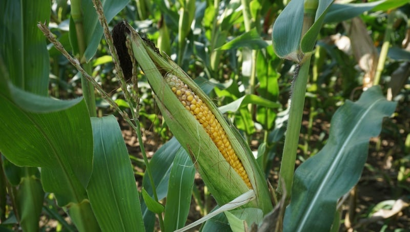

```{r setup, include=FALSE}
BioDataScience1::learnr_setup()
SciViews::R()
```

```{r, echo=FALSE}
BioDataScience1::learnr_banner()
```

```{r, context="server"}
BioDataScience1::learnr_server(input, output, session)
```

------------------------------------------------------------------------

## Objectifs

La loi de distribution Normale est centrale en statistiques. Ce tutoriel vous permet d'auto-évaluer vos acquis à son sujet. Vous allez :

-   Vérifier que vous comprenez bien la logique des calculs autour de la distribution Normale

-   Réaliser et interpréter un graphique quantile-quantile

Vous devez avoir étudié le contenu du [module 7](https://wp.sciviews.org/sdd-umons/?iframe=wp.sciviews.org/sdd-umons-2020/proba.html) du cours, et en particulier les sections relatives à la [distribution Normale](https://wp.sciviews.org/sdd-umons/?iframe=wp.sciviews.org/sdd-umons-2020/distribution-normale.html) et au [graphique quantile-quantile](https://wp.sciviews.org/sdd-umons/?iframe=wp.sciviews.org/sdd-umons-2020/graphique-quantile-quantile.html). Assurez-vous également au préalable d'être à l'aise avec le calcul des probabilités (que vous vérifiez avec le learnr `BioDataScience1::run("A07La_proba")`).

## Distribution Normale


La distribution Normale (ou Gaussienne) est appelée comme cela parce que c'est celle qui se rencontre le plus souvent. Elle s'observe à chaque fois que le résultat est la somme de petits effets aléatoires qui se combinent. Elle a une forme caractéristique, dite "en cloche".

### Graphique

Employez R pour représenter la densité de probabilité de la distribution $Y \sim N(10, 3)$.

💬 **Ce code correspond au snippet `.indens`** [`.in` = (d)`i`stribution: `n`ormal].

```{r normal1_h2, exercise=TRUE, exercise.lines=10}
# Normal distribution (density probability) with parameters:
.mu <- ___; .s <- ___ #  mu = .mu and sigma = .s
.col <- 1; .add <- FALSE # Plot parameters
.x <- seq(-3.5*.s+.mu, 3.5*.s+.mu, l = 1000)     # Quantiles
.d <- function (x) dnorm(x, mean = .mu, sd = .s) # Distribution function
.q <- function (p) qnorm(p, mean = .mu, sd = .s) # Quantile for lower-tail prob
.label <- bquote(N(.(.mu), .(.s)))               # Curve parameters
curve(.d(x), xlim = range(.x), xaxs = "i", n = 1000, col = .col,
  add = .add, xlab = "Quantiles", ylab = "Probability density") # Curve
abline(h = 0, col = "gray") # Baseline
```

```{r normal1_h2-hint-1}
# Normal distribution (density probability) with parameters:
.mu <- 10; .s <- ___ #  mu = .mu and sigma = .s
.col <- 1; .add <- FALSE # Plot parameters
.x <- seq(-3.5*.s+.mu, 3.5*.s+.mu, l = 1000)     # Quantiles
.d <- function (x) dnorm(x, mean = .mu, sd = .s) # Distribution function
.q <- function (p) qnorm(p, mean = .mu, sd = .s) # Quantile for lower-tail prob
.label <- bquote(N(.(.mu), .(.s)))               # Curve parameters
curve(.d(x), xlim = range(.x), xaxs = "i", n = 1000, col = .col,
  add = .add, xlab = "Quantiles", ylab = "Probability density") # Curve
abline(h = 0, col = "gray") # Baseline

 #### ATTENTION: Hint suivant = solution !####
```

```{r normal1_h2-solution}
# Normal distribution (density probability) with parameters:
.mu <- 10; .s <- 3 #  mu = .mu and sigma = .s
.col <- 1; .add <- FALSE # Plot parameters
.x <- seq(-3.5*.s+.mu, 3.5*.s+.mu, l = 1000)     # Quantiles
.d <- function (x) dnorm(x, mean = .mu, sd = .s) # Distribution function
.q <- function (p) qnorm(p, mean = .mu, sd = .s) # Quantile for lower-tail prob
.label <- bquote(N(.(.mu), .(.s)))               # Curve parameters
curve(.d(x), xlim = range(.x), xaxs = "i", n = 1000, col = .col,
  add = .add, xlab = "Quantiles", ylab = "Probability density") # Curve
abline(h = 0, col = "gray") # Baseline
```

```{r normal1_h2-check}
grade_code("Le code pour obtenir ce graphique est un peu long... mais le snippet est là pour vous préremplir la majeure partie !")
```

Ceci est un graphique de base R. Vous avez beaucoup plus utilisé les graphiques {ggplot2} jusqu'ici. Leurs logiques diffèrent. Par exemple, pour ajouter un élément à un graphique de base, nous ferons appel à une instruction supplémentaire *sans* utiliser l'opérateur `+`, contrairement à {ggplot2}.

Ajoutez maintenant le libellé de la distribution à côté de sa courbe sur le graphique avec la fonction `text()` (dernière ligne du code à compléter). Pour cela, vous devez rajouter ceci à la fin :

```{r, echo=FALSE, eval=FALSE}
text(.mu-.s, .d(.mu-.s), .label, pos = 2, col = .col) # Label at left
```

💬 **Le code ajouté en dernière ligne après celui qui génère le graphique correspond au snippet `.inllabel`.**

```{r normal2_h2, exercise=TRUE, exercise.lines=12}
# Normal distribution (density probability) with parameters:
.mu <- 10; .s <- 3 #  mu = .mu and sigma = .s
.col <- 1; .add <- FALSE # Plot parameters
.x <- seq(-3.5*.s+.mu, 3.5*.s+.mu, l = 1000)     # Quantiles
.d <- function (x) dnorm(x, mean = .mu, sd = .s) # Distribution function
.q <- function (p) qnorm(p, mean = .mu, sd = .s) # Quantile for lower-tail prob
.label <- bquote(N(.(.mu), .(.s)))               # Curve parameters
curve(.d(x), xlim = range(.x), xaxs = "i", n = 1000, col = .col,
  add = .add, xlab = "Quantiles", ylab = "Probability density") # Curve
abline(h = 0, col = "gray") # Baseline  
# Add text on the plot
___ # Label at left
```

```{r normal2_h2-hint-1}
# Normal distribution (density probability) with parameters:
.mu <- 10; .s <- 3 #  mu = .mu and sigma = .s
.col <- 1; .add <- FALSE # Plot parameters
.x <- seq(-3.5*.s+.mu, 3.5*.s+.mu, l = 1000)     # Quantiles
.d <- function (x) dnorm(x, mean = .mu, sd = .s) # Distribution function
.q <- function (p) qnorm(p, mean = .mu, sd = .s) # Quantile for lower-tail prob
.label <- bquote(N(.(.mu), .(.s)))               # Curve parameters
curve(.d(x), xlim = range(.x), xaxs = "i", n = 1000, col = .col,
  add = .add, xlab = "Quantiles", ylab = "Probability density") # Curve
abline(h = 0, col = "gray") # Baseline  
# Add text on the plot
text(___) # Label at left

 #### ATTENTION: Hint suivant = solution !####
```

```{r normal2_h2-solution}
# Normal distribution (density probability) with parameters:
.mu <- 10; .s <- 3 #  mu = .mu and sigma = .s
.col <- 1; .add <- FALSE # Plot parameters
.x <- seq(-3.5*.s+.mu, 3.5*.s+.mu, l = 1000)     # Quantiles
.d <- function (x) dnorm(x, mean = .mu, sd = .s) # Distribution function
.q <- function (p) qnorm(p, mean = .mu, sd = .s) # Quantile for lower-tail prob
.label <- bquote(N(.(.mu), .(.s)))               # Curve parameters
curve(.d(x), xlim = range(.x), xaxs = "i", n = 1000, col = .col,
  add = .add, xlab = "Quantiles", ylab = "Probability density") # Curve
abline(h = 0, col = "gray") # Baseline  
# Add text on the plot
text(.mu-.s, .d(.mu-.s), .label, pos = 2, col = .col) # Label at left
```

```{r normal2_h2-check}
grade_code("D'autres snippets sont également disponibles pour annoter vos graphiques de lois de distributions dans la section `.ia`.")
```

### Calculs avec la loi Normale

Comme pour les autres lois de distributions, il est vital de pouvoir calculer des probabilités en fonctions de quantiles et des quantiles à partir de probabilités. Nous nous référerons toujours à la probabilités d'avoir une valeur plus petite (aide à gauche avec `lower.tail = TRUE`) ou plus grande (aide à droite avec `lower.tail = FALSE`) que ce quantile. Une aire comprise entre deux quantiles doit se calculer en deux temps (Pr{Q2} - Pr{Q1}).



Vous étudiez la croissance de plants de maïs. A partir d'un grand nombre de mesures, vous avez pu déterminer que la hauteur de vos plants suit une distribution Normale avec une moyenne de 145 cm et un écart type de 22 cm.

Calculez la probabilités d'avoir un plant de maïs de moins de 100 cm de haut dans votre champ.

💬 **Ce code correspond au snippet `.inproba`.**

```{r normal3_h3, exercise=TRUE}
pnorm(___, mean = ___, sd = ___, lower.tail = ___)
```

```{r normal3_h3-hint-1}
pnorm(100, mean = ___, sd = ___, lower.tail = ___)
```

```{r normal3_h3-hint-2}
pnorm(100, mean = 145, sd = ___, lower.tail = ___)

 #### ATTENTION: Hint suivant = solution !####
```

```{r normal3_h3-solution}
pnorm(100, mean = 145, sd = 22, lower.tail = TRUE)
```

```{r normal3_h3-check}
grade_code("Ici, c'est bien l'aire à gauche du quantile 100 cm qui nous intéresse. Elle correspond à la probabilité qu'un plant soit moins haut que ce quantile et se calcule en spécifiant `lower.tail = FALSE` dans la fonction `pnorm()`.")
```

Calculez la probabilités d'avoir un plant de maïs dont la hauteur est comprise entre 120 et 150 cm en utilisant les aires à gauche des quantiles.

```{r normal4_h3, exercise=TRUE}
pnorm(___, mean = ___, sd = ___, lower.tail = ___) -
  ___
```

```{r normal4_h3-hint-1}
pnorm(150, mean = ___, sd = ___, lower.tail = ___) -
  pnorm(___, mean = ___, sd = ___, lower.tail = ___)
```

```{r normal4_h3-hint-2}
pnorm(150, mean = ___, sd = ___, lower.tail = ___) -
  pnorm(120, mean = ___, sd = ___, lower.tail = ___)

 #### ATTENTION: Hint suivant = solution !####
```

```{r normal4_h3-solution}
pnorm(150, mean = 145, sd = 22, lower.tail = TRUE) -
  pnorm(120, mean = 145, sd = 22, lower.tail = TRUE)
```

```{r normal4_h3-check}
grade_code("Une aire comprise entre deux quantiles se calcule toujours en soustrayant la plus petite de la plus grande (par rapport aux deux quantiles respectifs). Deux calculs sont possibles : via les aires à gauche comme ici, ou via les aires à droite en utilisant `lower.tail = FALSE`.")
```

En partant de la distribution théorique $Y \sim N(10, 2.5)$, calculez le quantile délimitant une probabilités à droite de 0.1 (10% des plus grandes observations).

💬 **Ce code correspond au snippet `.inquant`.**

```{r normal5_h2, exercise=TRUE}
qnorm(___, mean = ___, sd = __, lower.tail = ___)
```

```{r normal5_h2-hint-1}
qnorm(0.1, mean = ___, sd = ___, lower.tail = ___)

 #### ATTENTION: Hint suivant = solution !####
```

```{r normal5_h2-solution}
qnorm(0.1, mean = 10, sd = 2.5, lower.tail = FALSE)
```

```{r normal5_h2-check}
grade_code("La fonction `qnorm()` calcule un quantile à partir d'une probabilité, contrairement à `pnorm()` qui calcule une probabilité à partir d'un quantile.")
```

## Graphique quantile-quantile


Utilisez le jeu de données `crabs` du package {MASS} qui reprend des mesures de la carapace de 200 crabes bleus.

```{r}
SciViews::R()
# Importation des données
(crabs <- read("crabs", package = "MASS", lang = "fr"))
```

Réalisez un graphique quantile-quantile visant à déterminer si la longueur de carapace (variable nommée `length`) de ces crabes suit une distribution Normale.

💬 **Ce code correspond au snippet `.cuqqnorm`** [`.cu` = `c`hart: `u`nivariate].

```{r qqnorm1_h2, exercise=TRUE}
SciViews::R()
crabs <- read("crabs", package = "MASS", lang = "fr")
car::qqPlot(___[["___"]], distribution = "norm",
  envelope = 0.95, col = "Black", ylab = "Longueur [cm]")
```

```{r qqnorm1_h2-hint-1}
SciViews::R()
crabs <- read("crabs", package = "MASS", lang = "fr")
car::qqPlot(crabs[["___"]], distribution = "norm",
  envelope = 0.95, col = "Black", ylab = "Longueur [cm]")

 #### ATTENTION: Hint suivant = solution !####
```

```{r qqnorm1_h2-solution}
SciViews::R()
crabs <- read("crabs", package = "MASS", lang = "fr")
car::qqPlot(crabs[["length"]], distribution = "norm",
  envelope = 0.95, col = "Black", ylab = "Longueur [cm]")
```

```{r qqnorm1_h2-check}
grade_code("Rappelez-vous de la syntaxe `DF$VAR` pour se référer à la variable nommée `VAR` dans le dataframe `DF`. Vous voyez ici que `length` suit une distribution Normale parce que tous les points (ou quasi-tous dans d'autres situations) sont à l'intérieur de l'enveloppe de confiance à 95% représenté par les courbes en pointillés bleus.")
```

Est-ce que la longueur de carapace suit une distribution log-Normale chez ces mêmes crabes ?

```{r qqnorm2_h2, exercise=TRUE}
SciViews::R()
crabs <- read("crabs", package = "MASS", lang = "fr")
car::qqPlot(___[["___"]], distribution = "___",
  envelope = 0.95, col = "Black", ylab = "Longueur [cm]")
```

```{r qqnorm2_h2-hint-1}
SciViews::R()
crabs <- read("crabs", package = "MASS", lang = "fr")
car::qqPlot(crabs[["___"]], distribution = "lnorm",
  envelope = 0.95, col = "Black", ylab = "Longueur [cm]")

 #### ATTENTION: Hint suivant = solution !####
```

```{r qqnorm2_h2-solution}
SciViews::R()
crabs <- read("crabs", package = "MASS", lang = "fr")
car::qqPlot(crabs[["length"]], distribution = "lnorm",
  envelope = 0.95, col = "Black", ylab = "Longueur [cm]")
```

```{r qqnorm2_h2-check}
  grade_code("Ici, nous utilisons `distribution = \"lnorm\"` au lieu de `\"norm\"`. Dans le cas présent, la réponse est non. Dans d'autres situations, si c'était le cas également, vous décider pour la distribution log-Normale si les données n'admettent pas de valeurs négatives (par exemple, des longueurs, des masses ou des concentrations en solution où des valeurs négatives sont impossibles).")
```

## Conclusion

La loi Normale est très importante en statistiques. Elle ne doit plus avoir de secrets pour vous. Comparer la distribution d'un échantillon à une distribution théorique comme la loi Normale est une excellente façon de vérifier la distribution des données.

```{r comm_noscore, echo=FALSE}
question_text(
  "Laissez-nous vos impressions sur cet outil pédagogique",
  answer("", TRUE, message = "Pas de commentaires... C'est bien aussi."),
  incorrect = "Vos commentaires sont enregistrés.",
  placeholder = "Entrez vos commentaires ici...",
  allow_retry = TRUE
)
```
