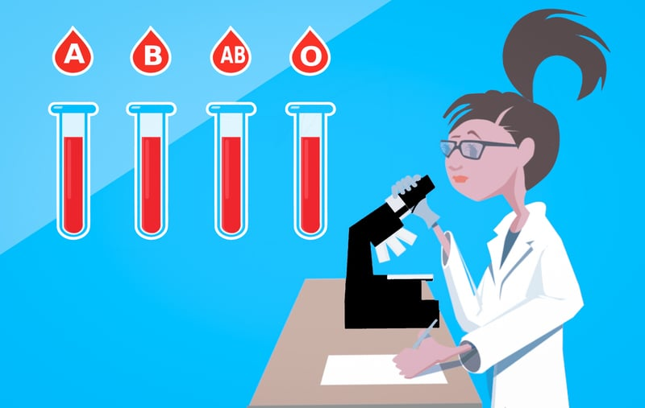

```{r setup, include=FALSE}
BioDataScience1::learnr_setup()
SciViews::R()
```

```{r, echo=FALSE}
BioDataScience1::learnr_banner()
```

```{r, context="server"}
BioDataScience1::learnr_server(input, output, session)
```

------------------------------------------------------------------------

## Objectifs

La loi de distribution du $\chi^2$ peut être utilisée pour étudier si des dépendances existent ou non entre les niveaux de deux variables qualitatives. C'est le test $\chi^2$ d'indépendance. Vos objectifs sont :

-   Comprendre le test d'hypothèse de $\chi^2$ d'indépendance pour deux variables qualitatives croisées

-   Interpréter correctement un tel test

Vous devez avoir assimilé la matière du [module 8](https://wp.sciviews.org/sdd-umons/?iframe=wp.sciviews.org/sdd-umons-2020/chi2.html) du cours, en particulier la [section 8.2](https://wp.sciviews.org/sdd-umons/?iframe=wp.sciviews.org/sdd-umons-2020/test-dhypoth%25C3%25A8se.html). Vous devez avoir réalisé le tutoriel `BioDataScience1::run("A08La_chi2")` préalablement. Ce learnr vous sert à auto-évaluer vos acquis relatifs au test $\chi^2$ d'indépendance.

## Fumeurs


Le tabagisme est étudié chez les adolescents. Voici les résultats d'un sondage sur un échantillon aléatoire parmi la population d'adolescents concernés par cette étude :

```{r, echo=TRUE}
tabac <- dtx(
  genre        = c("fille",  "garçon", "fille",      "garçon"),
  comportement = c("fumeur", "fumeur", "non fumeur", "non fumeur"),
  freq          = c(11,       22,        28,            19))
tabac_table <- xtabs(data = tabac, freq ~ genre + comportement)
knitr::kable(tabac_table)
```

Vous voulez savoir si la prévalence du tabagisme chez les adolescents est dépendante ou non du genre. Pour cela, vous considérez la distribution du $\chi^2$.

### Calcul du $\chi^2_{obs}$

Afin de déterminer la valeur du $\chi^2_{obs}$, vous commencez par réaliser le tableau contenant les fréquences théoriques sous l'hypothèse nulle d'indépendance du tabagisme par rapport au genre (les $\alpha_i$). Faite ce calcul à la main, en vous aidant éventuellement d'une calculette.

```{r}
a <- dtx(
  genre        = c("fille", "garcon"),
  fumeur       = c(16.1, 16.9),
  `non fumeur` = c(22.9, 24.1))
b <- dtx(
  genre        = c("fille", "garcon"),
  fumeur       = c(4.8, 7.6),
  `non fumeur` = c(15.5, 11.9))
c <- dtx(
  genre        = c("fille", "garcon"),
  fumeur       = c(5.9, 9.6),
  `non fumeur` = c(12.8, 10.1))
d <- dtx(
  genre        = c("fille", "garcon"),
  fumeur       = c(12.4, 15.9),
  `non fumeur` = c(26.4, 21.5))
ggtexttable <- ggpubr::ggtexttable
aa <- ggtexttable(a, rows = NULL)
bb <- ggtexttable(b, rows = NULL)
cc <- ggtexttable(c, rows = NULL)
dd <- ggtexttable(d, rows = NULL)
combine_charts(chartlist = list(aa, bb, cc, dd))
```

```{r qu_alpha_i}
question("Sélectionnez le tableau correspondant aux valeurs de $\\alpha_i$ (vous pouvez utiliser une calculette pour vérifier)",
  answer("A", correct = TRUE),
  answer("B"),
  answer("C"),
  answer("D"),
  allow_retry = TRUE,
  incorrect = "Recommencez afin de trouver la bonne réponse",
  correct = "C'est correct ! Ces valeurs correspondent aux totaux des lignes multipliés par les totaux des colonnes et divisés par le total général.")
```

Calculez ensuite la valeur du $\chi^2_{obs}$ toujours sous l'hypothèse nulle d'indépendance à l'aide de votre calculette. Pour rappel, le calcul est le suivant :

$$\chi^2_{obs} = \sum_i \frac{(a_i - \alpha_i)^2}{\alpha_i}$$

```{r qu_valeur_chi2}
question("Valeur du $\\chi^2$",
  answer("5.34", correct = TRUE),
  answer("1.85"),
  answer("6.28"),
  answer("3.59"),
  allow_retry = TRUE, random_answer_order = TRUE,
  incorrect = "Recommencez afin de trouver la bonne réponse",
  correct = "C'est correct ! Cette valeur est la somme des a_i moins alpha_i au carré divisés par les alpha_i.")
```

### Test $\chi^2$ d'indépendance

Continuez le calcul de votre test d'hypothèse d'indépendance à la main en déterminant l'aire à droite délimitée par la valeur du quantile $\chi^2_{obs}$ calculé ci-dessus dans la distribution du $\chi^2$ correspondant à cette étude.

💬 **Ce code correspond au snippet `.icproba`** [`.ic` = (d)`i`stribution: `c`hi2].

```{r valeur_chi2_h2, exercise=TRUE}
pchisq(___, df = ___, lower.tail = ___)
```

```{r valeur_chi2_h2-hint-1}
pchisq(___, df = 1, lower.tail = ___)

 #### ATTENTION: Hint suivant = solution !####
```

```{r valeur_chi2_h2-solution}
pchisq(5.34, df = 1, lower.tail = FALSE)
```

```{r valeur_chi2_h2-check}
grade_code("Notez bien que la distribution du Chi^2 correspondante a ici un seul degré de liberté.")
```

```{r qu_interpretation}
quiz(
  question("Rejetez-vous $H_0$ au seuil alpha de 5% ?",
    answer("oui", correct = TRUE),
    answer("non"),
    allow_retry = TRUE,
    incorrect = "Recommencez afin de trouver la bonne réponse",
    correct = "C'est correct !"),
  question("Toujours au seuil alpha de 5%, y-a-t'il dépendance ou indépendance des deux variables ?",
    answer("Dépendance des deux variables", correct = TRUE),
    answer("Indépendance des deux variables"),
    allow_retry = TRUE,
    incorrect = "Recommencez afin de trouver la bonne réponse",
    correct = "C'est correct ! Vous rejetez H0 et cela signifie ici dépendance entre le genre et la prévalence du tabagisme chez ces adolescents, en l'occurence, les garçons ont plus tendance à fumer que les filles (vous comparez les fréquences observées par rapport aux fréquences attendues sous H0 pour le déterminer).")
)
```

### Utilisation de `chisq.test()`

Maintenant, calculez le même test d'hypothèse, mais avec la fonction dédiée `chisq.test()` dans R sur notre tableau de contingence à double entrée, considérant qu'il est déjà encodé dans R sous le nom `tabac_table`.

💬 **Ce code correspond au snippet `.hcchi2bi`** [`.hc` = `h`ypothesis tests: `c`ontingency].

```{r tabac-prepare}
tabac <- dtx(
  genre        = c("fille",  "garçon", "fille",      "garçon"),
  comportement = c("fumeur", "fumeur", "non fumeur", "non fumeur"),
  freq          = c(11,       22,        28,            19))
tabac_table <- xtabs(data = tabac, freq ~ genre + comportement)
```

```{r chi2_test_h2, exercise=TRUE, exercise.setup = "tabac-prepare"}
(chi2. <- chisq.test(___, correct = FALSE))
cat("Expected frequencies:\n"); chi2.[["expected"]]
```

```{r chi2_test_h2-hint-1}
(chi2. <- chisq.test(TABLE_FREQ, correct = FALSE))
cat("Expected frequencies:\n"); chi2.[["expected"]]

 #### ATTENTION: Hint suivant = solution !####
```

```{r chi2_test_h2-solution}
(chi2. <- chisq.test(tabac_table, correct = FALSE))
cat("Expected frequencies:\n"); chi2.[["expected"]]
```

```{r chi2_test_h2-check}
grade_code("Dorénavant, le détail du calcul à la main ne vous est plus utile. Il vous sert seulement dans un premier temps à comprendre la logique derrière le test. Vous pouvez directement utiliser `chisq.test()` en pratique.")
```

Vérifiez que vous obtenez bien la même valeur que celle que vous aviez calculée à la main. La fonction `chisq.test()` permet une subtilité supplémentaire via la correction de continuité de Yates si vous indiquez `correct = TRUE`. *Il est conseillé d'utiliser cette correction en pratique et elle est activée par défaut, donc, si vous ne précisez pas `correct=` dans l'appel de `chisq.test()`.*

```{r, echo=TRUE}
(chi2. <- chisq.test(tabac_table, correct = TRUE))
cat("Expected frequencies:\n"); chi2.[["expected"]]
```

## Groupes sanguins



Une étude de la distribution des différents groupes sanguins est réalisée dans trois états américains : Iowa en vert, Missouri en bleu et Floride en rouge sur la carte ci-dessous.

```{r, fig.align='center', echo=FALSE, message=FALSE, out.width= '80%'}
SciViews::R
usa <- map_data("state")
usa$region <- as.factor(usa$region)
#usa$region
#levels(usa$region)

library(cowplot)
chart(usa, aes(long, lat, group = group)) +
  geom_polygon(fill = "white", colour = "black") +
  geom_polygon(data = filter(usa, region == "florida"),
    aes(long, lat, group = group), fill = "red") +
  geom_polygon(data = filter(usa, region == "missouri"),
    aes(long, lat, group = group), fill = "blue") +
  geom_polygon(data = filter(usa, region == "iowa"),
    aes(long, lat, group = group), fill = "green") +
  theme(axis.line = element_blank(), axis.title = element_blank(),
    axis.text = element_blank(), axis.ticks = element_blank()) +
  coord_quickmap()
```

Voici les résultats de cette étude sur un échantillon aléatoire de la population (notez l'utilisation de `xtabs()` ici en avant dernière ligne pour créer le tableau de contingence à double entrée à partir des fréquences et qui correspond au snippet `.ectable2f`) :

```{r, echo=TRUE}
blood <- dtx(
  group = c("A", "B", "AB", "O", "A", "B", "AB", "O", "A", "B", "AB", "O"),
  state = c("Floride", "Floride", "Floride", "Floride",
            "Iowa", "Iowa", "Iowa", "Iowa",
            "Missouri", "Missouri", "Missouri", "Missouri"),
  freq  = c(122, 117, 19, 244, 1781, 1351, 289, 3301, 353, 269, 60, 713))
blood_table <- xtabs(data = blood, freq ~ group + state)
knitr::kable(blood_table)
```

Les distributions des groupes sanguins sont-elles identiques dans les trois états étudiés ?

Avant de réalisez votre test $\chi^2$ d'indépendance avec R, veuillez indiquer le nombre de degré de liberté de la distribution $\chi^2$ théorique associée.

```{r qu_ddl}
question("Nombre de degré de liberté de la distribution du $\\chi^2$.",
  answer("1"),
  answer("2"),
  answer("3"),
  answer("4"), 
  answer("6", correct = TRUE),
  answer("12"),
  allow_retry = TRUE,
  incorrect = "Recommencez afin de trouver la bonne réponse",
  correct = "C'est correct ! Le nombre de degrés de libertés est le nombre de lignes moins une multiplié par le nombre de colonnes moins une du tableau de contingence à double entrée, soit ici (3-1) * (4-1) = 6.")
```

Calculez le test $\chi^2$ d'indépendance dans R pour ce jeu de données directement avec la fonction `chisq.test()` considérant que le tableau de contingence est déjà créé dans R sous le nom `blood_table`.

💬 **Ce code correspond au snippet `.hcchi2bi`.**

```{r blood-prepare}
blood <- dtx(
  group = c("A", "B", "AB", "O", "A", "B", "AB", "O", "A", "B", "AB", "O"),
  state = c("Floride", "Floride", "Floride", "Floride",
            "Iowa", "Iowa", "Iowa", "Iowa",
            "Missouri", "Missouri", "Missouri", "Missouri"),
  freq  = c(122, 117, 19, 244, 1781, 1351, 289, 3301, 353, 269, 60, 713))
blood_table <- xtabs(data = blood, freq ~ group + state)
```

```{r chi_blood_h2, exercise=TRUE, exercise.setup = "blood-prepare"}
(chi2. <- chisq.test(___))
cat("Expected frequencies:\n")
chi2.[["expected"]]
```

```{r chi_blood_h2-hint-1}
(chi2. <- chisq.test(TABLE))
cat("Expected frequencies:\n")
chi2.[["expected"]]
```

```{r chi_blood_h2-solution}
(chi2. <- chisq.test(blood_table))
cat("Expected frequencies:\n")
chi2.[["expected"]]
```

```{r chi_blood_h2-check}
grade_code("Le code est similaire au cas précédent. Pour rappel, ne pas spécifier `correct =` dans `chisq.test()` implique la valeur `TRUE` par défaut. Cependant la correction de Yates n'est disponible que pour un tableau 2x2. Donc, cela n'a pas d'effet ici.")
```

```{r qu_interpretation2}
quiz(
  question("Avec un seuil alpha de 5%, rejetez-vous $H_0$ ici ?",
    answer("oui"),
    answer("non", correct = TRUE),
    allow_retry = TRUE,
    incorrect = "Recommencez afin de trouver la bonne réponse",
    correct = "C'est correct !"),
  question("Toujours au seuil alpha de 5%, y-a-t'il dépendance ou indépendance des variables ?",
    answer("Dépendance des variables"),
    answer("Indépendance des variables", correct = TRUE),
    allow_retry = TRUE,
    incorrect = "Recommencez afin de trouver la bonne réponse",
    correct = "C'est correct ! Cela signifie que la distribution des groupes sanguins dans la population américaine ne diffère pas d'un état à l'autre de manière significative au seuil alpha de 5% (en tous cas pour ces 3 états-là).")
)
```

## Conclusion

A l'issue de cette série d'exercices, vous devriez être à l'aise avec l'utilisation de la distribution du $\chi^2$ et de ses tests d'hypothèse. Vous pouvez maintenant passer à des applications concrètes (assignation GitHub).

```{r comm_noscore, echo=FALSE}
question_text(
  "Laissez-nous vos impressions sur ce learnr",
  answer("", TRUE, message = "Pas de commentaires... C'est bien aussi."),
  incorrect = "Vos commentaires sont enregistrés.",
  placeholder = "Entrez vos commentaires ici...",
  allow_retry = TRUE
)
```
