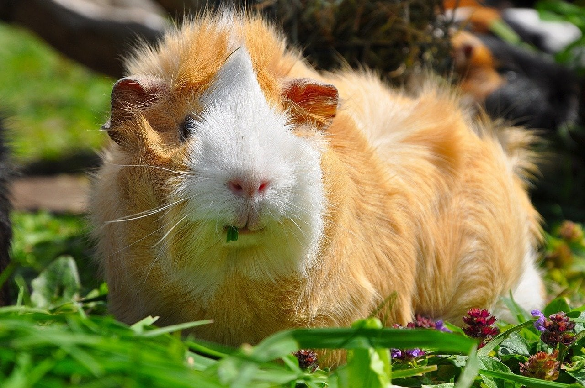

```{r setup, include=FALSE}
BioDataScience1::learnr_setup()
SciViews::R()
```

```{r, echo=FALSE}
BioDataScience1::learnr_banner()
```

```{r, context="server"}
BioDataScience1::learnr_server(input, output, session)
```

----

## Objectifs

Vous avez découvert il y a peu la moyenne et plusieurs tests d'hypothèses associés (différentes variantes du test *t* de Student). Le test *t* de Student indépendant vous permet de comparer les moyennes de deux populations.

Le [module 10](https://wp.sciviews.org/sdd-umons/?iframe=wp.sciviews.org/sdd-umons-2020/variance.html) du cours vous explique pourquoi c'est une mauvaise idée de l'appliquer pour comparer plus de deux moyennes simultanément via des comparaisons deux à deux multiples sans précautions particulières.

{width='10%'}

L'analyse de variance (ANOVA) est, par contre, toute indiquée pour comparer les moyennes de plus de deux populations simultanément.

{width='10%'}

Dans ce tutoriel, vous allez pouvoir auto-évaluer votre capacité à\ :

- réaliser des graphiques relatifs à la distribution F

- effectuer une analyse de variance (ANOVA) et l'interpréter correctement

- recourir à un test post-hoc de comparaison multiples pour préciser les différences de moyennes en cas de rejet de H~0~ de l'ANOVA

## Distribution F

La loi de distribution théorique sur laquelle l'ANOVA se base est la distribution F de Fisher-Snedecor. C'est une distribution asymétrique d'une allure similaire à la distribution du Chi^2^. Cependant, les paramètres diffèrent. La question suivante vous permet de vérifier si vous avez bien compris à quoi correspondent les deux paramètres de la distribution F.

Tracez le graphique de densité de probabilité de la distribution F qui correspond à l'analyse d'un échazntillon de  100 observations réparties en 5 groupes (comparaison de 5 moyennes).

💬 **Ce code correspond au snippet `.ifdens`**

```{r fplot_h2, exercise=TRUE, exercise.lines=10}
# Fisher-Snedecor's F distribution (density probability) with parameter:
.df1 <- ___; .df2 <- ___ # numerator (.df1) and denominator (.df2) df
.col <- 1; .add <- FALSE # Plot parameters
.x <- seq(0, qf(0.999, df1 = .df1, df2 = .df2), l = 1000)  # Quantiles
.d <- function (x) df(x, df1 = .df1, df2 = .df2)           # Distribution function
.q <- function (p) qf(p, df1 = .df1, df2 = .df2)           # Quantile for lower-tail prob
.label <- bquote(F(.(.df1), .(.df2)))                      # Curve parameters
curve(.d(x), xlim = range(.x), xaxs = "i", n = 1000, col = .col,
  add = .add, xlab = "Quantiles", ylab = "Probability density") # Curve
abline(h = 0, col = "gray") # Baseline
```

```{r fplot_h2-hint-1}
# Fisher-Snedecor's F distribution (density probability) with parameter:
.df1 <- 4; .df2 <- ___ # numerator (.df1) and denominator (.df2) df
.col <- 1; .add <- FALSE # Plot parameters
.x <- seq(0, qf(0.999, df1 = .df1, df2 = .df2), l = 1000)  # Quantiles
.d <- function (x) df(x, df1 = .df1, df2 = .df2)           # Distribution function
.q <- function (p) qf(p, df1 = .df1, df2 = .df2)           # Quantile for lower-tail prob
.label <- bquote(F(.(.df1), .(.df2)))                      # Curve parameters
curve(.d(x), xlim = range(.x), xaxs = "i", n = 1000, col = .col,
  add = .add, xlab = "Quantiles", ylab = "Probability density") # Curve
abline(h = 0, col = "gray") # Baseline

 #### ATTENTION: Hint suivant = solution !####
```

```{r fplot_h2-solution}
# Fisher-Snedecor's F distribution (density probability) with parameter:
.df1 <- 4; .df2 <- 95 # numerator (.df1) and denominator (.df2) df
.col <- 1; .add <- FALSE # Plot parameters
.x <- seq(0, qf(0.999, df1 = .df1, df2 = .df2), l = 1000)  # Quantiles
.d <- function (x) df(x, df1 = .df1, df2 = .df2)           # Distribution function
.q <- function (p) qf(p, df1 = .df1, df2 = .df2)           # Quantile for lower-tail prob
.label <- bquote(F(.(.df1), .(.df2)))                      # Curve parameters
curve(.d(x), xlim = range(.x), xaxs = "i", n = 1000, col = .col,
  add = .add, xlab = "Quantiles", ylab = "Probability density") # Curve
abline(h = 0, col = "gray") # Baseline
```

```{r fplot_h2-check}
grade_code("Le code pour obtenir ce graphique est un peu long... mais le snippet est là pour vous préremplir la majeure partie ! Vous avez cependant su convertir le nombre d'observations et le nombre de groupes en degrés de liberté intragroupe et intergroupe.", "Il semble que vous n'avez pas su déterminer correctement les paramètres de la distribution F. Si n correspond au nombre d'observations et k au nombre de groupes, alors le nombre de degrés intergroupe vaut k – 1  et le nombre de degrés intragroupe vaut n – k.")
```

## Croissance des dents de cochons d'Inde

Vous allez maintenant réaliser une analyse complète de l'effet de la vitamine C sur la longueur des odontoblastes (cellules responsables de la croissance et de la formation de l'émail des dents) de cochons d'Inde. Les données utilisées proviennent du jeu de données `ToothGrowth` du package `datasets` (vous pouvez donc consulter la page d'aide si vous souhaitez obtenir plus d'informations).

{width='50%'}

Le jeu de données comprend les variables suivantes\ :

```{r, echo=TRUE}
# importation
toothgrowth <- read("ToothGrowth", package = "datasets", lang = "fr")
# Quelques informations sur le tableau de données.
glimpse(toothgrowth)
```

- `len`\ : longueur des odontablastes (µm)
- `supp`\ : supplément administré, OJ (jus d'orange contenant donc entre autres de la vitamine C) ou VC (vitamine C sous forme d'acide ascorbique)
- `dose`\ : dose de vitamine C administrée en trois rations différentes, 0.5, 1 et 2 mg/J

```{r, echo=TRUE}
# Vérification des types des variables et ajout des labels
toothgrowth %>.%
  mutate(., 
    supp = factor(supp, levels = c("OJ", "VC")),
    dose = ordered(dose, levels = c(0.5, 1, 2))) %>.%
  labelise(toothgrowth, self = FALSE,
    label = list(
      len = "Longueur des odontoblastes",
      supp = "Supplémentation",
      dose = "Dose de vitamine C"),
    units = list(
      len = "µm",
      supp = NA,
      dose = "mg/J"
      )
    ) -> toothgrowth
```

**Cette étape est la première à réaliser après avoir importé les données. Il faut vérifier et adapter les types et les labels des variables.** Il est particulièrement important que les variables qui définissent les sous-populations comparées soient bien encodées sous forme d'objets `factor` ou `ordered`\ ! Le piège lorsqu'il s'agit de valeurs numériques, comme ici, est de laisser la variable sous forme `integer` ou `numeric`, car alors, la fonction `lm()` fera une autre analyse (régression linéaire que nous verrons au cours SDD II).

Nous allons nous concentrer uniquement sur les individus qui ont reçu de la vitamine C. La question biologique est la suivante : **y a t'il une différence de la longueur des odontoblastes en fonction de la ration journalière de vitamine C administrée\ ?**

```{r, echo=TRUE}
tooth_vc <- filter(toothgrowth, supp == "VC")
```

### Description des données

Rappelez-vous que la description des données est une étape indispensable avant leur analyse (voir modules [2](https://wp.sciviews.org/sdd-umons/?iframe=wp.sciviews.org/sdd-umons-2020/visu1.html), [3](https://wp.sciviews.org/sdd-umons/?iframe=wp.sciviews.org/sdd-umons-2020/visu2.html) et [4](https://wp.sciviews.org/sdd-umons/?iframe=wp.sciviews.org/sdd-umons-2020/visu3.html) de SDD I).

### Description numérique

Réalisez un tableau reprenant les moyennes et les écart-types de la longueur des dents des cochons d'Inde pour chaque dose administrée en vitamine C ainsi que le nombre d'observations par groupe. Le jeu de données à utiliser est donc `tooth_vc`.

💬 **Ce code correspond au snippet `.hmanova1desc`**

```{r tg_prepare}
toothgrowth <- read("ToothGrowth", package = "datasets", lang = "fr")
toothgrowth$dose <- as.ordered(toothgrowth$dose)

toothgrowth <- labelise(toothgrowth, self = FALSE,
  label = list(
    len = "Longueur des odontaoblastes",
    supp = "Supplémentation",
    dose = "Dose de vitamine C"
  ),
  units = list(
    len = "µm",
    supp = NA,
    dose = "mg/J"
  )
)

tooth_vc <- filter(toothgrowth, supp == "VC")

tooth_vc <- labelise(tooth_vc, self = FALSE,
  label = list(
    len = "Longueur des odontoblastes",
    supp = "Supplémentation",
    dose = "Dose de vitamine C"
  ),
  units = list(
    len = "µm",
    supp = NA,
    dose = "mg/J"
  )
)

anova. <- lm(data = tooth_vc, len ~ dose)
```

```{r tooth_tab_h2, exercise=TRUE, exercise.lines=4, exercise.setup="tg_prepare"}
___ %>.%
  group_by(., ___) %>.%
  summarise(., moyenne = ___(___), `écart type` = ___(___),
    n = sum(!is.na(___)))
```

```{r tooth_tab_h2-hint-1}
tooth_vc %>.%
  group_by(., ___) %>.%
  summarise(., moyenne = mean(___), `écart type` = sd(___),
    n = sum(!is.na(___)))

 #### ATTENTION: Hint suivant = solution !####
```

```{r tooth_tab_h2-solution}
tooth_vc %>.%
  group_by(., dose) %>.%
  summarise(., moyenne = mean(len), `écart type` = sd(len),
    n = sum(!is.na(len)))
```

```{r tooth_tab_h2-check}
grade_code("Vous obtenez le tableau adéquat en vue de réaliser ensuite une ANOVA : les moyennes correspondent à ce que nous comparons, les écart-types indiquent la dispersion des données dans chaque sous-population et le nombre d'observations permet de cerner la quantité d'informations disponibles.")
```

### Description graphique

Plusieurs graphiques différents permettent de visualiser correctement vos observations avant de réaliser une ANOVA. Employez ici les boîtes de dispersion parallèles.

💬 **Ce code correspond au snippet `.cbbox`**

```{r tooth_graph, exercise = TRUE, exercise.setup = "tg_prepare"}
chart(data = ___, ___ ~ ___) +
  geom____()
```

```{r tooth_graph-solution}
chart(data = tooth_vc, len ~ dose) +
  geom_boxplot()
```

```{r tooth_graph-check}
grade_code("Vous obtenez le graphique adéquat qui permet de comparer la longueur des dents en fonction de la dose administrée. Notez toutefois que la boite de dispersion présente la médiane à la place de la moyenne. Ce graphique est donc, sans doute plus adapté au test de Kruskal-Wallis. Voyez dans le cours les autres graphiques qui comparent les moyennes pour des versions alternatives intéressantes dans le cas de l'ANOVA.")
```

Maintenant que vous avez pris connaissance de vos données grâce à un tableau et un graphique, vous pouvez réaliser votre test d'hypothèse... mais avant cela, assurez-vous que les conditions d'application du test sont respectées.

### Vérification des conditions d'applications

Pour réaliser une ANOVA, il faut respecter les conditions d'application suivantes\ :

- échantillon représentatif (par exemple, aléatoire),
- observations indépendantes,
- variable dite réponse quantitative,
- une variable dite explicative qualitative à trois niveaux ou plus,
- distribution Normale des résidus,
- homoscédasticité (même variance intragroupe).

Pour les deux premières conditions, vous lisez attentivement le protocole expérimental pour voir si l'échantillonnage est représentatif et les observations sont indépendantes les unes des autres. Il faut un processus aléatoire qui intervienne dans la sélection des individus dans l'expérience et pour leur attribution à un des niveaux (ration de vitamine C quotidienne). Chaque individu doit avoir une chance égale d'être tiré au sort. Il ne doit pas y avoir de dépendance (par exemple, utiliser une portée de cobayes au sein d'une même sous-population est une mauvaise idée car la ressemblance génétique entre frères et sœurs rend les observations partiellement dépendantes entre elles).

Les contraintes relatives au type de variables en jeu se vérifient facilement. Nous insistons encore une fois sur la nécessité de s'assurer que la variable explicative (celle qui sépare l'échantillon en sous-populations) soit bien qualitative, donc un objet `factor` ou `ordered` dans R.

Les deux dernières conditions **doivent être vérifiées sur les données de l'échantillon**. Si les données sont en nombre suffisant, soit au moins une petite dizaine par sous-population, nous pourrons appliquer un test d'homogénéité de variance et comparer la distribution des résidus du modèle à une distribution Normale. Nous sommes dans cette situation. Si le nombre d'observations est trop faible, il faut le tester ou l'avoir testé précédemment sur un plus gros échantillon similaire, ou se rabattre sur un test non paramétrique (Kruskal-Wallis) en cas de doute. Rappelons aussi qu'il est possible de tester des transformations des données, si l'une ou les deux conditions ne sont pas rencontrées.

En pratique, on commence par vérifier l'homoscédasticité, puis on réalise notre ANOVA et ensuite on vérifie la distribution Normale des résidus. La raison qui nous pousse à postposer la vérification de la Normalité des résidus sera réalisée plus loin dans ce tutoriel.

### Test de Bartlett

Il existe plusieurs tests qui permettent de vérifier l'homoscédasticité. Nous vous proposons d'utiliser le test de Bartlett. Avant de foncer dans la zone de code R, réfléchissez à l'hypothèse nulle et à l'hypothèse alternative de ce test. Cela doit être clair dans votre esprit, sans quoi vous serez incapable d'interpréter correctement le test.

💬 **Ce code correspond au snippet `.hvbartlett`**

```{r tooth_bart, exercise = TRUE, exercise.setup = "tg_prepare"}
bartlett.test(data = ___, ___ ~ ___)
```

```{r tooth_bart-solution}
bartlett.test(data = tooth_vc, len ~ dose)
```

```{r tooth_bart-check}
grade_code("vous avez entré l'instruction correcte. Le plus important est encore à faire. Répondez donc à la question suivante.")
```

```{r bart_quiz1}
question("Y a t'il homoscédasticité (égalité des variances entre sous-populations) ici si vous choisissez 5% comme seuil alpha ?",
  answer("oui", correct = TRUE),
  answer("non"),
  correct = "Super, vous avez pu correctement analyser les résultats de ce test. ",
  incorrect = "Il semble que vous n'avez pas bien compris la notion d'homoscédasticité ou que vous n'avez pas pu définir correctement les hypothèses H0 et H1 du test de Bartlett.",
  allow_retry = TRUE)
```

## ANOVA

Dans R, nous avons plusieurs fonctions pour réaliser une ANOVA. Nous utilisons `lm()` qui demande un jeu de données et une formule. Nous luio- appliquons la méthode `anova()` pour produire le tableau de l'analyse de la variance.

```{r, echo=TRUE, eval=FALSE}
anova(anova. <- lm(data = DF, YNUM ~ XFACTOR))
```

Vous êtes habitué à cet interface formule que vous utilisez dans la réalisation de vos graphiques ou de vos tests d'hypothèse précédents. Cette fonction calcule un objet de classe `lm` duquel la fonction `anova()` va extraire l'information qui nous intéresse pour interpréter ce test. Réalisez votre modèle ANOVA sur la longueur des odontoblastes en fonction de la dose de vitamine C administrée.

💬 **Ce code correspond au snippet `.hmanova1`**

```{r tooth_anova_h2, exercise = TRUE, exercise.setup = "tg_prepare"}
anova(anova. <- lm(data = ___, ___ ~ ___))
```

```{r tooth_anova_h2-hint-1}
anova(anova. <- lm(data = tooth_vc, ___ ~ ___))

#### ATTENTION: Hint suivant = solution !####
```

```{r tooth_anova_h2-solution}
anova(anova. <- lm(data = tooth_vc, len ~ dose))
```

```{r tooth_anova_h2-check}
grade_code("Vous avez compris le principe. Mais attention : n'allez pas plus loin dans l'interprétation des résultats sans avoir vérifié la Normalité des résidus.")
```

Vérifiez maintenant la distribution Normale des résidus de modèle `.anova`

💬 **Il existe une snippet pour vous aider `.hmanovaqqplot`**

```{r tooth_qqplot_h2, exercise = TRUE, exercise.setup = "tg_prepare"}
plot(___, ___ = ___)
```

```{r tooth_qqplot_h2-hint-1}
plot(___, which = 2)

#### ATTENTION: Hint suivant = solution !####
```

```{r tooth_qqplot_h2-solution}
plot(anova., which = 2)
```

```{r tooth_qqplot_h2-check}
grade_code("Tous les points de ce graphique quantile-quantile s'alignent assez bien le long de la droite. Les résidus du modèle ne montrent donc pas de dérive importante par rapport à une distribution Normale et nous avons réuni toutes les conditions d'application de l'ANOVA. Vous pouvez maintenant interpréter votre test (tableau d'analyse de la variance) que vous avez réalisé dans l'exercice précédent.")
```

```{r anova_quiz}
question("Y a t'il un effet significatif de la dose de vitamine C administrée sur la longueur des odontoblastes au seuil alpha de 5% ?",
  answer("oui", correct = TRUE),
  answer("non"),
  correct = "Excellent ! Vous avez correctement analysé votre tableau de l'analyse de la variance. L'ANOVA vous permet de savoir qu'au moins un des groupes diffère des autres. Vous allez devoir réaliser une analyse complémentaire pour déterminer la ou les moyennes qui diffère(nt) des autres.",
  incorrect = "Il semble que vous avez mal interprété votre ANOVA. Allez revoir la règle de décision basée sur la comparaison de la valeur P d'un test au seuil alpha fixé.",
  allow_retry = TRUE)
```

## Tests post-hoc

Votre ANOVA indique donc qu'il y a au moins une des moyennes qui est significativement différente des autres au seuil $\alpha$ de 5%. Un test post-hoc de comparaisons multiples va vous permettre de préciser cela. **Attention\ : ce genre de test est conçus pour être fiable uniquement lorsque H~0~ est rejetée pour l'ANOVA.** Ne l'utilisez pas *avant* d'avoir fait votre ANOVA, ni lorsque H~0~ n'est *pas* rejetée\ !

💬 **Ce code correspond au snippet `.hmanovamult`**

```{r tooth_post, exercise = TRUE, exercise.setup = "tg_prepare"}
summary(anovaComp. <- confint(multcomp::glht(anova.,
  linfct = multcomp::mcp(___ = "Tukey")))) # Add a second factor if you want
.oma <- par(oma = c(0, 5.1, 0, 0)); plot(anovaComp.); par(.oma); rm(.oma)
```

```{r tooth_post-solution}
summary(anovaComp. <- confint(multcomp::glht(anova.,
  linfct = multcomp::mcp(dose = "Tukey")))) # Add a second factor if you want
.oma <- par(oma = c(0, 5.1, 0, 0)); plot(anovaComp.); par(.oma); rm(.oma)
```

```{r tooth_post-check}
grade_code("Avec l'aide des snippets, il est relativement simple de réaliser un test post-hoc. Le graphique montre une comparaison deux à deux des différentes moyennes (pour la comparaison i - j, moyenne_i - moyenne_j) avec un correction via la méthode HSD de Tukey pour éviter l'inflation de l'erreur.")
```

```{r post_quiz}
question("Quels sont les niveaux significativement différents au seuil alpha de 5% ?",
         answer("0.5 par rapport à 1", correct = TRUE),
         answer("0.5 par rapport à 2", correct = TRUE),
         answer("1 par rapport à 2", correct = TRUE), 
  allow_retry = TRUE, correct = "Superbe ! Les trois moyennes sont toutes différentes les uns des autres ici. Les intervalles sur le graphique ne contiennent jamais zéro.",
  incorrect = "Votre réponse est probablement incomplète. Pour une première analyse, regardez bien le tableau et le graphique issus de l'analyse post hoc.")
```

## Interprétation biologique

Notre ANOVA est terminée. Il nous reste à intégrer ces résultats dans notre document. Rappelez-vous que la formulation est importante. Vous utiliserez une phrase du genre\ : chez le cochon d'Inde, la longueur des odontoblastes s'accroît de manière significative au seuil $\alpha$ de 5% avec une augmentation de la ration quotidienne de vitamine C de 0.5 à 1, et à 2 mg/J (ANOVA à 2 et 27 ddl, F = 67,1, valeur P < 3,3•10^-11^ ; voir aussi tests post-hoc de Tukey Table X et Fig. Y). Vous discuterez ensuite des mécanismes qui entrent possiblement en jeu ici, en réfléchissant au rôle de l'acide ascorbique dans les réactions biochimiques de formation de la dentine et de l'émail, par exemple.

Comme la formulation du test dans la parenthèse est fort longue pour l'ANOVA, on utilise souvent un renvoi vers la Table de l'analyse de la variance qui est intégrée dans le document pour plus de lisibilité à la fois du texte et du résultat de l'ANOVA. Naturellement, si un test post-hoc est réalisé, il doit aussi être intégré soit sous forme de tableau, soit sous forme de graphique, ou encore les deux si la place dans le document le permet (pour les articles scientifiques on est souvent fort limité en nombre de figures et tables).

Dans le matériel et méthodes, vous devez expliquer que vous réaliser une ANOVA après avoir vérifié les conditions d'application (homoscédasticité attestée à l'aide d'un test de Bartlett au seuil $\alpha$ de 5% et Normalité des résidus vérifiée sur un graphique quantile-quantile). Vous devez aussi indiquer la version R (et éventuellement la version des packages additionnel R utilisés). Pensez à la fonction `sessionInfo()` pour obtenir la version de R. Il n'est pas nécessaire de préciser la version de RStudio qui est ici essentiellement l'interface vous permettant d'écrire et lancer le code R de votre analyse. Par contre, si vous utilisez un environnement logiciel reproductible comme la SciViews Box, vous pouvez le préciser et en indiquer la version.

## Conclusion

Bravo! Vous venez de terminer une ANOVA complète. Toutes les étapes de cette analyse sont importantes\ : les phases de remaniement et description des données ainsi que la vérification des conditions d'application du test sont trop souvent négligées. Ne faites pas cette erreur-là vous-même.

```{r comm_noscore, echo=FALSE}
question_text(
  "Laissez-nous vos impressions sur cet outil pédagogique",
  answer("", TRUE, message = "Pas de commentaires... C'est bien aussi."),
  incorrect = "Vos commentaires sont enregistrés.",
  placeholder = "Entrez vos commentaires ici...",
  allow_retry = TRUE
)
```
