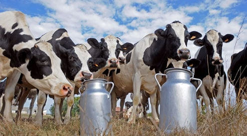

```{r setup, include=FALSE}
BioDataScience1::learnr_setup()
SciViews::R("infer", "model", lang = "fr")
# Required for RSConnect
# SciViews::R
library(rlang)
library(data.table)
library(ggplot2)
library(tibble)
library(tidyr)
library(dplyr)
library(dtplyr)
library(broom)
library(forcats)
library(collapse)
library(fs)
library(data.trame)
library(svFast)
library(svTidy)
library(svMisc)
library(svBase)
library(svFlow)
library(data.io)
library(chart)
library(tabularise)
library(SciViews)
# infer section
library(distributional)
library(inferit)
# model section
library(modelit)
# ... more
library(readxl)
library(testthat)
library(equatags)
library(BioDataScience)
library(BioDataScience1)

set.seed(43)
production <- c(12, 13, 14, 11, 10, 13, 14, 12, 11, 10, 10, 12, 12, 13,
  14, 10, 14, 13, 10, 14, 17, 13, 17, 14, 13, 13, 17, 14, 17, 13, 10, 9,
  10, 12, 11, 9, 10, 12, 10, 11, 11, 9, 11, 11, 12, 10, 9, 13, 11, 10,
  13, 12, 11, 15, 14, 11, 15, 13, 14, 12)
production <- round(production + rnorm(n = length(production), sd = 0.5), 1)

milk_production <- dtx(
  ration = ordered(rep(c("low", "high"), each = 30L), levels = c("low", "high")),
  food   = factor(rep(rep(c("hay", "grass", "maize silage"), each = 10L), times = 2L)),
  milk   = production)

milk_production <- labelise(milk_production,
  label = list(
    ration = "Ration",
    food   = "Type d'alimentation",
    milk   = "Quantité de lait"),
  units = list(
    milk = "L/J"
))
```

```{r, echo=FALSE}
BioDataScience1::learnr_banner()
```

```{r, context="server"}
if (Sys.info()["user"] == "rstudio-connect") {
  options(learnr_user_id = session$user)
  assignInNamespace("default_user_id", function() {
    getOption("learnr_user_id", unname(Sys.info()["user"]))
  }, ns = "learnr")
}
BioDataScience1::learnr_server(input, output, session)
```

------------------------------------------------------------------------

## Objectifs

Lors de la réalisation du tutoriel précédent portant sur l'ANOVA à un facteur, vous avez étudié une variable réponse quantitative pour différents niveaux d'une variable explicative qualitative (de classe **factor** dans R). Dans le [module 10](https://wp.sciviews.org/sdd-umons/?iframe=wp.sciviews.org/sdd-umons-2025/variance2.html) du cours, vous avez vu qu'il était également possible de considérer deux variables explicatives facteurs avec une **ANOVA à deux facteurs**.

Ce tutoriel vous permet d'autoévaluer votre aptitude à :

-   présenter vos données avant une ANOVA à deux facteurs

-   effectuer une ANOVA à deux facteurs

-   interpréter correctement les résultats obtenus

Assurez-vous d'avoir compris les sections [10.1](https://wp.sciviews.org/sdd-umons/?iframe=wp.sciviews.org/sdd-umons-2025/anova-%25C3%25A0-deux-facteurs.html), [10.2](https://wp.sciviews.org/sdd-umons/?iframe=wp.sciviews.org/sdd-umons-2025/mod%25C3%25A8le-sans-interactions.html) et [10.3](https://wp.sciviews.org/sdd-umons/?iframe=wp.sciviews.org/sdd-umons-2025/mod%25C3%25A8le-crois%25C3%25A9-complet.html) du cours. Vous devez également maîtriser les différentes notions vues dans le [module 9](https://wp.sciviews.org/sdd-umons/?iframe=wp.sciviews.org/sdd-umons-2025/variance.html) relatives à l'ANOVA à un facteur.

## Rendement laitier

Dans ce tutoriel, vous allez réaliser une analyse visant à étudier l'influence du type et de la quantité d'alimentation de vaches sur le rendement laitier.



Le jeu de données `milk_production` contient les variables suivantes :

-   `ration` : la quantité d'alimentation apportée (`"low"` = ration faible ou `"high"` = ration élevée)
-   `food` : le type d'alimentation fourni (`"hay"` = foin, `"grass"` = herbe ou `"maize silage"` = maïs ensilés)
-   `milk` : la quantité de lait produit en L/j

```{r}
glimpse(milk_production)
```

La question à laquelle vous allez répondre est la suivante : **le rendement de production de lait varie-t-il en fonction de la ration et du type d'aliment donné aux vaches ?**

### Description graphique des données

Différents graphiques vous permettent de visualiser les observations de votre jeu de données avant la réalisation de votre ANOVA à deux facteurs. À partir du jeu de données (`milk_production`), réalisez un premier graphique représentant la moyenne du rendement de la production de lait (`milk`) en fonction du type d'alimentation (`food`) en utilisant la couleur pour la quantité d'alimentation apportée (`ration`).

```{r lait_graph_h2, exercise=TRUE}
chart(___, ___ ~ ___ %col=% ___) +
  geom_point(alpha = 0.4, position = position_dodge2(0.4, padding = 0.1)) +
  stat_summary(geom = "point", fun = "mean", position = position_dodge(0.4), size = 4)
```

```{r lait_graph_h2-hint-1}
chart(milk_production, ___ ~ food %col=% ___) +
  geom_point(alpha = 0.4, position = position_dodge2(0.4, padding = 0.1)) +
  stat_summary(geom = "point", fun = "mean", position = position_dodge(0.4), size = 4)

 #### ATTENTION: Hint suivant = solution !####
```

```{r lait_graph_h2-solution}
## Solution ##
chart(milk_production, milk ~ food %col=% ration) +
  geom_point(alpha = 0.4, position = position_dodge2(0.4, padding = 0.1)) +
  stat_summary(geom = "point", fun = "mean", position = position_dodge(0.4), size = 4)
```

```{r lait_graph_h2-check}
grade_code("Le graphique que vous venez de réaliser est un des graphiques qui permettent de comparer le rendement laitier en fonction de la ration par type d'alimentation. Le choix du nuage de point avec l'ajout de la moyenne est tout indiqué lorsque le nombre d'observations est faible (n'oubliez pas d'expliciter dans la légende du graphique que les gros points sont les moyennes). Les aliments ensilés semblent mener à une production plus importante de lait par jour sur le graphique... mais est-ce significatif ?")
```

### Visualisation graphique des interactions

Dans un modèle ANOVA à deux facteurs, il faut aussi considérer que l'effet d'un facteur sur la variable réponse peut être différent suivant les modalités de l'autre facteur. On parle alors d'**interactions**. Il est possible de les explorer en réalisant un graphique des interactions qui vous permet de visualiser les écarts des moyennes respectives des différentes sous-populations.

Réalisez le graphique permettant de visualiser les interactions dans le jeu de données `milk_production` (variables facteurs `food` et `ration`). Pour cela, vous commencez par calculer la moyenne du rendement par type d'alimentation et par ration avec les fonctions "speedy" et "fast". Ensuite, vous réalisez un graphique de ce rendement moyen en fonction du type d'alimentation et de la ration.

```{r interaction_h3, exercise=TRUE}
___ %>.%
  ___(., ___, ___) %>.% # regroupement par type d'alimentation et par ration
  ___(., milk_mean = ___(___)) %>.%  # moyenne du rendement
  # graphique du rendement moyen en fonction du type d'alimentation et des rations
  chart(data = ___, ___ ~ ___ %col=% ___ %group=% ___) +
    ___() + # lignes
    ___() # points
```

```{r interaction_h3-hint-1}
DF %>.%
  sgroup_by(., FACTOR1, FACTOR2) %>.% # regroupement par type d'alimentation et par ration
  ssummarise(., milk_mean = fmean(VARNUM)) %>.%  # moyenne du rendement
  # graphique du rendement moyen en fonction du type d'alimentation et des rations
  chart(data = ___, ___ ~ ___ %col=% ___ %group=% ___) +
    ___() + # lignes
    ___() # points
```

```{r interaction_h3-hint-2}
milk_production %>.%
  sgroup_by(., food, ration) %>.% # regroupement par type d'alimentation et par ration
  ssummarise(., milk_mean = fmean(milk)) %>.% # moyenne du rendement
  # graphique du rendement moyen en fonction du type d'alimentation et des rations
  chart(data = ., VARNUM ~ FACTOR1 %col=% FACTOR2 %group=% FACTOR2) +
    ___() + # lignes
    ___() # points

 #### ATTENTION: Hint suivant = solution !####
```

```{r interaction_h3-solution}
## Solution ##
milk_production %>.%
  sgroup_by(., food, ration) %>.% # regroupement par type et quantité d'alimentation
  ssummarise(., milk_mean = fmean(milk)) %>.% # moyenne du rendement
  # graphique du rendement moyen en fonction du types d'alimentation et par ration
  chart(data = ., milk_mean ~ food %col=% ration %group=% ration) +
    geom_line() + # lignes
    geom_point() # points
```

```{r interaction_h3-check}
grade_code("Ce graphique permet d'analyser les interactions entre les variables explicatives (rations et types d'alimentation). Lorsque les segments de droites sont parallèles ou à peu près, il n'y a pas d'interactions. À l'inverse, lorsque les traits ne sont pas parallèles, il existe probablement une ou plusieurs interactions. Moins les traits sont parallèles, plus l'interaction est forte. Dans notre cas, nous serions tentés de penser qu'il n'y a pas d'interactions. Cependant, il reste plus sûr de réaliser un modèle croisé complet dans un premier temps pour le vérifier. Nous pourrons alors nous rabattre sur un modèle croisé sans interactions, plus simple si cela se justifie.")
```

### Description numérique (tableau)

Vous pouvez également résumer vos données sous la forme d'un tableau. À partir du jeu de données `milk_production`, réalisez un tableau résumé contenant la moyenne et la variance du rendement de la production de lait (`milk`) par type d'alimentation (`food`) et par quantité des rations (`ration`). Ajoutez également le nombre d'observations par sous-groupe (en utilisant toujours les fonctions "speedy" et "fast"). Terminez en affichant le tableau obtenu formaté avec `tabularise()` (en utilisant `auto.labs = FALSE` pour éviter l'erreur de duplication de noms de colonnes).

<!-- 💬 **Le code ci-dessous correspond au snippet `.hmanova2desc`.** -->

```{r lait_tab_h2, exercise=TRUE}
___ %>.%
  sgroup_by(., ___, ___) %>.%
  ssummarise(., moyenne = fmean(___), variance = fvar(___), n = fnobs(___)) %>.%
  ___(., auto.labs = FALSE)
```

```{r lait_tab_h2-hint-1}
DF %>.%
  sgroup_by(., XFACTOR1, XFACTOR2) %>.%
  ssummarise(., moyenne = fmean(YNUM), variance = fvar(YNUM), n = fnobs(YNUM)) %>.%
  tabularise(., auto.labs = FALSE)

 #### ATTENTION: Hint suivant = solution !####
```

```{r lait_tab_h2-solution}
## Solution ##
milk_production %>.%
  sgroup_by(., food, ration) %>.%
  ssummarise(., moyenne = fmean(milk), variance = fvar(milk), n = fnobs(milk)) %>.%
  tabularise(., auto.labs = FALSE)
```

```{r lait_tab_h2-check}
grade_code("Le tableau que vous avez obtenu est parfait pour présenter vos données avant de réaliser une ANOVA à deux facteurs. Les différences entre les moyennes sont mises en évidence, de même qu'une relative homogénéité des variances (homoscédasticité, à confirmer de toute façon). Lorsque n est petit à moyen (< 30-50), vous ne considèrerez pas des variances allant du simple au double comme fondamentalement différentes... mais bien sûr, un test de Bartlett viendra trancher la question plus tard. Le plan d'expérience est balancé, car nous avons le même nombre d'individus mesurés pour chaque condition et aucune valeur manquante. C'est optimal.")
```

Les graphiques et le tableau que vous venez de réaliser vous ont permis de prendre connaissance des données sur lesquelles vous travaillez. Vous allez maintenant pouvoir passer à la réalisation de votre test d'hypothèse. Vous commencez à avoir l'habitude : avant de pouvoir le réaliser, vous allez devoir vérifier si les conditions d'application du test sont respectées.

### Vérification des conditions d'applications

Si vous souhaitez réaliser une ANOVA à deux facteurs, vous devez respecter les conditions d'application suivantes :

-   échantillon représentatif,
-   observations indépendantes,
-   une variable réponse quantitative,
-   deux variables explicatives qualitatives à deux niveaux ou plus,
-   distribution **normale** des résidus,
-   **homoscédasticité** (même variance intragroupe).

Pour vérifier si l'échantillonnage est représentatif de la population et si les observations sont bien indépendantes les unes des autres, vous devez vous référer au protocole expérimental. Dans le cas de cette étude, vous considérerez, sur base de la discussion du protocole utilisé avec les fermiers (considérez que vous l'avez fait), que les individus ont bien été sélectionnés par un processus aléatoire. Considérez aussi que vous constatez que l'attribution des vaches au niveau de la ration et du type d'alimentation a également été réalisée de manière aléatoire. Vous avez aussi constaté qu'il n'y a pas de parenté forcée (par ex., les vaches issues de l'insémination par le même taureau qui sont toutes nourries de la même manière).

Le type de variable peut se vérifier en consultant les données, par exemple avec la fonction `str()`, ou en déroulant le contenu de l'objet avec le bouton bleu dans l'onglet "Environnement" de RStudio. Attention de bien vous assurer que les deux variables explicatives que vous utilisez sont de type facteur non ordonné (**factor**) ou facteur ordonné (**ordered**) dans R. C'est le cas ici, car la `ration` est un facteur ordonné (**ordered**) et `food` est un facteur non ordonné (**factor**). La variable réponse `milk` est bien numérique (**numeric**).

```{r, echo=TRUE}
str(milk_production)
```

Vous devez encore vérifier les deux dernières conditions sur votre échantillon. Les données par sous-population étant en nombre suffisant, vous allez pouvoir appliquer un test permettant de vérifier l'homoscédasticité (homogénéité des variances). Vous devrez aussi vérifier que la distribution des résidus est normale. Mais cette étape ne peut se fait que plus tard, après le calcul de l'ANOVA à deux facteurs, mais avant son interprétation (les résidus ne peuvent être calculés qu'après le modèle lui-même, puisqu'il s'agit de l'écart entre les observations et les valeurs prédites par le modèle, par définition).

### Test de Bartlett

Pour vérifier l'homoscédasticité de vos données, vous allez utiliser le test de Bartlett. Afin d'interpréter correctement ce test, commencez par poser les hypothèses de départ. Le test de Bartlett doit se faire sur toutes les sous-populations. Pour cela, vous pouvez utiliser la fonction `interaction(FACTEUR1, FACTEUR2)` en lui renseignant les deux variables explicatives. Cette fonction calculera pour vous tous les sous-groupes possibles. Elle peut être utilisée directement dans la formule.

Effectuez maintenant un test de Bartlett sur les données du jeu `milk_production` de la quantité de lait (`milk`) en fonction du type d'alimentation (`food`) et de la ration (`ration`). Pour rappel, nous avons :

-   H~0~ : homoscédasticité
-   H~1~ : hétéroscédasticité

<!-- 💬 **Le code ci-dessous correspond au snippet `.hvbartlett`.** -->

```{r lait_bart_h2, exercise=TRUE}
bartlett.test(data = ___, ___ ~ ___(___, ___))
```

```{r lait_bart_h2-hint-1}
bartlett.test(data = DF, YNUM ~ interaction(XFACTOR1, XFACTOR2))

 #### ATTENTION: Hint suivant = solution !####
```

```{r lait_bart_h2-solution}
## Solution ##
bartlett.test(data = milk_production, milk ~ interaction(food, ration))
```

```{r lait_bart_h2-check}
grade_code("Vous avez correctement encodé l'instruction R pour ce test. Saurez-vous l'interpréter en répondant à la question suivante ? ")
```

```{r lait_bart_quiz}
question("Au seuil alpha de 5%, y a-t-il homoscédasticité ?",
  answer("Oui", correct = TRUE),
  answer("Non"),
  allow_retry = TRUE,
  random_answer_order = TRUE,
  incorrect = "Avez-vous bien défini les hypothèses H0 et H1 de votre test de Bartlett ?",
  correct = "La valeur P que vous avez obtenue étant plus grande que le seuil alpha de 5%, vous ne rejetez donc pas H0 et pouvez considérer qu'il y a homoscédasticité.")
```

## ANOVA à deux facteurs

### ANOVA à deux facteurs avec interactions

Vous allez maintenant pouvoir réaliser une ANOVA à deux facteurs avec interaction.

Comme pour l'ANOVA à un facteur, vous allez utiliser la fonction `lm()` qui demande `data =` un jeu de données et une formule. Vous assignez le résultat à `milk_anova` pour utilisation future, et vous appliquez la fonction `anova()` sur l'objet obtenu pour produire le tableau de l'analyse de la variance. Le modèle croisé avec interactions peut s'écrire de deux manières dans R.

```{r, echo=TRUE, eval=FALSE}
DF_anova <- lm(data = DF, YNUM ~ XFACTOR1 + XFACTOR2 + XFACTOR1:XFACTOR2)
anova(DF_anova)
```

où `XFACTOR1:XFACTOR2` représente les interactions entre `XFACTOR1` et `XFACTOR2`.

Ce modèle peut aussi être écrit de manière plus simple en utilisant `*` à la place du `+` entre les deux variables facteurs ce qui signifiera implicitement de tenir compte également des interactions. Cela donne :

```{r, echo=TRUE, eval=FALSE}
DF_anova <- lm(data = DF, YNUM ~ XFACTOR1 * XFACTOR2)
anova(DF_anova)
```

Réalisez votre modèle ANOVA à deux facteurs avec interactions sur le rendement de lait en fonction du type d'alimentation et de la ration en utilisant la version simplifiée de la formule. Formatez votre tableau de l'ANOVA avec `tabularise()`. Enfin, réalisez le graphique adéquat pour vérifier si les résidus suivent une distribution normale.

<!-- 💬 **Le code ci-dessous correspond au snippet `.hmanova2`**. -->

```{r lait_interaction_h2, exercise = TRUE}
milk_anova <- lm(data = ___, ___ ~ ___ * ___)
___(milk_anova) %>.%
  ___(.)
___$___(milk_anova)
```

```{r lait_interaction_h2-hint-1}
milk_anova <- lm(data = milk_production, ___ ~ ___ * ___)
anova(milk_anova) %>.%
  tabularise(.)
chart$___(milk_anova)

 #### ATTENTION: Hint suivant = solution !####
```

```{r lait_interaction_h2-solution}
## Solution ##
milk_anova <- lm(data = milk_production, milk ~ food * ration)
anova(milk_anova) %>.%
  tabularise(.)
chart$qqplot(milk_anova)
```

```{r lait_interaction_h2-check}
grade_code("Vous avez encodé correctement votre modèle et obtenu le tableau de l'ANOVA et le graphique quantile-quantile qui vous permet de vérifier la normalité des résidus. Ici, ce dernier graphique ne montre pas d'écarts dramatiques et valide donc cette dernière condition d'application. Vous pouvez interpréter vos résultats en répondant à la question ci-dessous.")
```

```{r lait_interaction_quiz}
question("Observez-vous des interactions significatives entre les rations et les types d'alimentation au seuil alpha de 5% ?",
  answer("oui"),
  answer("non", correct = TRUE),
  allow_retry = TRUE,
  incorrect = "L'interprétation que vous avez faite n'est pas la bonne. Retournez voir dans le cours comment se prend la décision du rejet ou non de H0 en comparant la valeur P obtenue au seuil alpha 5% pour le terme d'interactions.",
  correct = "Il n'y a pas d'interactions significatives entre les deux facteurs au seuil alpha de 5%. Avant de continuer l'analyse, vous allez simplifier le modèle en retirant le terme correspondant à ces interactions (notez que vous pouvez aussi parfaitement interpréter les deux facteurs sur le modèle complet si vous préférez, en pratique : la simplification n'est pas obligatoire).")
```

### ANOVA à deux facteurs sans interactions

Lorsque vous n'avez pas d'interactions significatives, vous pouvez choisir de simplifier votre modèle. Votre nouveau modèle s'écrit donc de cette manière (avec un `+` entre les deux facteurs dans la formule) :

```{r, echo=TRUE, eval=FALSE}
DF_anova <- lm(data = DF, YNUM ~ XFACTOR1 + XFACTOR2)
anova(DF_anova)
```

Réalisez votre modèle ANOVA à deux facteurs sans interactions sur le rendement de lait en fonction de la ration et du type d'alimentation. Vous placerez votre modèle dans `milk_anova2`. Vous sortirez ensuite le tableau de l'ANOVA formaté avec `tabularise()` et réaliserez le graphique quantile-quantile sur les résidus du modèle.

<!-- 💬 **Le code ci-dessous correspond au snippet `.hmanova2noint`**. -->

```{r lait_croise_h2, exercise=TRUE}
milk_anova2 <- ___(data = ___, ___ ~ ___ + ___)
___(milk_anova2) %>.%
  ___(.)
___$___(milk_anova2)
```

```{r lait_croise_h2-hint-1}
milk_anova2 <- lm(data = ___, ___ ~ ___ + ___)
___(milk_anova2) %>.%
  ___(.)
chart$___(milk_anova2)

 #### ATTENTION: Hint suivant = solution !####
```

```{r lait_croise_h2-solution}
## Solution ##
milk_anova2 <- lm(data = milk_production, milk ~ food + ration)
anova(milk_anova2) %>.%
  tabularise(.)
chart$qqplot(milk_anova2)
```

```{r lait_croise_h2-check}
grade_code("Vous avez réussi à simplifier votre modèle. Dans cette analyse, les résidus ne s'écartent pas trop non plus d'une distribution normale. Les conditions de votre ANOVA à deux facteurs sont donc remplies. Vous pouvez interpréter vos résultats en répondant aux questions ci-dessous.")
```

```{r lait_croise_quiz}
quiz(
  question("Y a-t-il une différence significative entre les deux rations au seuil alpha de 5% ?",
    answer("oui", correct = TRUE),
    answer("non"),
    allow_retry = TRUE,
    incorrect = "L'interprétation que vous avez faite n'est pas la bonne. Retournez voir dans le cours comment se prend la décision du rejet ou non de H0 en comparant la valeur P obtenue au seuil alpha de 5%.",
    correct = "Votre interprétation est correcte, il y a bien une différence significative au seuil alpha de 5% entre les rations données sur le rendement de lait."),
  question("Y a-t-il une différence significative entre les trois types d'alimentation au seuil alpha de 5% ?",
    answer("oui", correct = TRUE),
    answer("non"),
    allow_retry = TRUE,
    incorrect = "L'interprétation que vous avez faite n'est pas la bonne. Retournez voir dans le cours comment se prend la décision du rejet ou non de H0 en comparant la valeur P¨ obtenue au seuil alpha 5%.",
    correct = "Votre interprétation est correcte, il y a bien une différence significative, au seuil alpha de 5%, entre les types d'alimentation donnés sur le rendement de lait.")
)
```

## Tests post-hoc

Votre ANOVA à deux facteurs sans interactions indique qu'il y a une différence significative entre les rations données et qu'il y a au moins une des moyennes qui est significativement différente des autres au seuil $\alpha$ de 5% pour le type d'alimentation. Un test post-hoc de comparaisons multiples vous permettra de détailler la situation pour les aliments. Il n'est pas nécessaire pour les rations : comme il n'y en a que deux, nous savons d'emblée où se situe la différence.

Réalisez un test post-hoc de Tukey pour comparer les moyennes des trois types d'alimentation (version textuelle et graphique). Le code R est un peu complexe, mais vous ne devez pas en comprendre les détails.

<!-- 💬 **Ce code correspond au snippet `.hmanovamult`** -->

```{r lait_prepa}
milk_anova2 <- lm(data = milk_production, milk ~ food + ration)
```

```{r lait_post_h2, exercise=TRUE, exercise.setup="lait_prepa"}
summary(milk_posthoc2 <- confint(multcomp::glht(milk_anova2,
  linfct = multcomp::mcp(___ = "Tukey"))))
oma <- par(oma = c(0, 5.1, 0, 0))
plot(milk_posthoc2)
par(oma)
rm(oma)
```

```{r lait_post_h2-hint-1}
summary(milk_posthoc2 <- confint(multcomp::glht(milk_anova2,
  linfct = multcomp::mcp(XFACTOR1 = "Tukey"))))
oma <- par(oma = c(0, 5.1, 0, 0))
plot(milk_posthoc2)par(oma)
par(oma)
rm(oma)

 #### ATTENTION: Hint suivant = solution !####
```

```{r lait_post_h2-solution}
## Solution ##
summary(milk_posthoc2 <- confint(multcomp::glht(milk_anova2,
  linfct = multcomp::mcp(food = "Tukey"))))
oma <- par(oma = c(0, 5.1, 0, 0))
plot(milk_posthoc2)
par(oma)
rm(oma)
```

```{r lait_post_h2-check}
grade_code("Identifiez les productions laitières moyennes qui diffèrent significativement en fonction des types d'aliments en répondant à la question suivante.")
```

```{r lait_post_quiz}
question("Quels sont les niveaux significativement différents au seuil alpha de 5% pour les types d'aliments ?",
  answer("foin par rapport à maïs ensilé", correct = TRUE),
  answer("herbe par rapport à maïs ensilé", correct = TRUE),
  answer("herbe par rapport à foin", correct = FALSE),
  allow_retry = TRUE, correct = "En effet, la moyenne pour le maïs ensilé est différente de celles du foin et de l'herbe.",
  incorrect = "Votre réponse est peut-être incomplète ou vous avez commis une erreur dans l'interprétation. Regardez bien le tableau et le graphique issus de l'analyse post-hoc.")
```

## Conclusion

Félicitation ! Vous avez réalisé l'analyse d'un jeu de données à l'aide d'une ANOVA à deux facteurs. N'oubliez pas de bien vérifier vos conditions d'application avant d'interpréter vos résultats. N'hésitez pas à simplifier votre modèle lorsque cela s'avère utile.

Complément d'information concernant la vérification de la normalité des résidus. Le graphique quantile-quantile demande un peu de pratique pour s'interpréter correctement, mais c'est le moyen le plus complet pour comparer une distribution observée à une distribution théorique. En effet, il donne aussi des indications sur la façon dont la distribution diffère (asymétrie, valeurs extrêmes, longue queue à gauche ou à droite de la distribution...) Vous trouverez dans la littérature qu'il existe des tests d'hypothèse qui permettent de vérifier la normalité. Nous pourrions les utiliser ici également. Par exemple, le test de Shapiro-Wilk est un tel test bien connu (H~0~ : normalité, H~1~ : non-normalité). La fonction `shapiro.test()` effectue cette analyse. L'extraction des résidus du modèle se fait avec `resid()`. Cela donne donc :

```{r, echo=FALSE}
milk_anova2 <- lm(data = milk_production, milk ~ food + ration)
```

```{r, echo=TRUE}
shapiro.test(resid(milk_anova2))
```

Nous ne rejetons pas H~0~ (de peu) au seuil alpha de 5%... mais ce test est connu pour être plutôt "conservateur" (il rejette difficilement H~0~ dans les situations qui ne sont pas franches). Quoi qu'il en soit, il tend à confirmer ici que nous pouvons utiliser l'ANOVA à deux facteurs sur nos données... mais de peu. Gardez cependant à l'esprit que l'ANOVA est relativement robuste à de petits écarts à la normalité, surtout si ces écarts sont symétriques autour de la moyenne. Impossible de le vérifier avec le test de Shapiro-Wilk, mais sur le graphique quantile-quantile, cela se marque par une forme en Z (écart dans un sens à gauche et dans l'autre sens à droite). C'est effectivement ce que l'on observe ici. Au final, nous conseillons tout de même d'éviter d'utiliser (uniquement) des tests de normalité et d'apprendre à bien interpréter le graphique quantile-quantile.

```{r comm_noscore, echo=FALSE}
question_text(
  "Laissez-nous vos impressions sur cet outil pédagogique",
  answer("", TRUE, message = "Pas de commentaires... C'est bien aussi."),
  incorrect = "Vos commentaires sont enregistrés.",
  placeholder = "Entrez vos commentaires ici...",
  allow_retry = TRUE
)
```

```{css, echo=FALSE}
@media print {
  .topics {
    width: 100% !important;
    padding: 0 0.5em 0 !important;
  }
  .topicsContainer, .topicsContainer *, .learnrBanner, .learnrBanner *, .topicActions, .topicActions * {
    display: none !important;
  }
}
```
