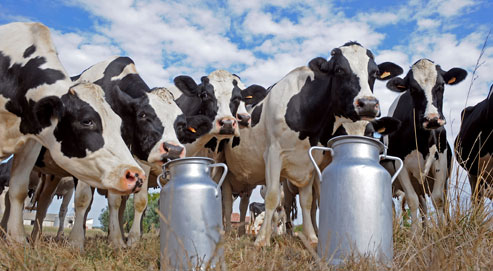

```{r setup, include=FALSE}
BioDataScience1::learnr_setup()
SciViews::R("infer", "model", lang = "fr")
# data ----
set.seed(43)
production <- c(12, 13, 14, 11, 10, 13, 14, 12, 11, 10, 10, 12, 12, 13,
  14, 10, 14, 13, 10, 14, 17, 13, 17, 14, 13, 13, 17, 14, 17, 13, 10, 9,
  10, 12, 11, 9, 10, 12, 10, 11, 11, 9, 11, 11, 12, 10, 9, 13, 11, 10,
  13, 12, 11, 15, 14, 11, 15, 13, 14, 12) 
production <- round(production + rnorm(n = length(production), sd = 0.5), 1)

milk_production <- dtx(
  ration = ordered(rep(c("low", "high"), each = 30L), levels = c("low", "high")), 
  food   = factor(rep(rep(c("hay", "grass", "maize silage"), each = 10L), times = 2L)), 
  milk   = production)

milk_production <- labelise(milk_production, 
  label = list(
    ration = "Ration",
    food   = "Type d'alimentation",
    milk   = "Quantité de lait"),
  units = list(
    milk = "L/J"
))
```

```{r, echo=FALSE}
BioDataScience1::learnr_banner()
```

```{r, context="server"}
BioDataScience1::learnr_server(input, output, session)
```

------------------------------------------------------------------------

## Objectifs

Lors de la réalisation du tutoriel précédent portant sur l'ANOVA à un facteur, vous avez étudié une variable réponse quantitative pour différents niveaux d'une variable explicative qualitative (de classe **factor** dans R). Dans le [module 11](https://wp.sciviews.org/sdd-umons/?iframe=wp.sciviews.org/sdd-umons-2022/variance2.html) du cours, vous avez vu qu'il était également possible de considérer deux variables explicatives facteurs avec une **ANOVA à deux facteurs**.

Ce tutoriel vous permet d'auto-évaluer votre aptitude à :

-   présenter vos données avant une ANOVA à deux facteurs

-   effectuer une ANOVA à deux facteurs

-   interpréter correctement les résultats obtenus

Assurez-vous d'avoir compris les sections [11.1](https://wp.sciviews.org/sdd-umons/?iframe=wp.sciviews.org/sdd-umons-2022/anova-%25C3%25A0-deux-facteurs.html), [11.2](https://wp.sciviews.org/sdd-umons/?iframe=wp.sciviews.org/sdd-umons-2022/mod%25C3%25A8le-sans-interactions.html) et [11.3](https://wp.sciviews.org/sdd-umons/?iframe=wp.sciviews.org/sdd-umons-2022/mod%25C3%25A8le-crois%25C3%25A9-complet.html) du cours. Vous devez également maîtriser les différentes notions vue dans le [module 10](https://wp.sciviews.org/sdd-umons/?iframe=wp.sciviews.org/sdd-umons-2022/variance.html) relatives à l'ANOVA à un facteur.

## Rendement laitier

Dans ce tutoriel, vous allez réaliser une analyse visant à étudier l'influence du type et de la quantité d'alimentation de vaches sur le rendement laitier.



Le jeu de données `milk_production` contient les variables suivantes :

-   `ration` : la quantité d'alimentation apportée (`"low"` = ration faible ou `"high"` = ration élevée)
-   `food` : le type d'alimentation fourni (`"hay"` = foin, `"grass"` = herbe ou `"maize silage"` = maïs ensilés)
-   `milk` : la quantité de lait produit en L/j

```{r}
glimpse(milk_production)
```

La question à laquelle vous allez essayer de répondre est la suivante : **le rendement de production de lait varie-t-il en fonction de la ration et du type d'aliment donné aux vaches ?**

### Description graphique des données

Différents graphiques vous permettent de visualiser les observations de votre jeu de données avant la réalisation de votre ANOVA à deux facteurs. À partir du jeu de données (`milk_production`), réalisez un premier graphique représentant la moyenne du rendement de la production de lait (`milk`) en fonction du type d'alimentation (`food`) en utilisant la couleur pour la quantité d'alimentation apportée (`ration`).

```{r lait_graph_h2, exercise=TRUE}
chart(___, ___ ~ ___ %col=% ___) +
  geom_point(alpha = 0.4, position = position_dodge2(0.4, padding = 0.1)) +
  stat_summary(geom = "point", fun = "mean", position = position_dodge(0.4), size = 4)
```

```{r lait_graph_h2-hint-1}
chart(milk_production, ___ ~ food %col=% ___) +
  geom_point(alpha = 0.4, position = position_dodge2(0.4, padding = 0.1)) +
  stat_summary(geom = "point", fun = "mean", position = position_dodge(0.4), size = 4)

 #### ATTENTION: Hint suivant = solution !####
```

```{r lait_graph_h2-solution}
## Solution ##
chart(milk_production, milk ~ food %col=% ration) +
  geom_point(alpha = 0.4, position = position_dodge2(0.4, padding = 0.1)) +
  stat_summary(geom = "point", fun = "mean", position = position_dodge(0.4), size = 4)
```

```{r lait_graph_h2-check}
grade_code("Le graphique que vous venez de réalisez permet de comparer le rendement laitier en fonction de la ration par type d'alimentation. Le choix du nuage de point avec l'ajout de la moyenne est tout indiqué lorsque le nombre d'observations est faible. Les aliments ensilés semblent mener à une production plus importante de lait par jour sur le graphique... mais est-ce significatif ?")
```

### Visualisation graphique des interactions

Dans un modèle ANOVA à deux facteurs, il faut aussi considérer que l'effet d'un facteur sur la variable réponse peut être différent suivant les modalités de l'autre facteur. On parle alors d'**interactions**. Il est possible de les explorer en réalisant un graphique des interactions qui vous permet de visualiser les écarts des moyennes respectives des différentes sous-populations.

Réalisez le graphique permettant de visualiser les interactions dans le jeu de données `milk_production` (variables facteurs `food` et `ration`). Pour cela, vous commencez par calculer la moyenne du rendement par type d'alimentation et par ration (en utilisant les fonction s "tidy"). Ensuite, vous réalisez un graphique de ce rendement moyen en fonction du type d'alimentation et de la ration.

```{r interaction_h3, exercise=TRUE}
___ %>.% # regroupement par type d'alimentation et par ration
  ___(., ___, ___) %>.%
  ___(., milk_mean = ___(___)) %>.%  # moyenne du rendement
  ___(.) %>.% # collecter les résultats
  chart(data = ___, ___ ~ ___ %col=% ___ %group=% ___) + # graphique du rendement moyen en fonction du types d'alimentation et par ration
  ___() + # lignes
  ___() # points
```

```{r interaction_h3-hint-1}
DF %>.% # regroupement par type d'alimentation et par ration
  group_by(., FACTOR1, FACTOR2) %>.%
  summarise(., milk_mean = mean(VARNUM)) %>.%  # moyenne du rendement
  collect_dtx(.) %>.% # collecter les résultats
  chart(data = ___, ___ ~ ___ %col=% ___ %group=% ___) + # graphique du rendement moyen en fonction du types d'alimentation et par ration
  ___() + # lignes
  ___() # points
```

```{r interaction_h3-hint-2}
milk_production %>.% # regroupement par type d'alimentation et par ration
  group_by(., food, ration) %>.%
  summarise(., milk_mean = mean(milk)) %>.% # moyenne du rendement
  collect_dtx(.) %>.% # collecter les résultats
  chart(data = ., VARNUM ~ FACTOR1 %col=% FACTOR2 %group=% FACTOR2) +
  ___() + # lignes
  ___() # points

 #### ATTENTION: Hint suivant = solution !####
```

```{r interaction_h3-solution}
## Solution ##
milk_production %>.% # regroupement par type et quantité d'alimentation
  group_by(., food, ration) %>.%
  summarise(., milk_mean = mean(milk)) %>.% # moyenne du rendement
  collect_dtx(.) %>.% # collecter les résultats
  chart(data = ., milk_mean ~ food %col=% ration %group=% ration) + 
  geom_line() + # lignes
  geom_point() # points
```

```{r interaction_h3-check}
grade_code("Ce graphique permet d'analyser les interactions entre les variables explicatives (rations et types d'alimentation). Lorsque les segments de droites sont parallèles ou à peu près, il n'y a pas d'interactions. À l'inverse, lorsque les traits ne sont pas parallèles, il existe probablement une ou plusieurs interactions. Moins les traits sont parallèles, plus l'interaction est forte. Dans notre cas, nous serions tenté de penser qu'il n'y a pas d'intéractions. Cependant, il reste plus sûr de réaliser un modèle croisé complet dans un premier temps pour le vérifier. Nous pourrons alors nous rabattre sur un modèle croisé sans intéractions plus simple, si cela se justifie.")
```

### Description numérique (tableau)

Vous pouvez également résumer vos données sous la forme d'un tableau. À partir du jeu de données `milk_production`, réalisez un tableau résumé contenant la moyenne et l'écart-type du rendement de la production de lait (`milk`) par type d'alimentation (`food`) et par quantité des rations (`ration`). Ajoutez également le nombre d'observations par sous-groupe (en utilisant cette fois-ci les fonctions "speedy" et "fast" pour changer).

<!-- 💬 **Le code ci-dessous correspond au snippet `.hmanova2desc`.** -->

```{r lait_tab_h2, exercise=TRUE}
___ %>.%
  sgroup_by(., ___, ___) %>.%
  ssummarise(., mean = fmean(___), sd = fsd(___), count = fnobs(___)) %>.%
  ___(.)
```

```{r lait_tab_h2-hint-1}
DF %>.%
  sgroup_by(., XFACTOR1, XFACTOR2) %>.%
  ssummarise(., mean = fmean(YNUM), sd = fsd(YNUM), count = fnobs(YNUM)) %>.%
  collect_dtx(.)

 #### ATTENTION: Hint suivant = solution !####
```

```{r lait_tab_h2-solution}
## Solution ##
milk_production %>.%
  sgroup_by(., food, ration) %>.%
  ssummarise(., mean = fmean(milk), sd = fsd(milk), count = fnobs(milk)) %>.%
  collect_dtx(.)
```

```{r lait_tab_h2-check}
grade_code("Le tableau que vous avez obtenu est parfait pour présenter vos données avant de réaliser une ANOVA à deux facteurs. Les différences entre les moyennes sont mises en évidence, de même q'une relative homogénéité des écarts types (homoscédasticité, à confirmer de toute façon). Le plan d'expérience est balancé car nous avons le même nombre d'individus mesurés pour chaque condition et aucune valeur manquante. C'est optimal. Attention, ce tableau est en anglais. N'oubliez pas de le traduire si votre rapport est en français.")
```

Les graphiques et la tableau que vous venez de réaliser vous ont permis de prendre connaissance des données sur lesquelles vous travaillez. Vous allez maintenant pouvoir passer à la réalisation de votre test d'hypothèse. Vous commencez à avoir l'habitude : avant de pouvoir le réaliser, vous allez devoir vérifier si les conditions d'application du test sont respectées.

### Vérification des conditions d'applications

Si vous souhaitez réaliser une ANOVA à deux facteurs, vous devez respecter les conditions d'application suivantes :

-   échantillon représentatif,
-   observations indépendantes,
-   une variable réponse quantitative,
-   deux variables explicatives qualitatives à deux niveaux ou plus,
-   distribution **Normale** des résidus,
-   **homoscédasticité** (même variance intragroupe).

Pour vérifier si l'échantillonnage est représentatif de la population et si les observations sont bien indépendantes les unes des autres, vous pouvez vous référer au protocole expérimental. Dans le cas de cette étude, vous considérerez, sur base de la discussion du protocole utilisé avec les fermiers (considérez que vous l'avez fait), que les individus ont bien été sélectionnés par un processus aléatoire. Considérez aussi que vous constatez que l'attribution des vaches aux niveaux de la ration et du type d'alimentation a également été réalisée de manière aléatoire. Vous avez également constaté qu'ils n'y a pas de parenté forcée (par ex., les vaches issues de l'insémination par le même taureau qui sont toutes nourries de la même manière).

Le type de variable peut se vérifier en consultant les données, par exemple avec la fonction `str()`, ou en déroulant le contenu de l'objet avec le bouton bleu dans l'onglet "environment" de RStudio. Attention de bien vous assurer que les deux variables explicatives que vous utilisez sont bien type facteur non ordonné (**factor**) ou facteur ordonné (**ordered**) dans R. C'est le cas ici car la `ration` est un facteur ordonné (**ordered**) et `food` est un facteur non ordonné (**factor**). La variable réponse `milk` est bien numérique (**numeric**).

```{r, echo=TRUE}
str(milk_production)
```

Vous devez encore vérifier les deux dernières conditions sur votre échantillon. Les données par sous-population étant en nombre suffisant, vous allez pouvoir appliquer un test permettant de vérifier l'homoscédasticité (homogénéité des variances). Vous devrez aussi vérifier que la distribution des résidus est Normale. Mais cette étape ne peut se fait que plus tard, après le calcul de l'ANOVA à deux facteurs mais avant son interprétation (les résidus ne peuvent être calculés qu'après le modèle lui-même, puisqu'il s'agit de l'écart entre les observations et les valeurs prédites par le modèle, par définition).

### Test de Bartlett

Pour vérifier l'homoscédasticité de vos données, vous allez utiliser le test de Bartlett. Afin d'interpréter correctement ce test, commencez par poser les hypothèses de départ. Le test de Bartlett doit se faire sur toutes les sous-populations. Pour cela, vous pouvez utiliser la fonction `interaction()` en lui renseignant les deux variables explicatives. Cette fonction, calculera pour vous tous les sous-groupes possibles. Elle peut être utilisée directement dans la formule.

Effectuez maintenant un test de Bartlett sur les données du jeu `milk_production` de la quantité de lait (`milk`) en fonction du type d'alimentation (`food`) et de la ration (`ration`).

<!-- 💬 **Le code ci-dessous correspond au snippet `.hvbartlett`.** -->

```{r lait_bart_h2, exercise=TRUE}
bartlett.test(data = ___, ___ ~ ___(___, ___))
```

```{r lait_bart_h2-hint-1}
bartlett.test(data = DF, YNUM ~ interaction(XFACTOR1, XFACTOR2))

 #### ATTENTION: Hint suivant = solution !####
```

```{r lait_bart_h2-solution}
## Solution ##
bartlett.test(data = milk_production, milk ~ interaction(food, ration))
```

```{r lait_bart_h2-check}
grade_code("Vous avez correctement encodé l'instruction R pour ce test. Saurez-vous l'interpréter en répondant à la question suivante ? ")
```

```{r lait_bart_quiz}
question("Au seuil alpha de 5%, y a-t-il homoscédasticité ?",
  answer("Oui", correct = TRUE),
  answer("Non"),
  allow_retry = TRUE,
  random_answer_order = TRUE,
  incorrect = "Avez-vous bien défini les hypothèses H0 et H1 de votre test de Bartlett ?",
  correct = "La valeur P que vous avez obtenue étant plus grande que le seuil alpha de 5%, vous ne rejetez donc pas H0 et pouvez considérer qu'il y a homoscédasticité.")
```

## ANOVA à deux facteurs

### ANOVA à deux facteurs avec interactions

Vous allez maintenant pouvoir réaliser une ANOVA à deux facteurs avec interaction.

Comme pour l'ANOVA à un facteur, vous allez utiliser la fonction `lm()` qui demande un jeu de données et une formule. Vous assignez le résultat à `milk_anova` pour utilisation future, et vous appliquez la fonction `anova()` sur l'objet obtenu pour produire le tableau de l'analyse de la variance. Le modèle croisé avec interactions peut s'écrire de deux manières dans R.

```{r, echo=TRUE, eval=FALSE}
anova(DF_anova <- lm(data = DF, YNUM ~ XFACTOR1 + XFACTOR2 + XFACTOR1:XFACTOR2))
```

où `XFACTOR1:XFACTOR2` représente les interactions entre `XFACTOR1` et `XFACTOR2`.

Ce modèle peut aussi être écrit de manière plus simple en utilisant `*` à la place du `+` entre les deux variables facteurs ce qui signifiera implicitement de tenir compte également des interactions. Cela donne :

```{r, echo=TRUE, eval=FALSE}
anova(DF_anova <- lm(data = DF, YNUM ~ XFACTOR1 * XFACTOR2))
```

Réalisez votre modèle ANOVA à deux facteurs avec interactions sur le rendement de lait en fonction du type d'alimentation et de la ration en utilisant la version simplifiée de la formule.

<!-- 💬 **Le code ci-dessous correspond au snippet `.hmanova2`**. -->

```{r lait_interaction_h2, exercise = TRUE}
anova(milk_anova <- lm(data = ___, ___ ~ ___ * ___))
```

```{r lait_interaction_h2-hint-1}
anova(milk_anova <- lm(data = milk_production, ___ ~ ___ * ___))

 #### ATTENTION: Hint suivant = solution !####
```

```{r lait_interaction_h2-solution}
## Solution ##
anova(milk_anova <- lm(data = milk_production, milk ~ food * ration))
```

```{r lait_interaction_h2-check}
grade_code("Vous avez encodé correctement votre modèle. N'oubliez pas qu'avant de pouvoir interpréter vos résultats vous devez vérifier la Normalité des résidus. Dans cette analyse, les résidus suivent bien une distribution Normale (le test n'est pas repris ici pour rester focalisé sur l'ANOVA à deux facteurs elle-même, mais faites comme si vous l'aviez vérifié avec `chart$qqplot(milk_anova)`). Les conditions d'application de votre ANOVA à deux facteurs sont donc remplies. Vous pouvez interpréter vos résultats en répondant à la question ci-dessous.")
```

```{r lait_interaction_quiz}
question("Observez-vous des intéractions significatives entre les rations et les types d'alimentation au seuil alpha de 5% ?",
  answer("oui"),
  answer("non", correct = TRUE),
  allow_retry = TRUE,
  incorrect = "L'interprétation que vous avez faite n'est pas la bonne. Retournez voir dans le cours comment se prend la décision du rejet ou non de H0 en comparant la valeur P obtenue au seuil alpha 5% pour le terme d'interactions.",
  correct = "Il n'y a pas d'interactions significatives entre les deux facteurs. Avant de continuez l'analyse, vous allez simplifier le modèle en retirant le terme correspondant à ces interactions (notez que vous pouvez aussi parfaitement interpréter les deux facteurs sur le modèle complet si vous préférez, en pratique).")
```

### ANOVA à deux facteurs sans interactions

Lorsque vous n'avez pas d'interactions significatives, vous pouvez choisir de simplifier votre modèle. Votre nouveau modèle s'écrit donc de cette manière :

```{r, echo=TRUE, eval=FALSE}
anova(DF_anova <- lm(data = DF, YNUM ~ XFACTOR1 + XFACTOR2))
```

Réalisez votre modèle ANOVA à deux facteurs sans interactions sur le rendement de lait en fonction de la ration et du type d'alimentation. Vous placerez votre modèle dans `milk_anova2`.

<!-- 💬 **Le code ci-dessous correspond au snippet `.hmanova2noint`**. -->

```{r lait_croise_h2, exercise=TRUE}
anova(milk_anova2 <- lm(data = ___, ___ ~ ___ + ___))
```

```{r lait_croise_h2-hint-1}
anova(milk_anova2 <- lm(data = lait, ___ ~ ___ + ___))

 #### ATTENTION: Hint suivant = solution !####
```

```{r lait_croise_h2-solution}
## Solution ##
anova(milk_anova2 <- lm(data = milk_production, milk ~ food + ration))
```

```{r lait_croise_h2-check}
grade_code("Vous avez réussi à simplifier votre modèle. Dans cette analyse, les résidus suivent également une distribution Normale (vous faites comme si vous l'avez testé à l'aide d'un graphique quantile-quantile avec `chart$qqplot(milk_anova2)` à ce stade). Les conditions de votre ANOVA à deux facteurs sont donc remplies. Vous pouvez interpréter vos résultats en répondant aux questions ci-dessous.")
```

```{r lait_croise_quiz}
quiz(
  question("Y a-t-il une différence significative entre les deux rations au seuil alpha de 5% ?",
    answer("oui", correct = TRUE),
    answer("non"),
    allow_retry = TRUE,
    incorrect = "L'interprétation que vous avez faite n'est pas la bonne. Retournez voir dans le cours comment se prend la décision du rejet ou non de H0 en comparant la valeur P obtenue au seuil alpha de 5%.",
    correct = "Votre interprétation est correcte, il y a bien une différence significative au seuil alpha de 5% entre les rations données sur le rendement de lait."),
  question("Y a-t-il une différence significative entre les trois types d'alimentation au seuil alpha de 5% ?",
    answer("oui", correct = TRUE),
    answer("non"),
    allow_retry = TRUE,
    incorrect = "L'interprétation que vous avez faite n'est pas la bonne. Retournez voir dans le cours comment se prend la décision du rejet ou non de H0 en comparant la valeur P¨ obtenue au seuil alpha 5%.",
    correct = "Votre interprétation est correcte, il y a bien une différence significative, au seuil alpha de 5%, entre les types d'alimentation donnés sur le rendement de lait.")
)
```

## Tests post-hoc

Votre ANOVA à deux facteurs sans interactions indique qu'il y a une différence significative entre les rations données et qu'il y a au moins une des moyennes qui est significativement différente des autres au seuil $\alpha$ de 5% pour le type d'alimentation. Un test post-hoc de comparaisons multiples vous permettra d'avoir plus de précision pour les aliments. Il n'est pas nécessaire pour les rations : comme il n'y en a que deux, nous savons d'emblée où se situent la différence.

<!-- 💬 **Ce code correspond au snippet `.hmanovamult`** -->

```{r lait_prepa}
milk_anova2 <- lm(data = milk_production, milk ~ food + ration)
```

```{r lait_post_h2, exercise=TRUE, exercise.setup="lait_prepa"}
summary(milk_posthoc2 <- confint(multcomp::glht(milk_anova2,
  linfct = multcomp::mcp(___ = "Tukey")))) # Add a second factor if you want
oma <- par(oma = c(0, 5.1, 0, 0))
plot(milk_posthoc2)
par(oma)
rm(oma)
```

```{r lait_post_h2-hint-1}
summary(milk_posthoc2 <- confint(multcomp::glht(milk_anova2,
  linfct = multcomp::mcp(XFACTOR1 = "Tukey")))) # Add a second factor if you want
oma <- par(oma = c(0, 5.1, 0, 0))
plot(milk_posthoc2)par(oma)
rm(oma)

 #### ATTENTION: Hint suivant = solution !####
```

```{r lait_post_h2-solution}
## Solution ##
summary(milk_posthoc2 <- confint(multcomp::glht(milk_anova2,
  linfct = multcomp::mcp(food = "Tukey")))) # Add a second factor if you want
oma <- par(oma = c(0, 5.1, 0, 0))
plot(milk_posthoc2)
par(oma)
rm(oma)
```

```{r lait_post_h2-check}
grade_code("Le test de comparaison n'est pas vraiment nécessaire dans le cas de la variable ration puisque vous n'avez que deux niveaux, mais si vous l'aviez ajouté dans le code, cela n'aurait fait que le confirmer. Par contre, il prend tout son sens dans le cas de la variable alimentation pour identifier les paires de moyennes qui sont différentes. Identifiez les niveaux qui sont significativement différents en répondant à la question suivante.")
```

```{r lait_post_quiz}
question("Quels sont les niveaux significativement différents au seuil alpha de 5% pour les types d'aliments ?",
  answer("foin par rapport à maïs ensilé", correct = TRUE),
  answer("herbe par rapport à maïs ensilé", correct = TRUE),
  answer("herbe par rapport à foin", correct = FALSE), 
  allow_retry = TRUE, correct = "En effet, la moyennes pour le maïs ensilé est différentes de celle du foin et de l'herbe.",
  incorrect = "Votre réponse est peut-être incomplète ou vous avez commis une erreur dans l'interprétation. Regardez bien le tableau et le graphique issus de l'analyse post-hoc.")
```

## Conclusion

Félicitation ! Vous avez réalisé une ANOVA à deux facteurs complète. N'oubliez pas de bien vérifier vos conditions d'application de test avant d'interpréter vos résultats. N'hésitez pas à simplifier votre modèle lorsque cela s'avère nécessaire. Bien sûr, vous devez vérifier la Normalité des résidus avec un graphique quantile-quantile exactement de la même façon que nous l'avons fait pour l'ANOVA à un facteur dans le tutoriel précédent... Ici, nous avons court-circuité cette étape pour rester focalisé sur l'ANOVA et son interprétation ! Voici ce que cela donne :

<!-- 💬 **Il existe une snippet pour vous aider `.hmanovaqqplot`** -->

```{r final_model, echo=FALSE}
milk_anova2 <- lm(data = milk_production, milk ~ food + ration)
```

```{r normality_test, echo=TRUE}
chart$qqplot(milk_anova2)
```

Les points sont proches de la droite, mis à part une dérive en haut à droite du graphique. La partie basse correspond à un écart classique lié à l'échantillonnage. Il n'y a pourtant rien de dramatique et comme l'ANOVA est relativement robuste face à de petites déviations de la Normalité, nous en concluons donc que les résidus du modèle ANOVA à deux facteurs sans interactions ne s'éloignent pas de manière problématique d'une distribution Normale. Nous prendrons toutefois les précautions d'usage si les valeurs *p* sont proches du seuil alpha (transformation pour mieux Normaliser les données). Nous pouvons considérer (avec le résultat complémentaire du test de Bartlett) que les conditions d'application sont suffisamment bien rencontrées. **Notez bien ici la nuance relative à la robustesse du modèle face à de petites dérives qui est importante !**.

Vous trouverez dans la littérature qu'il existe des tests d'hypothèse qui permettent de vérifier la Normalité. Nous pourrions les utiliser ici également. Par exemple, le test de Shapiro-Wilk est un tel test bien connu (H~0~: Normalité, H~1~: non-Normalité). La fonction `shapiro.test()` effectue cette analyse. L'extraction des résidus du modèle se fait avec `resid()`. Cela donne donc :

```{r, echo=FALSE}
shapiro.test(resid(milk_anova2))
```

Nous ne rejetons pas H~0~ (de peu) au seuil alpha de 5%... mais ce test est connu pour être plutôt "conservateur" (il rejette difficilement H~0~ dans les situations qui ne sont pas franches). Quoi qu'il en soit, il tend à confirmer ici que nous pouvons utiliser l'ANOVA à deux facteurs sur nos données.

```{r comm_noscore, echo=FALSE}
question_text(
  "Laissez-nous vos impressions sur cet outil pédagogique",
  answer("", TRUE, message = "Pas de commentaires... C'est bien aussi."),
  incorrect = "Vos commentaires sont enregistrés.",
  placeholder = "Entrez vos commentaires ici...",
  allow_retry = TRUE
)
```
