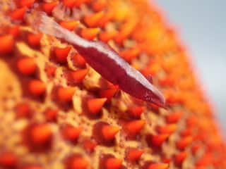
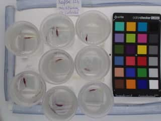

```{r setup, include=FALSE}
BioDataScience1::learnr_setup()
SciViews::R()
library(broom.mixed)
# dataset
id <- c(1 ,2 ,3 ,4 ,6 ,7 ,8 ,1 ,2 ,3 ,4 ,6 ,7 ,8 ,1 ,2 ,3 ,4 ,6 ,7 ,8 ,1 ,2 ,3 ,4 ,6 ,7 ,8 ,1 ,2 ,3 ,4 ,6 ,7 ,8 ,1 ,2 ,3 ,4 ,6 ,7 ,8)
time <- c(1 ,1 ,1 ,1 ,1 ,1 ,1 ,12 ,12 ,12 ,12 ,12 ,12 ,12 ,24 ,24 ,24 ,24 ,24 ,24 ,24 ,36 ,36 ,36 ,36 ,36 ,36 ,36 ,48 ,48 ,48 ,48 ,48 ,48 ,48 ,60 ,60 ,60 ,60 ,60 ,60 ,60)
grey <- c(115.143 ,100.2152 ,62.1222 ,80.289 ,161.6584 ,136.8296 ,73.0948 ,109.9172 ,100.445 ,72.1274 ,94.4386 ,174.459 ,147.546 ,96.5144 ,110.9132 ,97.1 ,70.3492 ,83.8586 ,181.745 ,143.8308 ,109.9544 ,121.559 ,99.786 ,78.7692 ,80.8518 ,182.1782 ,158.6062 ,108.7996 ,124.127 ,125.2232 ,82.0568 ,90.6632 ,178.3226 ,155.8228 ,109.1466 ,119.9694 ,118.6336 ,85.8494 ,80.0712 ,183.4602 ,149.6784 ,119.926)

zeno_soror <- dtx(
  id   = as.factor(id),
  time = time,
  grey = grey
)
zeno_soror <- labelise(zeno_soror, label = list(
  id   = "Individus",
  time = "Temps",
  grey = "Nuance de gris"))

zeno_rep <- lmerTest::lmer(data = zeno_soror, grey ~ time + ( time | id))
```

```{r, echo=FALSE}
BioDataScience1::learnr_banner()
```

```{r, context="server"}
BioDataScience1::learnr_server(input, output, session)
```

------------------------------------------------------------------------

## Objectifs

Il est courant en biologie de réaliser des mesures répétées sur des individus successivement dans le temps par exemple. Nous avons déjà rencontré une situation similaire lors de la réalisation d'une expérience qui menait à comparer des mesures réalisées sur les mêmes individus, le test *t* de Student apparié. Par exemple, lors d'une expérience qui étudie la perte de poids entre deux mesures aux temps *t~1~* et *t~2~* de patients. N'hésitez pas à revoir ce test étudié au [module 9](https://wp.sciviews.org/sdd-umons/?iframe=wp.sciviews.org/sdd-umons-2022/variantes-du-test-t-de-student.html). Le modèle à mesures répétées va nous permettre d'étudier des mesures répétées sur des individus (plus de deux fois).

Dans ce tutoriel, vous allez pouvoir auto-évaluer votre capacité à :

-   présenter vos données avant de réaliser une ANOVA à mesures répétées
-   utiliser l'ANOVA à mesures répétées pour résoudre une question pratique en biologie

## Expérience

Cette séance d'exercice se base sur les travaux de fin d'études d'une étudiante traitant de la caractérisation de la pigmentation du couple symbiotique crevette *Zenopontonio soror* et étoile de mer *Culcita novaeguinae*.



Dans le cadre de ce travail, la chercheuse a étudié la décoloration de *Zenopontonia soror* lorsque ces crevettes se trouvaient isolées de l'hôte pendant plusieurs heures. Pour ce faire des photos ont été réalisées à intervalle régulier sur plusieurs individus (mêmes individus à chaque fois). L'intensité de gris a été mesurée sur l'abdomen de chaque individu. Le dispositif est présenté ci-dessous



Vous avez à votre disposition un sous-ensemble des données collectées.

```{r}
skimr::skim(zeno_soror)
```

Le niveau de gris varie de 0 à 255. Une valeur proche de 0 correspond à une crevette très foncée alors qu'une valeur proche de 255 est une crevette très claire. Le temps est exprimé par pas de 5 min. Par exemple un temps de 12 correspond à 1h (12 \* 5min). L'`id` correspond au code de la crevette étudiée.

La question posée était la suivante : **observe-t-on une décoloration de l'abdomen (un éclaircissement des individus) au cours du temps ?**

## Facteur fixe et facteur aléatoire

```{r}
head(zeno_soror)
```

La première problématique lors de la réalisation de ce type d'expérience est de définir correctement le facteur fixe du facteur aléatoire. Aidez-vous de la description proposée dans la section précédente.

```{r quiz_factor}
question("Parmi les variables proposées ci-dessous, sélectionnez le facteur fixe parmi les variable suivantes",
  answer("id", message = "Cette variable est le facteur aléatoire."),
  answer("time", correct = TRUE, "Vous avez correctement sélectionné le facteur fixe"),
  answer("grey"),
  try_again_button = TRUE,
  random_answer_order = TRUE,
  message = "Nous sommes bien en présence de mesures repétées au cours du temps des individus (variable id).")
```

### Description graphique

Réalisez un graphique pertinent de votrez jeu de données par rapport à l'analyse qui est envisagée. Vous allez faire un graphique de la variation du niveau de gris au cours du temps en utilisant les facettes pour séparer les individus.

```{r plot, exercise=TRUE}
chart(data = ___, ___) +
  geom____()
```

```{r plot-solution}
## Solution ##
chart(data = zeno_soror, grey ~ time | id) +
  geom_line()
```

```{r plot-check}
grade_code("Ce graphique est pertinent pour cette analyse. Le graphique en ligne indique explicitemet que les observations sont liés (Les mesures qui sont réalisées sur les mêmes individus dans notre cas). On peut observer un tendance à la hausse sur chaque graphique à l'exception de des individus 1 et 4.")
```

## Modèle à mesures répétées

Réalisez à présent le modèle à mesures répétées adéquat. Écrivez correctement la formule de ce modèle dans le code.

```{r lmer_h2, exercise=TRUE}
# Calcul du modèle
zeno_rep <- lmerTest::lmer(data = ___, ___)
# Affchez le tableau de l'anova
___(___)
```

```{r lmer_h2-hint-1}
# Calcul du modèle
zeno_rep <- lmerTest::lmer(data = zeno_soror, ___ ~ ___ + ( ___ | ___))
# Affchez le tableau de l'anova
anova(zeno_rep)

#### ATTENTION: Hint suivant = solution !####
```

```{r lmer_h2-solution}
## Solution ##
# Calcul du modèle
zeno_rep <- lmerTest::lmer(data = zeno_soror, grey ~ time + ( time | id))
# Affchez le tableau de l'anova
anova(zeno_rep)
```

```{r lmer_h2-check}
grade_code("La partie la plus technique de ce code est d'écrire correctement la formule. Avec une valeur de p de 0.0092, nous sommes en dessous du seuil alpha de 0.05. Nous rejetons donc H0.")
```

Réalisez maintenant le résumé du modèle et étudiez les intervalles de confiance sur ses paramètres.

```{r confint, exercise=TRUE, warning=FALSE}
# résumé du modèle
___(___)
# Intervalles de confiance
___(___)
```

```{r confint-solution}
## Solution ##
# résumé du modèle
summary(zeno_rep)
# Intervalles de confiance
confint(zeno_rep)
```

```{r confint-check}
grade_code("La pente et l'ordonnées à l'origine sont significatifs au seuil alpha de 5%. La pente du modèle est positive et estimée à 0.30. Les crevettes deviennent plus claire au cours du temps.")
```

### Validation des conditions d'application du modèle

Les conditions d'application sont les conditions générales de l'ANOVA :

-   échantillon représentatif (par exemple, aléatoire),
-   observations indépendantes,
-   variable réponse quantitative,
-   n variables explicatives qualitatives à deux niveaux ou plus,
-   distribution Normale des résidus,
-   homoscédasticité (même variance intragroupe),

Étudiez la distribution Normale des résidus de votre modèle.

```{r qqplot_h2, exercise=TRUE}
___ %>.%
  ___(___) %>.%
  car::qqPlot(___$___, distribution = "norm",
    envelope = 0.95, col = "Black", xlab = "Quantiles théoriques",
    ylab = "Résidus standardisés")
```

```{r qqplot_h2-hint-1}
zeno_rep %>.%
  augment(.) %>.%
  car::qqPlot(___$___, distribution = "norm",
    envelope = 0.95, col = "Black", xlab = "Quantiles théoriques",
    ylab = "Résidus standardisés")

#### ATTENTION: Hint suivant = solution !####
```

```{r qqplot_h2-solution}
## Solution ##
zeno_rep %>.%
  augment(.) %>.%
  car::qqPlot(.$.resid, distribution = "norm",
    envelope = 0.95, col = "Black", xlab = "Quantiles théoriques",
    ylab = "Résidus standardisés")
```

```{r qqplot_h2-check}
grade_code("Nous observons une distribution Normale des résidus. L'ensemble des points se trouve dans l'enveloppe de confiance à 95%.")
```

Étudiez à présent l'homoscédasticité à l'aide d'un graphique de la distribution des résidus.

```{r resid_h2, exercise=TRUE}
___ %>.%
  ___(___) %>.%
  chart(data = ___, ___ ~ ___) +
  geom____() +
  geom_hline(yintercept = 0) +
  geom_smooth(se = FALSE, method = "loess", formula = y ~ x) +
  labs(x = "Valeurs prédites", y = "Résidus") +
  ggtitle("Distribution des résidus")
```

```{r resid_h2-hint-1}
___ %>.%
  augment(.) %>.%
  chart(data = ___, ___ ~ ___) +
  geom____() +
  geom_hline(yintercept = 0) +
  geom_smooth(se = FALSE, method = "loess", formula = y ~ x) +
  labs(x = "Valeurs prédites", y = "Résidus") +
  ggtitle("Distribution des résidus")

#### ATTENTION: Hint suivant = solution !####
```

```{r resid_h2-solution}
## Solution ##
zeno_rep %>.%
  augment(.) %>.%
  chart(data = ., .resid ~ .fitted) +
  geom_point() +
  geom_hline(yintercept = 0) +
  geom_smooth(se = FALSE, method = "loess", formula = y ~ x) +
  labs(x = "Valeurs prédites", y = "Résidus") +
  ggtitle("Distribution des résidus")
```

```{r resid_h2-check}
grade_code("Ce graphique vous permet d'étudier la distribution des résidus. De manière simplifiée, il faut que la courbe bleue soit proche de la ligne noire. Il faut essayer d'avoir des résidus tout au long de cette ligne noire. Les valeurs doivent être aussi bien positives que négative avec des valeurs absolues similaire. Dans notre exemple, ces critères sont respectés. Il y a donc homoscédasticité, ou en tous cas, un écart pas trop important entre les variances.")
```

## Interprétation biologique

Un éclaircissement significatif de *Zenopontonio soror* au seuil alpha de 5% est observé lorsque ce dernier est isolé de son hôte *Culcita novaeguinae*. Plusieurs hypothèses sont en cours d'étude dont l'une d'entre elles est liée au syndrome de séparation. En absence de l'environnement olfactif de l'hôte, *Z. soror* est stressé. La décoloration est un marqueur de stress.

## Conclusion

Bravo ! Vous venez de terminer une analyse de données en utilisant l'ANOVA à mesures répétées.

```{r comm_noscore, echo=FALSE}
question_text(
  "Laissez-nous vos impressions sur cet outil pédagogique",
  answer("", TRUE, message = "Pas de commentaires... C'est bien aussi."),
  incorrect = "Vos commentaires sont enregistrés.",
  placeholder = "Entrez vos commentaires ici...",
  allow_retry = TRUE
)
```
